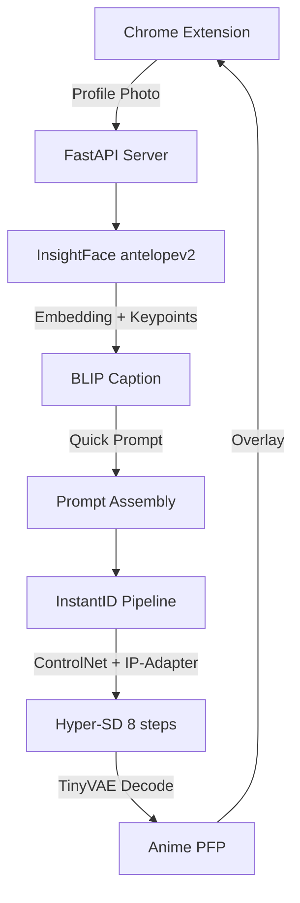

So I had this idea: what if every profile picture on my Twitter timeline was anime? Not the Lensa AI kind where you upload five selfies and wait ten minutes for a batch to come back. I wanted it live, in the browser, as you scroll. You see someone's face and by the time your eye lands on the tweet text, the photo has already been swapped with an anime version that actually looks like them.

The obvious way to do this is to run a Stable Diffusion pipeline per image. The obvious problem is that a standard SDXL pipeline takes 5 to 10 seconds per image at default settings. Add face detection, prompt generation and network round trips on top of that, and you're looking at double digit seconds per profile picture. If the anime version appears after the user has already scrolled past the tweet, the whole thing is pointless.

I spent several weeks getting this pipeline from "painfully slow" to "feels instant." Every component in the chain had to be attacked independently because no single trick was going to bridge a 15x gap.

---

## The first version was a science experiment, not a product

My first attempt used **[IP-Adapter FaceID](https://huggingface.co/h94/IP-Adapter-FaceID)** with SDXL as the base model. The pipeline worked like this: upload a face photo, extract a face embedding using [InsightFace](https://github.com/deepinsight/insightface), call GPT-4o to generate a Stable Diffusion prompt describing the image, then run the diffusion model with the face embedding for identity preservation.

```python
images = ip_model.generate(
    prompt=prompt, negative_prompt=negative_prompt,
    faceid_embeds=faceid_embeds, num_samples=1,
    width=1024, height=1024, num_inference_steps=20,
    seed=2023, guidance_scale=7.5
)
```

Twenty inference steps at 1024x1024 resolution with a guidance scale of 7.5. And on top of the diffusion itself, every single request included a round trip to the OpenAI API to generate the prompt. The whole pipeline took somewhere around 10 to 15 seconds on a consumer GPU, which is fine if you're generating one profile picture and waiting for it, but completely unusable if you want to replace dozens of images on a Twitter timeline while the user scrolls.

I needed to attack every stage of this pipeline independently.

---

## Twenty steps is twenty lifetimes

The single biggest lever in any diffusion pipeline is the number of inference steps. Standard SDXL uses 20 to 50 steps, each one a full forward pass through the UNet. If I could get acceptable output at fewer steps, the speedup would be roughly linear on the most expensive part of the pipeline.

**[SDXL-Lightning](https://huggingface.co/ByteDance/SDXL-Lightning)** from ByteDance was the first thing I tried. It's a LoRA adapter trained with progressive adversarial distillation that lets you generate in 2 or 4 steps instead of 20+. I loaded the 2 step variant and set guidance scale to 0.0 because Lightning is trained without classifier free guidance:

```python
repo = "ByteDance/SDXL-Lightning"
ckpt = "sdxl_lightning_2step_lora.safetensors"

pipe.load_lora_weights(hf_hub_download(repo, ckpt))
pipe.fuse_lora()
pipe.scheduler = EulerDiscreteScheduler.from_config(
    pipe.scheduler.config, timestep_spacing="trailing"
)

images = ip_model.generate(
    prompt=prompt, negative_prompt=negative_prompt,
    faceid_embeds=faceid_embeds, num_samples=1,
    width=1024, height=1024, num_inference_steps=2,
    seed=2023, guidance_scale=0.0
)
```

Two steps produced images that were recognizably anime but lacked detail. The colors were flat and faces sometimes melted into the background. Good enough to prove the approach could work, not good enough to ship.

I then switched to **[Hyper-SD](https://huggingface.co/ByteDance/Hyper-SD)**, also from ByteDance, which has both 1 step and 8 step variants and crucially offers a CFG compatible version. This means you can use classifier free guidance at higher step counts, which gives you much more control over output quality. I ran a systematic sweep across guidance scales from 1.0 to 9.0 at 8 steps, plotting the results side by side:

```python
guidance_scales = np.linspace(1.0, 9.0, 10)
for guidance_scale in guidance_scales:
    image = pipe(
        prompt, negative_prompt=negative_prompt,
        image_embeds=face_emb, image=face_kps,
        controlnet_conditioning_scale=0.8, ip_adapter_scale=0.8,
        num_inference_steps=8, width=1024, height=1024,
        guidance_scale=guidance_scale
    ).images[0]
```

A guidance scale of 6.5 at 8 steps turned out to be the sweet spot. High enough for detailed, recognizable anime faces, low enough to avoid the oversaturated mess you get at 9.0. And 8 steps instead of 20 meant the UNet portion of the pipeline was roughly 2.5x faster.

I also tested the 1 step Hyper-SD variant for the most aggressive speed scenario. One forward pass through the UNet, guidance scale of 1.0. The quality drop is real but for tiny profile pictures on a timeline, where the image is maybe 48x48 pixels on screen, it turns out to be acceptable.

---

## The prompt was secretly the slowest part

Here's something I didn't expect: the diffusion pipeline wasn't even the bottleneck in my first version. The GPT-4o API call was.

The original idea was clever in theory. Send the user's face photo to a vision model, have it generate a Stable Diffusion prompt that describes the person's features in anime terms, then feed that prompt into the pipeline. The prompts GPT-4o produced were genuinely good, rich with specific anime style descriptors and character references. But each API call took 2 to 4 seconds over the network, and that was before the diffusion even started.

I tried switching to **Claude Haiku** which was faster and cheaper:

```python
def query_anthropic(prompt, image):
    message = anthropic_client.messages.create(
        model="claude-3-haiku-20240307",
        max_tokens=256,
        messages=[{
            "role": "user",
            "content": [
                {"type": "image", "source": {
                    "type": "base64", "media_type": "image/jpeg", "data": image
                }},
                {"type": "text", "text": prompt}
            ],
        }],
    )
    return message.content[0].text
```

Better latency, but still a network round trip per image. For the timeline use case where I needed to process potentially dozens of images as the user scrolls, even 500ms per prompt was too much.

Then I tried running a vision model locally with **[Ollama](https://github.com/ollama/ollama)** using [Moondream](https://github.com/vikhyat/moondream), which eliminated network latency entirely. But Moondream on CPU was still slow enough to matter, and running it on GPU meant competing for VRAM with the diffusion model that actually needed those resources.

The solution I landed on was to stop using an LLM for prompts entirely. I replaced the whole vision model chain with **[BLIP](https://huggingface.co/Salesforce/blip-image-captioning-base)** image captioning combined with random sampling from a curated list of anime characters and drawing styles:

```python
prompt = query_blip("", face_image)
anime_character = popular_anime_characters[np.random.randint(0, len(popular_anime_characters))]
drawing_style = popular_anime_drawing_styles[np.random.randint(0, len(popular_anime_drawing_styles))]

prefix = "1girl, " if "woman" in prompt.lower() or "girl" in prompt.lower() else "1boy, "
prompt = prefix + anime_character + ", " + prompt + "," + drawing_style
prompt += ", (masterpiece), (best quality), (ultra-detailed), very aesthetic"
```

BLIP gives me a basic caption of the image in milliseconds because it's tiny compared to a full vision LLM. I append a randomly selected anime character name from a curated list of about 100 characters across Naruto, Attack on Titan, Demon Slayer and others, plus a drawing style descriptor. The prompts are less sophisticated than what GPT-4o produced, but the pipeline went from seconds waiting for a prompt to effectively zero.

The randomized anime character injection is actually a feature, not a bug. Every generation maps a different character's visual style onto your face, which makes the results more varied and interesting than a single deterministic prompt would.

---

## Every millisecond counts when you're stacking them

Once I had the step count down and the prompt bottleneck eliminated, I started chasing smaller wins that compound together.

### A VAE nobody would notice is worse

The **VAE** (Variational AutoEncoder) decodes the latent representation back into pixel space after the UNet is done. Standard SDXL's VAE is large and relatively slow. I swapped it for **[TAESD](https://huggingface.co/madebyollin/taesdxl)**, a distilled version that's several times faster at decoding:

```python
from diffusers import AutoencoderTiny
pipe.vae = AutoencoderTiny.from_pretrained(
    "madebyollin/taesdxl", torch_dtype=torch.float16
)
```

The decoded images are slightly softer than what the full VAE produces. For photorealistic generation this matters. For anime, where the aesthetic is already stylized and the output is going to be displayed at profile picture size, the quality difference is invisible.

### The scheduler matters more when every step counts

I tested three different schedulers and the choice matters more than you'd think at low step counts. With 8 steps, each individual step carries far more weight than when you have 50 to average out noise. **EulerDiscreteScheduler** with "trailing" timestep spacing worked for SDXL-Lightning but produced slightly blurry results with Hyper-SD. **DDIMScheduler** was stable but slow. **TCDScheduler** (Trajectory Consistency Distillation) was designed specifically for low step regimes and consistently gave the sharpest results:

```python
pipe.scheduler = TCDScheduler.from_config(pipe.scheduler.config)
```

### Fusing LoRA weights once and forgetting about them

Loading a LoRA adapter adds a small overhead to every forward pass because the adapter weights get applied as an additive modification during inference. Calling `fuse_lora()` merges those weights directly into the base model's weight matrices, eliminating the per forward overhead permanently:

```python
pipe.load_lora_weights(hf_hub_download(repo, ckpt))
pipe.fuse_lora()
```

This is a free speedup with zero quality loss. There's no reason not to do it if you're not planning to swap LoRA adapters at runtime.

---

## Three minutes of patience for a 40% speedup

The single biggest batch speedup came from **[stable-fast](https://github.com/chengzeyi/stable-fast)** (sfast), a compilation framework that applies three layers of optimization to the entire diffusion pipeline at once:

```python
from sfast.compilers.diffusion_pipeline_compiler import compile, CompilationConfig

def compile_model(model):
    config = CompilationConfig.Default()
    config.enable_xformers = True
    config.enable_triton = True
    config.enable_cuda_graph = True
    model = compile(model, config)
    return model

pipe = compile_model(pipe)
```

**[xformers](https://github.com/facebookresearch/xformers)** replaces standard attention with a memory efficient implementation that's both faster and uses less VRAM. **[Triton](https://github.com/openai/triton)** auto generates optimized CUDA kernels for the network operations, fusing multiple small ops into larger and more efficient kernels. **CUDA Graph** captures the entire forward pass as a single GPU execution graph, which eliminates the CPU to GPU synchronization overhead that normally happens between every operation.

The combined effect is around 40 to 60% faster per image generation. But the catch is that compilation takes several minutes on the first run. Triton needs to generate and compile custom kernels, and CUDA Graph needs to capture the execution pattern. For a server that boots once and serves many requests, this cold start is a one time cost that pays for itself immediately. For interactive development where you're restarting the server constantly, it's painful enough that I kept a non compiled version around for testing.

I also tried `torch.compile` with `mode="reduce-overhead"` and `fullgraph=True` as an alternative. That line is still commented out in my code because it kept breaking on the custom attention processors that InstantID injects into the UNet. stable-fast handled those gracefully where PyTorch's native compilation didn't.

---

## When speed is useless without resemblance

Speed optimizations don't matter if the output doesn't look like the person whose photo you fed in. My first approach with IP-Adapter FaceID preserved identity to some degree but the resemblance was vague at best. The anime character would have roughly the right hair color and maybe the right gender, but you'd never look at it and think "oh that's obviously the same person."

**[InstantID](https://github.com/InstantID/InstantID)** solved this by combining two complementary mechanisms. The first is a **[ControlNet](https://github.com/lllyasviel/ControlNet)** trained specifically for face identity that takes the detected face keypoints (eyes, nose and mouth positions) and uses them as geometric conditioning for the generation. The second is the **IP-Adapter FaceID** component that takes a 512 dimensional face embedding from InsightFace and injects it through the cross attention layers as semantic conditioning.

```python
# Both geometric AND semantic identity feed into the pipeline
face_info = face_app.get(face_image_cv2)
face_info = sorted(
    face_info, key=lambda x: (x['bbox'][2]-x['bbox'][0]) * (x['bbox'][3]-x['bbox'][1])
)[-1]  # largest face

face_emb = face_info['embedding']                        # semantic
face_kps = draw_kps(face_image, face_info['kps'])         # geometric

images = pipe(
    prompt=prompt, negative_prompt=negative_prompt,
    image_embeds=face_emb,
    image=face_kps,
    controlnet_conditioning_scale=0.8,
    ip_adapter_scale=0.8,
    num_inference_steps=8, guidance_scale=6.5
).images
```

The ControlNet ensures face landmarks are in the right positions. The IP-Adapter ensures actual facial features like eye shape, nose structure and face proportions match the original. Neither mechanism alone produces convincing results but together they give you an anime face that's recognizably the same person.

I used **[animagine-xl-3.1](https://huggingface.co/cagliostrolab/animagine-xl-3.1)** as the base model instead of standard SDXL because it's been fine tuned specifically for anime generation. The combination of an anime specialized base model with InstantID's dual identity preservation and Hyper-SD's step reduction gave me the quality I needed without sacrificing speed.

---

## The Chrome extension that made it all real

All the optimization work would be pointless without a way to actually use it while browsing. I built a Chrome extension with two modes: one for individual profiles and one for the entire timeline.

The profile page version watches for the profile photo element using a **MutationObserver**, detects when you navigate to a new profile (Twitter uses client side routing so the page doesn't reload), and fires off a request to the local [FastAPI](https://fastapi.tiangolo.com/) server:

```javascript
const observer = new MutationObserver((mutationsList) => {
    for (let mutation of mutationsList) {
        if (mutation.type === 'attributes' && mutation.attributeName === 'src') {
            if (mutation.target.alt === 'Opens profile photo') {
                overlayAnimePfp();
            }
        }
    }
});

observer.observe(document.body, {
    childList: true, attributes: true,
    subtree: true, attributeFilter: ['src']
});
```

The extension grabs the profile photo, upscales the URL from Twitter's default thumbnail to 400x400 by swapping the size parameter, sends it to the local server and overlays the returned anime image directly on top of the original element.

### Where all the speed work paid off

The ambitious version replaces every profile picture in the entire Twitter timeline. This is where the optimizations become essential because you're not generating one image, you're generating dozens as the user scrolls.

I used an **IntersectionObserver** to detect when profile pictures enter the viewport, which means I only burn GPU cycles on images the user is actually looking at:

```javascript
const intersectionObserver = new IntersectionObserver((entries, observer) => {
    entries.forEach(entry => {
        if (entry.isIntersecting) {
            const target = entry.target;
            if (target.tagName === 'IMG' &&
                target.src.includes('pbs.twimg.com/profile_images')) {
                observer.unobserve(target);
                overlayAnimePfp(target);
            }
        }
    });
}, { rootMargin: '0px', threshold: 0.2 });
```

A **MutationObserver** on the timeline container watches for new tweets being added to the DOM as the user scrolls and registers each new profile image with the IntersectionObserver:

```javascript
const observer = new MutationObserver((mutationsList) => {
    mutationsList.forEach(mutation => {
        if (mutation.type === 'childList' && mutation.addedNodes.length > 0) {
            mutation.addedNodes.forEach(target => {
                if (target.tagName === 'IMG' &&
                    target.src.includes('pbs.twimg.com/profile_images')) {
                    intersectionObserver.observe(target);
                }
            });
        }
    });
});
```

The two observers create a lazy loading pattern. The MutationObserver catches new images as they enter the DOM, the IntersectionObserver triggers generation only when they scroll into view, and the optimized pipeline generates fast enough that by the time the user's eye reaches the image, the anime version is already there.

---

## From 15 seconds to sub second

After weeks of attacking every component independently, the pipeline looked nothing like where I started:



| Component | Before | After | Impact |
|---|---|---|---|
| Inference steps | 20 | 8 (or 1) | 2.5x faster (or 20x) |
| Prompt generation | GPT-4o API (2-4s) | BLIP local (~50ms) | 40-80x faster |
| VAE decode | Standard SDXL VAE | TAESD | ~4x faster |
| Pipeline compilation | None | sfast with xformers, Triton and CUDA Graph | ~1.5x faster |
| LoRA overhead | Per forward pass | Fused into weights | ~1.25x faster |
| Scheduler | Euler | TCD | ~1.2x faster |

The combined effect turned a 15 second pipeline into something that runs well under a second on a warm server. The first generation after startup takes longer because of sfast compilation, but every request after that benefits from the compiled execution graph.

---

## My take

The thing that surprised me most is that the diffusion model was not the main bottleneck. The "AI describing an image so another AI can draw it" chain was the real time killer, and the fix was to just stop doing that. BLIP captioning with random anime character injection produces prompts that are objectively worse than what GPT-4o generates, but the pipeline is 40x faster and the quality difference is invisible at 48x48 pixels.

The other lesson is that performance in diffusion models is almost entirely about stacking small multipliers. No single change took me from slow to fast. Step reduction helped. TAESD helped. LoRA fusion helped. sfast compilation helped. TCD scheduler helped. Each one saved 20 to 60% on its portion of the pipeline and the combined effect was transformative.

The most satisfying part is scrolling my Twitter timeline and watching profile pictures just become anime. If you didn't know the extension was running you'd think everyone had just decided to switch to anime avatars at the same time. Which was the whole point.
