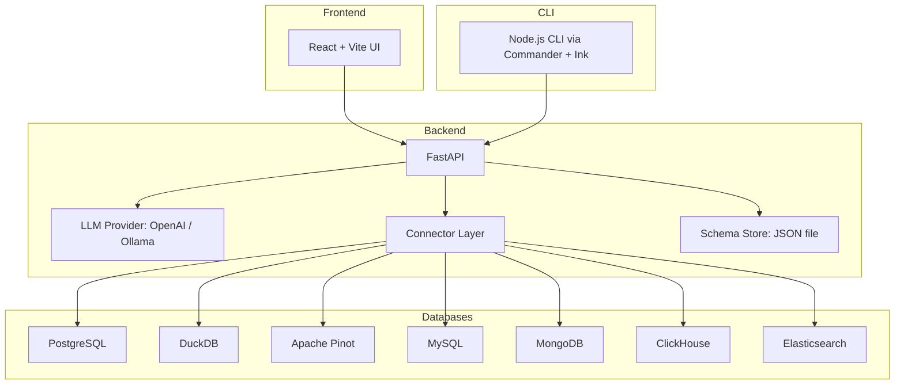

Every developer has typed the same query into ChatGPT at some point: "write me a SQL query that does X." You paste in your schema, describe what you want, and it gives you something that is usually 80% correct. The remaining 20% is where you spend the next thirty minutes fixing table names, dialect-specific syntax, and joins that the model hallucinated.

I wanted something better than that loop. Not a chatbot that generates SQL in a vacuum, but a tool that knows your actual schema, connects to your actual database, and generates SQL in the correct dialect. Then I wanted it to also convert that SQL into ORM code for whatever framework you happen to be using. And then I wanted a CLI. And then a synthwave theme, because at some point a side project stops being practical and starts being fun.

This is what I built, how it works, what broke, and what I would do differently.

---

## The problem with "just ask ChatGPT"

The naive text-to-SQL workflow has a fundamental issue: **context**. When you paste a schema into ChatGPT, you are doing the LLM's job for it. You are manually extracting the relevant tables, formatting them, and hoping the model respects your column names exactly. If your schema changes, you paste it again. If you have fifty tables and only need three, you either paste all fifty (burning tokens) or manually pick the right ones (burning time).

What I wanted was a tool where I could:

1. Point it at a real database
2. Let it introspect the schema automatically
3. Select which tables are relevant to my query
4. Type a natural language question
5. Get back syntactically correct SQL for that specific database dialect

That last point matters more than it sounds. PostgreSQL and MySQL disagree on string quoting, type casting, window function syntax, `LIMIT` vs `FETCH FIRST`, and about two dozen other things. If you are generating SQL for Apache Pinot, half of standard SQL does not apply at all since Pinot has its own query language quirks. The LLM needs to know which dialect it is targeting.

---

## Architecture overview

The system has three layers: a **FastAPI backend** that handles LLM interaction and database connections, a **React + Vite frontend** for the web UI, and a **Node.js CLI** for terminal users.



The backend does all the heavy lifting. The frontend and CLI are both thin clients that call the same REST API. This was a deliberate choice -- it means you can use the web UI for interactive exploration and the CLI for scripting or quick lookups, and they share identical behavior.

---

## The connector abstraction

The most interesting engineering decision was the **connector layer**. I needed to support databases that have almost nothing in common. PostgreSQL uses `information_schema`. DuckDB uses `information_schema` too, but with its own `duckdb_constraints()` function for primary keys. Apache Pinot has no `information_schema` at all -- you have to hit the Controller REST API to get table metadata. MongoDB does not even have a fixed schema. Elasticsearch has mappings instead of tables.

I built an abstract base class that every connector must implement:

```python
class BaseConnector(ABC):
    def __init__(self, config: Dict[str, Any]):
        self.config = config
        self._connection: Any = None

    @abstractmethod
    def connect(self) -> None: ...

    @abstractmethod
    def disconnect(self) -> None: ...

    @abstractmethod
    def get_schema(self, schema_name: Optional[str] = None
    ) -> Dict[str, Dict[str, Dict[str, Any]]]: ...

    @abstractmethod
    def get_connection_properties_schema(self) -> List[Dict[str, Any]]: ...

    async def test_connection(self, custom_config_str=None):
        try:
            self.connect()
            self.disconnect()
            return True, "Connection successful."
        except Exception as e:
            return False, f"Connection failed: {e}"
```

The return type of `get_schema` is the key design decision: `Dict[table_name, Dict[column_name, Dict[property, value]]]`. Every connector has to normalize its native schema representation into this shape. That normalization is where most of the connector-specific complexity lives.

### PostgreSQL: the straightforward one

The Postgres connector queries `information_schema.tables` joined with `information_schema.columns` and `information_schema.key_column_usage` to get column types, nullability, defaults, and primary key status. Standard stuff.

```python
query = sql.SQL("""
    SELECT 
        t.table_name,
        c.column_name,
        c.data_type,
        c.is_nullable,
        c.column_default,
        CASE 
            WHEN kcu.column_name IS NOT NULL THEN TRUE
            ELSE FALSE
        END AS is_primary_key
    FROM information_schema.tables t
    JOIN information_schema.columns c 
        ON t.table_name = c.table_name AND t.table_schema = c.table_schema
    LEFT JOIN information_schema.key_column_usage kcu 
        ON t.table_name = kcu.table_name 
        AND c.column_name = kcu.column_name
    LEFT JOIN information_schema.table_constraints tc 
        ON kcu.constraint_name = tc.constraint_name 
        AND tc.constraint_type = 'PRIMARY KEY'
    WHERE t.table_schema = %s AND t.table_type = 'BASE TABLE'
""")
```

This works well but has a known gap: it does not fetch foreign key relationships or indexes yet. For text-to-SQL generation this is usually fine because the LLM mostly needs column names and types. For more advanced schema-aware features, this would need expansion.

### Apache Pinot: the weird one

Pinot was the connector that required the most rethinking. Pinot is a **read-only OLAP store** -- there are no transactions, no `information_schema`, and the schema introspection works completely differently.

The query channel uses `pinotdb`, a DB-API 2.0 driver that talks to brokers via REST. But schema metadata comes from the **Controller REST API**, which is a separate endpoint entirely.

```python
def get_schema(self, schema_name=None):
    ctrl = self._controller_base()
    tables_resp = requests.get(f"{ctrl}/tables")
    all_tables = tables_resp.json().get("tables", [])

    schema_data = {}
    for tbl in all_tables:
        schema_json = requests.get(
            f"{ctrl}/schemas/{_schema_of(tbl)}"
        ).json()
        cols = {}
        for block in ("dimensionFieldSpecs", "metricFieldSpecs", 
                       "dateTimeFieldSpecs"):
            for spec in schema_json.get(block, []):
                cols[spec["name"]] = {
                    "type": spec["dataType"],
                    "nullable": not spec.get("singleValueField", True),
                    "default": spec.get("defaultNullValue"),
                    "is_primary_key": spec["name"] 
                        in schema_json.get("primaryKeyColumns", []),
                }
        schema_data[tbl] = cols
    return schema_data
```

Pinot schemas separate columns into dimension fields, metric fields, and datetime fields. The connector has to iterate through all three blocks and flatten them into the unified schema format. Pinot also appends `_OFFLINE` or `_REALTIME` suffixes to table names, so there is a helper to strip those when looking up the schema name.

Transaction methods on the Pinot connector just raise `NotImplementedError`. Pinot is read-only. The abstract base class requires these methods, so they exist but do nothing.

### MongoDB: the schemaless one

MongoDB was philosophically awkward. The whole point of MongoDB is that collections don't have fixed schemas. The connector handles this by sampling: it lists collection names and, for `get_table_info`, reads a single document and infers field types from it.

```python
def get_table_info(self, table_name, schema_name=None):
    coll = db[table_name]
    sample = coll.find_one() or {}
    info = {"columns": {}}
    for key, value in sample.items():
        info["columns"][key] = {
            "type": type(value).__name__, 
            "nullable": True
        }
    return info
```

This is obviously imperfect. A single document might not represent the full shape of the collection. But for text-to-SQL purposes, it gives the LLM enough context to generate reasonable queries. A production version would probably sample multiple documents and merge the field sets.

---

## The dynamic connection form

One thing I am actually proud of is the **self-describing connection form**. Each connector defines its own `get_connection_properties_schema()` that returns a list of property definitions:

```python
def get_connection_properties_schema(self) -> List[Dict[str, Any]]:
    return [
        {
            "name": "host",
            "label": "Host",
            "type": "string",
            "required": True,
            "default": "localhost",
            "description": "Hostname or IP of the PostgreSQL server."
        },
        {
            "name": "port",
            "label": "Port",
            "type": "integer",
            "required": True,
            "default": 5432,
        },
        # ...
    ]
```

The frontend fetches this schema and dynamically renders the correct form fields. String properties become text inputs. Password properties get masked inputs. Booleans become checkboxes. Integers become number inputs. No hardcoded forms per database type.

The flow is: user picks a connector from a grid of database logos -> frontend fetches the property schema from `/api/connectors/{id}/schema` -> renders a form -> user fills it in -> can test the connection, fetch the schema, or save it. The whole thing is driven by that one property list.

| Connector | Auth | Schema Introspection | Transactions |
|:---|:---|:---|:---|
| PostgreSQL | user/password | `information_schema` | Full support |
| MySQL | user/password | `information_schema` | Full support |
| DuckDB | file path | `information_schema` + `duckdb_constraints()` | Full support |
| Apache Pinot | optional | Controller REST API | Not supported |
| ClickHouse | optional | `system.columns` | Not supported |
| MongoDB | optional | Document sampling | Not supported |
| Elasticsearch | optional | Index mappings | Not supported |

---

## How the LLM integration works

The SQL generation itself is surprisingly simple. There is a **base prompt** that gets formatted with the database dialect name:

```
You are an AI assistant specialized in converting natural language 
queries into SQL queries for a **{db_name}** database.

If a database schema is provided below, use it to structure the query. 
Otherwise, generate the query based on common conventions.

Rules:
- Only output the SQL query.
- Do not add any explanations or comments.
- Ensure the SQL syntax is correct for the specified database: **{db_name}**.
- If a schema is provided, use table and column names exactly as specified.
```

The backend supports two LLM providers: **OpenAI** and **Ollama** (for local models). The provider is selected via the `MODEL_PROVIDER` environment variable.

The OpenAI path uses the Responses API with **web search** enabled as a tool. This was an intentional choice -- if the model is unsure about a specific database dialect's syntax, it can look it up. The system prompt appends: "If you are unsure about specific database syntax, use the available web search tool to clarify."

```python
client = openai.OpenAI(api_key=OPENAI_API_KEY)
response = client.responses.create(
    model=OPENAI_MODEL,
    tools=[{"type": "web_search_preview"}],
    instructions=system_prompt,
    input=user_content,
    service_tier="auto",
    temperature=0
)
```

Temperature 0 is important. You do not want creative SQL. You want deterministic, correct SQL.

The Ollama path is simpler -- it just posts the full prompt to the Ollama API's `/api/generate` endpoint with `stream: False`. No tool use, just raw completion.

Both paths do the same post-processing: strip markdown code fences if the model wraps output in them.

```python
if sql_query.lower().startswith("```sql"):
    sql_query = sql_query[6:]
if sql_query.endswith("```"):
    sql_query = sql_query[:-3]
return sql_query.strip()
```

Crude but effective. LLMs love wrapping code in fences even when you tell them not to.

### Schema injection

When the user has connected to a database and fetched its schema, the schema gets saved to a JSON file. On subsequent SQL generation requests, if no manual schema is provided, the backend loads the saved schema and injects it into the prompt:

```python
store = load_saved_connections()
entry = store.get(db_name, {})
full_schema = entry.get("dbSchema")
if full_schema:
    filtered = full_schema
    if selected_tables:
        filtered = {t: full_schema.get(t) 
                    for t in selected_tables if t in full_schema}
    schema_str = json.dumps(filtered, indent=2)
```

The `selected_tables` parameter is key. If you have a database with fifty tables, you don't want to dump all of them into the prompt. You select the relevant ones in the UI, and only those get included. This keeps token usage sane and improves generation quality because the LLM has less noise to filter through.

---

## SQL to ORM: the second generation step

After generating SQL, the tool offers a second step: converting that SQL into ORM code. The supported frameworks cover most of the major ecosystems:

- **SQLAlchemy** and **Django ORM** for Python
- **GORM** for Go
- **Hibernate**, **Spring Data JPA**, and **MyBatis** for Java
- **Sequelize**, **TypeORM**, and **Prisma** for JavaScript/TypeScript
- **ActiveRecord** for Ruby

There is also a "custom" option where you can type in any framework name and any language. The LLM is flexible enough to handle frameworks it has seen in training data.

The ORM prompt is separate from the SQL prompt:

```
Given an SQL query, a target ORM framework, and a programming language, 
generate the equivalent ORM code.

Rules:
- Only output the ORM code for the specified framework and language.
- Include necessary import statements.
- Prioritize using the ORM's built-in functions and query builders. 
  Avoid executing raw SQL unless absolutely necessary.
```

The ORM generation also uses web search on the OpenAI path. This is useful for less common frameworks or newer API versions where the model's training data might be stale.

---

## The CLI

I built a CLI because sometimes you do not want to open a browser to generate a query. The CLI is a Node.js app using **Commander** for command parsing and **Ink** (React for the terminal) for an interactive shell mode.

```bash
# Generate SQL
text2sql generate-sql "show all users from London" --db postgresql

# Generate ORM code
text2sql generate-orm "SELECT * FROM users" --framework sqlalchemy --language python

# List available connectors
text2sql list-connectors

# Interactive shell
text2sql interactive
```

The interactive mode renders a terminal UI using React components via Ink. It is the same command set but with a persistent shell that keeps history. The CLI talks to the same backend API, so you need the server running.

The schema option accepts either a raw string or a file path:

```javascript
function readSchema(value) {
  if (!value) return null;
  if (fs.existsSync(value)) {
    return fs.readFileSync(value, 'utf8');
  }
  return value;
}
```

If you pass `--schema ./my_schema.sql`, it reads the file. If you pass `--schema "CREATE TABLE users ..."`, it uses the string directly. Small convenience, but it matters for scripting.

---

## Deployment

The project ships as a single Docker container. The Dockerfile is a multi-stage build:

1. Install Python dependencies with Poetry
2. Install Node.js and build the React frontend with Vite
3. Copy the built frontend assets into the backend's `static/` directory
4. Serve everything from FastAPI's `StaticFiles` mount

```python
app.mount("/", StaticFiles(directory="static", html=True), name="static")
```

This means in production there is exactly one process: the FastAPI server on port 8000 serving both the API and the frontend. No nginx, no separate frontend server. The API routes (`/generate-sql`, `/api/connectors/*`, etc.) are registered before the static mount, so they take priority. Everything else falls through to the static files.

The whole thing runs on Fly.io on a `shared-cpu-1x` instance with 256MB of RAM. The `auto_stop_machines` setting is set to `stop`, so it scales to zero when idle. With `min_machines_running = 0`, I only pay for actual usage.

```toml
[http_service]
  internal_port = 8000
  force_https = true
  auto_stop_machines = 'stop'
  auto_start_machines = true
  min_machines_running = 0
```

---

## The synthwave theme

Yes, there is a synthwave theme. The frontend has three theme modes: light, dark, and synthwave. The synthwave theme uses the Monoton and Orbitron fonts, neon glow CSS effects, and a color palette of hot pink, cyan, and deep purple.

This is purely cosmetic and contributed nothing to the tool's functionality. I regret nothing.

---

## What I would do differently

**The saved connections JSON file is fragile.** Right now, connector configs and fetched schemas are persisted to a `saved_connections.json` file on disk. This works for a single-user local tool but breaks immediately with multiple users or container restarts on Fly.io (ephemeral filesystem). A SQLite database or even just an environment-level key-value store would be more robust.

**The 600-line App.tsx is a problem.** The entire frontend is a single React component with 40+ state variables. It started small and grew. It should have been split into separate components for the query panel, SQL output panel, ORM panel, and connection dialog. By the time I noticed, it was already working and I did not want to refactor a working UI during a weekend project.

**Schema caching needs work.** The schema is fetched once when you click "Fetch Schema" and saved. If your database schema changes, you have to re-fetch manually. An auto-refresh or at least a staleness indicator would help.

**The connector system handles optional dependencies awkwardly.** Connectors for MySQL, MongoDB, ClickHouse, and Elasticsearch do a try/except ImportError at the top of the file and set the client library to `None` if it is not installed. This means you can start the server without those libraries installed, but you get a runtime `ImportError` when you actually try to connect. A proper plugin system with declared dependencies would be cleaner.

**Testing is incomplete.** The tests mock the LLM calls (which is correct -- you don't want to call OpenAI in CI) but they also mock most of the connector layer. There are no integration tests that verify actual database connections work end-to-end. The conftest.py stubs out `psycopg2`, `duckdb`, and `pinotdb` entirely to avoid needing real database drivers in the test environment.

---

## My take

The core loop -- connect to a database, introspect the schema, generate SQL in the right dialect -- works well. Having the actual schema context makes LLM-generated SQL dramatically more accurate than the "paste your schema into ChatGPT" workflow. The ORM generation on top of that is a nice bonus, especially for teams that use multiple languages and frameworks.

The connector abstraction pattern of having each database return a self-describing property schema is something I would reuse in other projects. It eliminates a whole class of frontend-backend coordination problems where you would normally need to hardcode a form for each database type.

If you are building anything that wraps an LLM for code generation, the two things that matter most are context injection and output cleaning. Give the model the right context (the actual schema, the actual dialect) and clean its output aggressively (strip fences, trim whitespace). The prompt itself can be surprisingly simple when the context is good.
