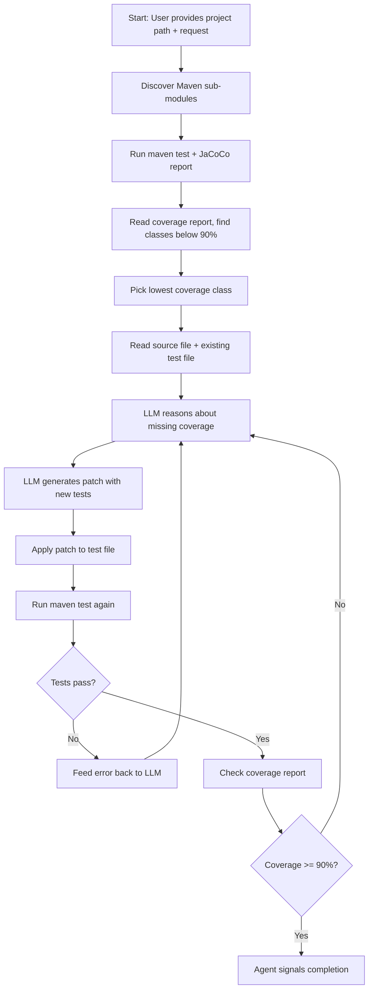

Nobody enjoys writing unit tests for a massive Java codebase. You know the drill. You open the class. You stare at the fifty branches you need to cover. You write the first three tests. You convince yourself the rest are trivial. You push the PR. Six months later someone finds a bug in exactly the branch you didn't test and you pretend to be surprised.

I got tired of pretending. So I built a tool called **unit-testoor** that uses LLMs to automatically generate JUnit tests, verify they compile and pass, and only keep the ones that actually increase line coverage. It runs as a CLI agent loop that reads your Java project, talks to an LLM, patches in new tests, runs Maven, checks JaCoCo reports, and repeats until coverage hits a target or it runs out of moves.

This is the story of building it. What worked. What broke. And why getting an LLM to write code that compiles is surprisingly different from getting it to write code that is correct.

---

## Why an agent loop and not a one-shot prompt

The naive version of this tool is obvious. Feed the source class and existing test class into an LLM. Ask it to generate more tests. Paste the output into the file. Run Maven. Pray nothing else changed.

I tried this first. It fails for three reasons:

1. **The LLM doesn't know what's already covered.** Without coverage data, it generates tests for branches that already have 100% coverage and misses the ones at 30%.
2. **Generated tests frequently don't compile.** Wrong imports, referencing private methods directly, using classes that don't exist in the dependency tree. A one-shot approach gives you no chance to fix these.
3. **Even compiling tests can be wrong.** The assertions might be backwards, the mocks might be configured incorrectly, the test might pass but not actually exercise the code path you need.

An agent loop solves all three. The LLM can read coverage reports, see what failed, and try again with that information. Each iteration is informed by the results of the previous one. The loop looks like this:



The agent gets up to 20 turns by default. If it can't improve coverage in 20 iterations, it stops. This is configurable:

```yaml
agent:
  max_conversation_history: 40
  max_turns: 20
  coverage_threshold: 90
```

---

## The tool belt: what the LLM can actually do

An LLM with no tools is just a text generator. The agent has five tools it can call via OpenAI's function calling API, and each one exists because I learned the hard way that the LLM needs it.

| Tool | What it does | Why the LLM needs it |
|------|-------------|---------------------|
| `shell` | Sandboxed command execution | Exploring project structure, running `rg` for search |
| `run_maven_test` | Runs Maven tests with JaCoCo | Generates coverage reports and verifies tests pass |
| `get_coverage_report` | Parses JaCoCo HTML/CSV | Tells the LLM which lines are uncovered |
| `read_file` | Reads source/test files with optional line ranges | LLM needs actual code context, not guesses |
| `apply_patch` | Applies code changes via custom diff format | The only way the LLM modifies files |

The tool schemas are defined as standard OpenAI function calling specs. Here is what the Maven test tool looks like:

```python
RUN_MAVEN_TEST_SCHEMA = {
    "type": "function",
    "name": "run_maven_test",
    "description": "Run Maven test for a given Java class...",
    "parameters": {
        "type": "object",
        "properties": {
            "project_path": {"type": "string"},
            "package_name": {"type": "string"},
            "class_name": {"type": "string"},
            "method_name": {"type": "string", "nullable": True},
            "run_integration_tests": {"type": "boolean", "default": False},
        },
        "required": ["project_path", "package_name", "class_name"],
    }
}
```

The dispatcher is straightforward. Parse the tool call from the LLM response, route to the right function, return the result:

```python
def tool_dispatcher(tool_call):
    name = tool_call.get('name')
    arguments = tool_call.get('arguments')
    if name == 'shell':
        result = execute_sandboxed_command(cmd_str, ...)
    elif name == 'run_maven_test':
        return tool_run_maven_test(**arguments)
    elif name == 'get_coverage_report':
        return tool_get_coverage_report(**arguments)
    elif name == 'apply_patch':
        return tool_apply_patch(arguments.get("input"))
    elif name == 'read_file':
        return tool_read_file(**arguments)
```

Every tool result gets truncated before being fed back to the LLM. Maven output can be thousands of lines. The LLM doesn't need all of them. It needs the return code and the first 20 lines of stdout/stderr:

```python
def head(text, n=40):
    lines = (text or "").splitlines()
    return "\n".join(lines[:n]) + (
        f"\n... (+{len(lines)-n} more)" if len(lines) > n else ""
    )
```

---

## The custom patch format: why standard diffs don't work

This was one of the biggest lessons from the project. Standard unified diff format (`@@` line markers, explicit line numbers) is a terrible choice when the LLM is authoring the patch. LLMs are bad at counting lines. They hallucinate line numbers. They get the hunk headers wrong. A patch with one incorrect `@@` marker silently applies to the wrong location, or more often, just fails entirely.

So I built a custom patch format that uses **context matching** instead of line numbers. The LLM provides context lines (marked with `$$`) that identify *where* in the file the change should go, and then uses `+` and `-` prefixes for additions and removals, just like a normal diff but without any line numbers:

```
*** Begin Patch
*** Update File: path/to/FooTest.java
$$ public void existingTest() {
     // existing test body
   }
+
+  @Test
+  public void testNewFeature() {
+    assertEquals(expected, foo.newMethod());
+  }
*** End Patch
```

The `$$` marker tells the patch engine: find this line in the file and anchor here. Then apply the additions and deletions relative to that anchor. The context matching is fuzzy -- it tries exact match first, then stripped whitespace match, then fully stripped match:

```python
def find_context_core(lines, context, start):
    if not context:
        return start, 0
    # Exact match
    for i in range(start, len(lines)):
        if lines[i : i + len(context)] == context:
            return i, 0
    # Trailing whitespace stripped
    for i in range(start, len(lines)):
        if [s.rstrip() for s in lines[i : i + len(context)]] == [
            s.rstrip() for s in context
        ]:
            return i, 1
    # Fully stripped
    for i in range(start, len(lines)):
        if [s.strip() for s in lines[i : i + len(context)]] == [
            s.strip() for s in context
        ]:
            return i, 100
    return -1, 0
```

The fuzz score tracks how imprecise the match was. A fuzz of 0 is exact. A fuzz of 100 means whitespace had to be ignored. This matters because the LLM frequently gets indentation wrong. Stripping whitespace lets a patch succeed even when the LLM indented with two spaces instead of four.

The patch engine also supports three actions: **Update File** (modify existing), **Add File** (create new), and **Delete File**. Each has different parsing rules. Add File doesn't use `$$` markers at all since there is no existing content to anchor against.

Despite all of this, the LLM *still* tries to use `@@` markers sometimes. So there is a sanitizer that strips them:

```python
def sanitize_patch_text(patch):
    lines = patch.splitlines()
    sanitized_lines = []
    for line in lines:
        if line.strip() == "@@":
            continue
        sanitized_line = line.replace('@@', '')
        sanitized_lines.append(sanitized_line)
    return "\n".join(sanitized_lines)
```

Brute force? Yes. But the LLM is an unreliable collaborator when it comes to formatting. You defend against its mistakes at every layer.

---

## Prompt engineering: the actual hard part

The agent instructions prompt is where most of the behavior lives. It has to do several jobs simultaneously:

1. Tell the LLM *what* it is (a test coverage maximization agent)
2. Explain the tools and how to use them
3. Teach the custom patch format with examples
4. Define the mission workflow (discover modules, read coverage, write tests, verify)
5. Enforce critical rules to prevent degenerate behavior

That last point deserves its own section. Without explicit rules, the LLM will:

- **Check coverage in an infinite loop** without ever writing a patch. It just keeps asking "what's the coverage?" over and over. So there is a hard rule: never run the same coverage check more than twice without an `apply_patch` in between.
- **Write tests without reading the source.** It guesses what methods exist based on the class name. The guesses are wrong roughly 40% of the time. So: always read both source and test files before writing.
- **Implement interfaces it hasn't verified.** The LLM sees a class name and assumes it is an interface, writes `implements FooClass`, and the compilation fails. The rule is: never write `implements` unless you have confirmed it is an interface via `read_file`.

I maintain two versions of the agent instructions. One for GPT-4.1 class models and one for GPT-5 class models. The GPT-5 version is more structured with explicit sections for tool usage policy, import management, and error recovery. The GPT-4.1 version is terser because those models needed fewer guardrails but followed instructions less precisely when given too many.

Here is a fragment of the critical rules section from the GPT-5 prompt:

```markdown
# Critical Rules
1. Do not check coverage more than twice in a row without making new patches.
2. Always read both source and test files before writing new or updated tests.
3. Focus on one class at a time for coverage improvement.
4. Verify tests pass before reassessing coverage.
5. Ensure all patches comply with the custom patch-format specifications.
6. Avoid displaying the full contents of newly-written files.
7. Make only non-destructive changes (add or modify tests, do not remove production code).
```

The prompts are loaded from files via a YAML config system, so you can swap them without touching code:

```yaml
prompts:
  agent_instructions: "prompts/agent_instructions_gpt5.txt"
  system_prompt: "prompts/system_prompt.txt"
  apply_patch_tool_desc: "prompts/apply_patch_test_tool_desc_gpt5.txt"
```

---

## Loop detection: when the agent gets stuck

Even with good prompts, the agent sometimes enters a loop. It applies a patch. The test fails. It reads the error. It applies the same patch again. The test fails again. Ad infinitum.

The loop detector is intentionally simple. It looks at the last N actions and checks if the pattern repeats:

```python
def detect_loop(history, pattern_length=3):
    if len(history) < pattern_length * 2:
        return False
    return history[-pattern_length:] == history[-2*pattern_length:-pattern_length]
```

If the last 3 actions are identical to the 3 before that, the agent is stuck and the loop exits. There is also a failure counter that triggers after 3 consecutive LLM errors (API failures, context length exceeded, etc.).

The context length issue is worth calling out. When the conversation history grows large enough, the LLM's context window fills up. The agent tracks token usage across the session:

```python
TOKEN_USAGE = {
    "input_tokens": 0,
    "output_tokens": 0,
    "total_tokens": 0,
    "cached_input_tokens": 0,
    "reasoning_output_tokens": 0,
}
```

When context length is exceeded, the response is skipped rather than crashing the loop. The conversation history is also bounded -- only the last 40 entries are sent to the LLM, which keeps the context window from growing without bound.

---

## The JaCoCo integration: reading coverage like a machine

JaCoCo generates both CSV and HTML reports. The CSV gives you class-level stats (lines covered, lines missed, branch coverage). The HTML gives you line-level detail -- which specific lines are uncovered. Both are useful for different things.

The CSV parser extracts per-class statistics:

```python
def parse_jacoco_csv(csv_file_path):
    coverage_stats = {}
    with open(csv_file_path, "r") as file:
        reader = csv.DictReader(file)
        for row in reader:
            class_name = row["CLASS"]
            total_lines = int(row["LINE_MISSED"]) + int(row["LINE_COVERED"])
            if total_lines > 0:
                coverage_stats[class_name] = {
                    "line_coverage_percent": (
                        int(row["LINE_COVERED"]) / total_lines
                    ) * 100,
                    # ... other stats
                }
    return coverage_stats
```

The HTML parser is more interesting. JaCoCo's HTML reports mark uncovered lines with specific CSS classes. The parser scrapes those:

```python
def parse_single_html_file(html_file_path):
    with open(html_file_path, "r") as file:
        content = file.read()
    uncovered_pattern = r'<span class="nc"[^>]*id="L(\d+)"'
    uncovered_branch_pattern = r'<span class="nc bnc"[^>]*id="L(\d+)"'
    uncovered_matches = re.findall(uncovered_pattern, content)
    uncovered_branch_matches = re.findall(uncovered_branch_pattern, content)
    all_uncovered = {int(line) for line in uncovered_matches}
    all_uncovered.update(int(line) for line in uncovered_branch_matches)
    return sorted(all_uncovered)
```

The `nc` class means "not covered" and `nc bnc` means "not covered branch." These specific line numbers are what get fed back to the LLM so it can target its test generation at the right code paths. Without this, the LLM is shooting in the dark.

---

## Sandboxing: don't trust the LLM with your filesystem

The agent has shell access. That is powerful and dangerous. An LLM with `rm -rf` access to your project directory is a liability. So all shell commands go through a sandbox layer.

The sandbox has three modes:

- **Read-only**: Can only read files. Useful for exploration.
- **Workspace-write**: Can write within the project directory. This is what the agent uses.
- **Danger-full-access**: No restrictions. Don't use this.

Commands are validated against a trusted list before execution:

```python
def _get_default_trusted_commands(self):
    return [
        "ls", "cat", "head", "tail", "grep", "find", "pwd", "echo",
        "whoami", "date", "uptime", "ps", "top", "htop", "free",
        "df", "du", "wc", "sort", "uniq", "cut", "awk", "sed",
        "bash", "rg", "mvn"
    ]
```

Untrusted commands prompt for user approval. The sandbox also handles `cd` commands specially, updating the working directory state without spawning a subprocess. And there is a timeout on every command (default 30 seconds) to prevent the agent from hanging on a stuck Maven build:

```python
result = subprocess.run(
    command,
    capture_output=True,
    text=True,
    timeout=timeout,
    cwd=self.temp_dir
)
```

The agent also checks whether the target project is a git repository before starting. If it is, and the repo was clean at start, any error during the agent loop triggers a `git reset --hard` to revert all changes. If the repo was already dirty, it leaves things alone. Safety net for when things go sideways.

---

## What I learned about LLMs writing Java

After running this against a large open-source Java project (Apache Pinot -- thousands of classes, complex Maven multi-module structure), here are the patterns I observed:

**The LLM is better at extending existing tests than writing new ones from scratch.** When there is already a test class with established patterns -- imports, mocking setup, utility methods -- the LLM follows the style and produces compilable tests much more reliably. Creating a brand new test class from nothing fails about 60% of the time on the first attempt.

**Import management is the number one compilation failure.** The LLM forgets imports. It adds imports for classes that don't exist. It puts imports before the package declaration. The prompt has explicit rules about this and it still gets it wrong roughly 20% of the time. The two-phase approach -- add imports first, then add the test method -- helps.

**Private method access is a recurring trap.** The LLM sees a private method in the source class and writes a test that calls it directly. Java says no. The fix is reflection, but the LLM's reflection code is often wrong too. The better approach is to test private methods through public entry points, but teaching an LLM that requires multiple rounds of feedback.

**Coverage reports are the most effective form of feedback.** When you tell the LLM "lines 45-52 are uncovered and they contain a null check branch," it generates targeted tests that hit those lines with high reliability. Without line-level coverage data, the LLM just guesses which branches need testing and the hit rate drops dramatically.

**Reasoning models (o-series, GPT-5) are meaningfully better at this task.** They make fewer patch format errors, they reason about edge cases more thoroughly, and they recover from compilation failures faster. The tradeoff is cost and latency. A GPT-5 run costs roughly 5-8x more per turn than GPT-4.1. For automated test generation where you want high success rates, it is worth it.

---

## The conversation history problem

Each turn in the agent loop adds to the conversation history. The LLM needs context about what it already tried. But the full history of tool calls and results gets large fast. A single Maven output is hundreds of lines. A file read is thousands of characters.

I keep the last 40 conversation entries and feed them as user messages with structured formatting:

```python
context = [
    {
        "role": "user",
        "content": (
            f"**Reasoning**: {entry.get('reasoning', '')}\n"
            f"**Action**: {entry.get('action', '')}\n"
            f"**Result**: {entry.get('result', '')}\n---\n"
        )
    }
    for entry in conversation_history[-MAX_CONVERSATION_HISTORY:]
]
```

The reasoning field captures the LLM's own explanation of what it was doing, which helps it maintain coherence across turns. But even with the 40-entry cap, context windows fill up on complex runs. When the API returns a context length error, the turn is skipped and the agent continues. It loses some context but stays alive.

A better approach would be to summarize older history entries. Compress the first 30 entries into a paragraph. Keep the last 10 in full detail. I haven't built this yet, but the PLAN.md for the project describes a multi-tier memory architecture for exactly this purpose:

```python
class AgentMemory:
    def __init__(self):
        self.working_memory = []      # Current context
        self.short_term = deque(maxlen=100)  # Recent interactions
        self.long_term = VectorStore()  # Persistent storage
```

That is on the roadmap. For now, the bounded sliding window is good enough for runs under 20 turns.

---

## The LLM provider abstraction

The tool supports both OpenAI and Ollama as LLM backends. The abstraction is a thin wrapper:

```python
class LLMClient:
    def call(self, prompt, system_prompt=None, tools=None, **kwargs):
        if self.config.provider == "ollama":
            return self._call_ollama(prompt, system_prompt, tools, **kwargs)
        elif self.config.provider == "openai":
            return self._call_openai(prompt, system_prompt, tools, **kwargs)
```

Ollama support means you can run this locally with open-weight models. The quality is worse -- local models are meaningfully worse at following the patch format and at generating compilable Java -- but it works for experimentation without API costs.

For OpenAI, the tool uses the newer **responses API** rather than the older chat completions API. This gave access to function calling, reasoning effort control for o-series models, and the `flex` service tier for cheaper batch processing:

```python
response = self.openai_client.responses.create(
    model=model,
    input=input_text,
    tools=tools_arg,
    parallel_tool_calls=False,
    service_tier="flex",
    **({"reasoning": {"effort": "low"}} if model.startswith("o") or
        model.startswith("gpt-5") else {}),
)
```

Reasoning effort is set to `low` for reasoning models. The agent loop provides its own iteration. You don't need the model to think for 30 seconds per turn when it's going to get feedback and try again anyway.

---

## My take

Building an LLM agent for a mechanical but nuanced task like test generation taught me that the hard part isn't the LLM call. It's everything around it. The patch format. The context management. The loop detection. The coverage parsing. The sandbox. The error recovery. The prompt rules that prevent degenerate behavior.

The LLM is a surprisingly capable test author when you give it the right information -- actual coverage data, actual source code, actual error messages. Without that grounding, it guesses. And its guesses are confidently wrong in ways that waste more time than writing the tests manually.

The custom patch format was the single highest-leverage decision. Switching from standard unified diffs to context-based anchoring reduced patch application failures by roughly 70%. LLMs don't count lines. Stop asking them to.

If you're building an LLM agent for any kind of code modification task, the lesson is: **make the machine interface fit the LLM's capabilities, not the other way around.** The LLM is good at pattern matching and text generation. It is bad at counting, at precise formatting, and at maintaining state across turns. Build the scaffolding that compensates for those weaknesses and the LLM becomes genuinely useful.
