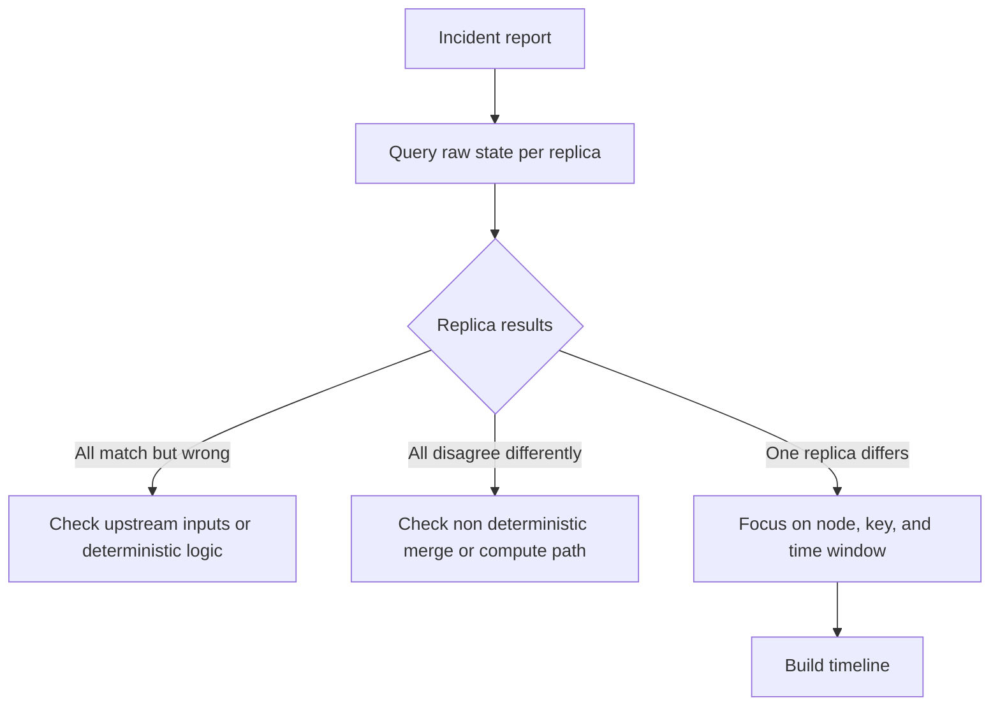
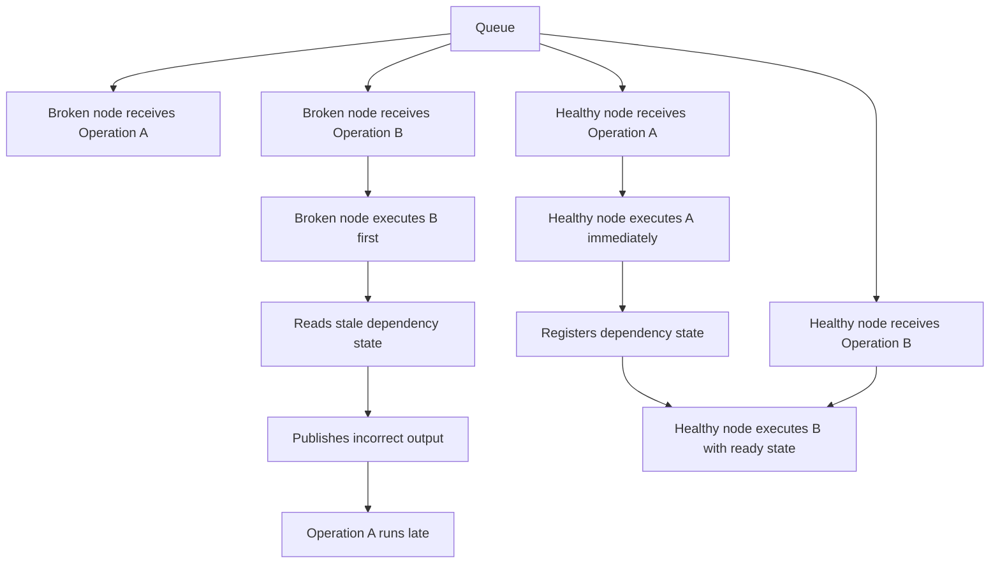

It was 2 AM. The system was healthy. Every dashboard was green. A report had come in earlier that day saying some numbers looked off, which is the kind of report you convince yourself is probably nothing until you are debugging it at 2 AM and it is very much not nothing.

Race conditions do not crash things. They do not leave stack traces. What they leave is doubt, a vague report from another team, and a specific kind of tired.

I have been here enough times that the investigation path is now muscle memory. This post is that path written down, with a real incident, a partial upsert race condition in Apache Pinot, walked through at each step.

## A quick primer on partial upserts in Apache Pinot

Pinot is an OLAP store built for realtime analytics at scale. By default it is append-only: every incoming event becomes a new row. The data stored in Pinot is fundamentally immutable in form of segment tar files. So how does it support upserts? It tracks a primary key index across segments in a metadata manager and maintains a pointer to the latest record for that primary key. During query time, only the latest record is fetched for the primary key while rest aere ignored.

Partial upserts are more surgical than full upserts. You define a merge function per column. One column might use `MAX` so only the latest value wins. Another might use `UNION` to accumulate a list. Each incoming record is merged field-by-field against the current best record for that key, which lives in the upsert metadata manager. If the metadata is incomplete when consumption begins, merges produce wrong output with no visible indication that anything went wrong.

The incident below is what happens when the metadata manager is missing a prior segment's keys at exactly the wrong moment.

---

## Why race conditions feel invisible in production

Most production safety checks are structural and not semantic.

So a record can be perfectly valid JSON with perfectly wrong values. A replica can look healthy while carrying one field populated from a stale branch of history. Every local check passes and the global behavior is still wrong. At root, race conditions are ordering failures and they only surface when timing shifts just enough under load spikes, rebalances, or thread pool contention to break an assumption that normally holds.

This is also why they find you at 2 AM which is the preferred time to do maintainence on clusters.

## The first move: establish raw ground truth

When an incident starts begin with raw state. Most distributed systems provide a way to bypass caches and normal query routing so you can ask a specific node what it has persisted for a key. You need to figure out the raw data stored in each node and if it actually diverges.  

The strongest race signal is narrow: one replica disagrees and the rest agree. When code and input are otherwise the same, the remaining explanation is state timing on that node during processing. That single finding shrinks your search space from the entire system to one node, one key, and one time window.



### What this looked like in practice

In a real incident on an Apache Pinot real-time table with partial upsert enabled, the first signal was a query anomaly. Pinot has a diagnostic mode called `skipUpsert=true` that bypasses the upsert view and exposes every record for the primary key. Running it across one server revealed this:

```sql
SET skipUpsert=true;
SELECT $hostName, $segmentName, $docId, recordTimestamp, mergedTimestamp
FROM EVENTS_REALTIME
WHERE primaryKey = '<key>'
ORDER BY $segmentName DESC
```

| $hostName | $segmentName | recordTimestamp | mergedTimestamp |
| :--- | :--- | :--- | :--- |
| server-1 | EVENTS\_REALTIME\_\_8\_\_SEG\_P | 1770576109677 | 1772011594948 |
| server-1 | EVENTS\_REALTIME\_\_8\_\_SEG\_M1 | 1770576109677 | **-9223372036854775808** |
| server-1 | EVENTS\_REALTIME\_\_8\_\_SEG\_M1 | 1770572866073 | **-9223372036854775808** |
| server-1 | EVENTS\_REALTIME\_\_8\_\_SEG\_M | 1770571942967 | 1770571943180 |

`-9223372036854775808` is `Long.MIN_VALUE`, the uninitialized default for a long column in Pinot's partial upsert. It means the merge never ran. Segment SEG\_M1 had consumed records that should have picked up `mergedTimestamp` from segment SEG\_M and instead wrote those rows with the raw default value.

Crucially, this anomaly appeared only on Server 1. Servers 0, 2, and 3 had consistent merged values for the same key. One server disagreed. That asymmetry was the entry point. From here the investigation had a precise scope.

## Building a timeline that can survive scrutiny

After scope is reduced I build a timeline with hard timestamps. This is the most important part of the entire process. The goal is to find the first moment where ordering diverged between the broken node and a healthy one. Everything before that moment is setup and everything after it is consequence.

I mostly looked for major events that happened in the lifecyle of SEG\_M1 across servers. Since I already knew we had unmerged data, it meant either the SEG\_M data was not present in the server when SEG\_M1 started consuming OR we had a bug in our code where we weren't handling merging correctly.



### The timeline on the broken node

From server-1's  lifecycle logs it was pretty hard to determine what went wrong. So I started comparing it against the healthy servers's logs and figure out all points of divergence. (I use Claude code heavily for such analysis)

Reconstructing Server 1's log sequence produced this exact divergence pattern side by side against the healthy servers.

**Servers 0, 2, 3 — normal path:**

```
T+00:00 — CONSUMING→ONLINE for SEG_M executed immediately on all three servers
T+00:01 — Snapshot for SEG_M1 starts: "Taking snapshot for N segments"
T+00:01 — SEG_M persisted in snapshot with ~12,000 doc IDs
T+01:00 — SEG_M1 starts consuming: ~7,000 events, SEG_M present in metadata
```

**Server 1 — the broken path:**

```
T+00:00 — OFFLINE→CONSUMING for SEG_M SCHEDULED
           (stuck in message queue for an extended period, never executed)
T+55:45 — OFFLINE→CONSUMING for SEG_M finally executes
           → "Segment SEG_M is already completed, skipping"
T+55:47 — Snapshot for SEG_M1 starts: "Taking snapshot for N-1 segments"
           (SEG_M is absent from the metadata manager)
T+56:50 — SEG_M1 starts consuming: ~32,000 events (large catchup batch)
           Partial upsert merges run without SEG_M's keys in metadata
T+83:42 — SEG_M finally added to upsert metadata via CONSUMING→ONLINE
           (27 minutes after SEG_M1 already started consuming)
```

The snapshot count was the concrete tell. Every other server logged `Taking snapshot for N segments`. Server 1 logged `Taking snapshot for N-1 segments`. One missing segment in one log line made the ordering failure undeniable rather than speculative.

I also noticed that SEG\_M never started consuming data on this server (since OFFLINE -> CONSUMING state transition was skipped). And when we finally downloaded the data committed by other servers for this segment (CONSUMING -> ONLINE), the SEG\_M1 had already started cosuming at this point. 

## Finding the guard that looked safe but was not

Once you know where ordering broke you can inspect coordination code with intent. In many systems there is already a guard, and that is why these bugs survive code review. The guard exists but enforces a weaker property than the runtime path needs.

The question I keep asking is simple: does this guard enforce ordering at the exact unit of work where correctness is defined? A startup latch protects cold start and says nothing about late arriving updates during normal operation. A global readiness flag tells you the service is broadly ready not whether a specific partition has loaded the segment this operation depends on.

### The one-shot latch that looked adequate

Pinot has a readiness latch in its table data manager that blocks consuming segments from starting until all existing segments are loaded at server startup. It looks like protection against ordering races. For cold start it is. For anything that happens afterward it provides no guarantee at all.

The latch is one-way. Once it flips to `true` it never rechecks. All four servers had passed this gate days before the incident:

| Server | Latch set | SEG\_M1 consumption start |
| :--- | :--- | :--- |
| Server 0 | Day 1, 13:19 | Day 3, 17:49 |
| Server 1 | Day 1, 08:41 | Day 3, 18:44 |
| Server 2 | Day 2, 22:49 | Day 3, 17:49 |
| Server 3 | Day 0, 23:00 | Day 3, 17:49 |

The gate was permanently open across the entire cluster. There was no mechanism to make a newly created consuming segment wait for the prior segment to finish registering in the upsert metadata manager. The guard existed and enforced exactly the wrong granularity. It was global and one shot while the correctness requirement was per partition and per segment-transition.

### How Server 1's bad data became everyone's problem

When SEG\_M1's commit cycle ran the next day, the controller selected Server 1 as the winning replica (since it had consumed to same offset as other servers) and pushed its segment to the distributed store. The other servers also had consumed to exact same offset so they were told to keep their local versions as long as they were same as Server-1s.

However, since Server 1 had consumed without SEG\_M's keys, its segment had materially different content. The other three servers detected a checksum mismatch while retaining segment and logged a warning about this. They then proceeded to replace their local correct version with incorrect version from Server 1 present in distributed store.

## Practical containment while investigation is in progress

It is 2 AM. The goal is not elegance. It is to stop creating new inconsistent state while you validate hypotheses. That can mean pausing a consumer group for affected partitions or routing writes through a stricter serialized path. 

Honestly, in this case the only way out was to reconsume the data. This however meant rolling back everything to a state a few days older than current one. We discussed the usecase and freshness mattered more than correctness there. We just did a reload on servers to ensure results were consistent across servers (even though incorrect)

### What the right fix looks like here

The one-shot startup latch needs to be replaced with something that enforces ordering at the right granularity: per partition, per segment transition, not once at boot.

The correct shape is a per-partition gate that blocks a new consuming segment from starting until the prior segment's state transition has been fully registered in the upsert metadata manager. Such a gate needs two cooperating halves: a blocking wait called before consumption begins and a signal emitted when the prior segment's transition completes. Both halves must cover every exit path: success, failure, and the skip-because-already-done case that tripped Server 1.

For Pinot, this kind of per-partition, per-segment ordering guarantee needs to apply to all partial upsert and dedup tables, not only tables where it has historically been opt-in. The startup latch can then be retired for these table modes entirely, since the stronger per-segment gate subsumes it.

I like to run repeated chaos-style timing tests around the repaired boundary after any such fix. The objective is not perfect certainty. It is confidence that ordering holds across realistic jitter and backlog, including the kind of prolonged message delay that triggered this incident.

## Improving observability for the next incident

You cannot design away every race condition but you can design for faster diagnosis. When a worker starts processing, log what state it can see, not only that it started. Include dependency counts and sequence markers that explain readiness at that moment.

In the Pinot incident, the `Taking snapshot for N segments` log line, a count rather than a boolean, was what made the divergence visible in minutes rather than hours. A binary `snapshot taken` log would have been useless. Similarly, `skipUpsert=true` exposed per-segment divergence that the normal upsert view would have hidden entirely. And the Helix message timestamps, creation time and execution start time embedded in each message, made the delay immediately calculable rather than estimated. We also added metrics to ensure any such inconsistency gets flagged in grafana.

Log counts not booleans. Preserve raw read tools. Record causal identifiers at async boundaries. Those three habits change incident duration more than anything else. 

## A compact 2 AM checklist

1. Confirm divergence from raw node state first
2. Narrow to one node, one key, and one time window
3. Reconstruct broken and healthy timelines side by side
4. Pinpoint the first ordering break then inspect that guard
5. Contain spread before starting broader cleanup

## Conclusion

Race condition debugging is disciplined reconstruction of time. Confirm divergence from raw state. Narrow to the smallest failing boundary. Build the timeline until the first ordering break is undeniable. Then inspect the guard at the correct granularity.

The Pinot incident illustrated every step. A `Long.MIN_VALUE` in one field pointed to one missing segment in one snapshot. The snapshot count made the race undeniable. The message timestamps made the delay measurable. And the root cause was a guard enforcing the right property at the wrong scope, startup-global instead of per-partition-per-segment.

When you follow that loop the work becomes calmer. The system may still fail in surprising ways at surprising hours. But the investigation starts from method and method is what turns a 2 AM into a 3 AM instead of a 7 AM.
