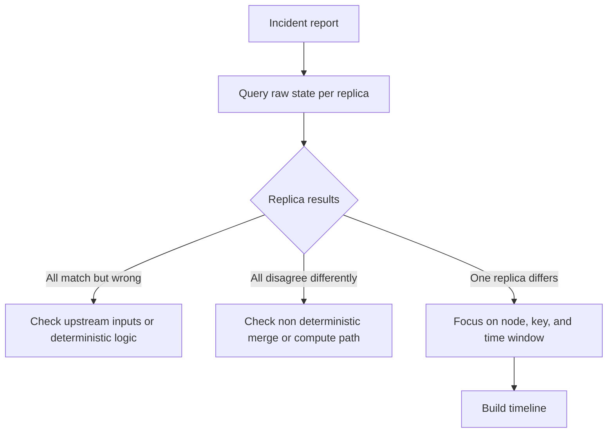
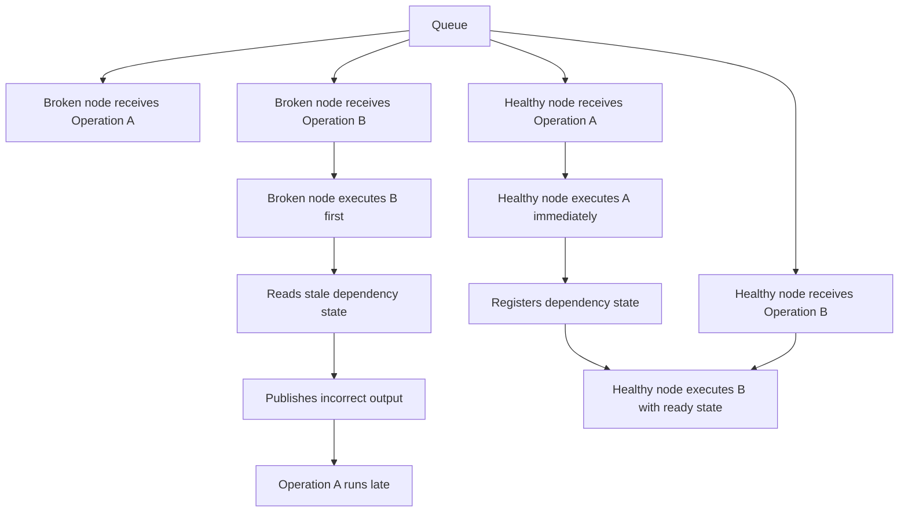

Race conditions in distributed systems rarely introduce themselves politely. They do not crash the process and they do not leave behind an obvious stack trace. What they do leave is doubt. A report comes in saying numbers look off in one dashboard. Another team says one customer record looks stale. Nobody can reproduce it on demand and by the time you look everything appears healthy.

That is the shape of the problem. The system still runs and most requests still return something sensible. But one operation on one node happened at the wrong moment and now you are carrying silent data damage.

I have been pulled into this exact situation many times. The first few incidents felt random and chaotic. Over time the same pattern kept showing up. The symptoms looked different but the investigation path was surprisingly stable. This post is that path written down in the order I wish I had learned it.

## Why race conditions feel invisible in production

Most production safety checks are structural. They confirm the data shape is valid and that writes are acknowledged. They do not prove that every dependency completed before downstream work began.

So a record can be perfectly valid JSON with perfectly wrong values. A table can pass schema checks while containing yesterday state. A replica can look healthy while carrying one field populated from a stale branch of history.

This is why teams lose days on these incidents. Engineers inspect code paths and see no obvious bug. SREs inspect cluster health and see green dashboards. Data teams run ad hoc queries and only find weak hints of inconsistency. Every local check passes and the global behavior is still wrong.

At root race conditions are ordering failures. One operation assumes another operation already finished. Under normal timing that assumption often holds. Under load spikes rebalances thread pool contention or long garbage collection pauses timing shifts just enough to break the assumption.

## The first move: establish raw ground truth

When an incident starts I do not begin with theories. I begin with raw state. Most distributed systems provide a way to bypass caches and normal query routing so you can ask a specific node what it has persisted for a key. That path matters more than any log search in the first hour.

If all replicas return the same wrong value the issue may still be serious but it is usually not a replica timing race. You might be looking at bad upstream input or deterministic processing logic that produced the wrong answer everywhere.

If replicas disagree in many different ways you may be dealing with non deterministic computation or unstable merge logic. That is another class of bug and the fix strategy is different.

The strongest race signal is narrower. One replica disagrees and the rest agree. When code and input are otherwise the same the remaining explanation is state timing on that node during processing.

This single finding shrinks your search space dramatically. Instead of asking what in the system is wrong you can ask what happened on this node for this key in this time window.

## Building a timeline that can survive scrutiny

After scope is reduced I build a timeline with hard timestamps. This step is tedious and it is the most important part of the entire process.

Suppose Operation A loads dependency state. Operation B writes a derived value. Operation C publishes the record. On a broken node you may find A queued at 14:30:01.003 then B queued at 14:30:01.450. B executes at 14:30:02.802 while A is still pending. C starts at 14:30:03.190 and publishes at 14:30:03.400 based on stale input. A finally runs at 14:47:12.004 after queue congestion clears.

Now compare that with a healthy node for the same key. A executes quickly and registers metadata before C starts. B and C run with complete state and the output is correct.

When engineers skip this side by side comparison they often patch the wrong place. The divergence point in time is the actual bug boundary. Everything before it is setup and everything after it is consequence.

I also look for state volume markers in logs. Lines such as initialized with metadata from K entities or snapshot contains K records can expose missing prerequisites more clearly than generic event names. If the broken node reports lower counts at the same logical phase you have a concrete lead rather than a vague suspicion.

## Finding the guard that looked safe but was not

Once you know where ordering broke you can inspect coordination code with intent. In many systems there is already a guard and that is why these bugs survive code review. The guard exists but enforces a weaker property than the runtime path needs.

A startup latch is a classic example. It blocks processing until dependencies load at boot then never checks again. That protects cold start and says nothing about late arriving dependency updates during normal operation.

Another common trap is a global readiness flag. It can tell you the service is broadly ready and it cannot tell you whether partition 214 has loaded the previous segment that this operation depends on.

Message delivery order is often treated as a guarantee when it is only an observation from calm periods. Under backpressure delivery can reorder or delay enough to violate assumptions in downstream handlers.

Time based waits have similar fragility. Waiting 30 seconds before serving reads feels safe until one dependency takes 31 seconds.

The question I keep asking in code review is simple. Does this guard enforce ordering at the exact unit of work where correctness is defined.

## How one node incident turns into system wide corruption

The painful part of distributed races is amplification. A single bad write does not stay isolated once consistency machinery starts reconciling replicas.

If conflict resolution chooses the wrong version as winner that version can become canonical and replication then spreads it faithfully. Anti entropy processes are doing their job from the system perspective. They are converging state and convergence does not know which value is semantically correct.

Later maintenance may erase recovery options. Compaction can drop older versions and TTL can remove evidence that would have helped reconstruction. By the time humans notice the incident the cluster may be internally consistent and externally wrong.

This is why urgency matters. Early containment can prevent cluster wide propagation even before root cause is fully confirmed.

## Practical containment while investigation is in progress

During incident response you may need to slow the system down to protect data quality. Depending on architecture that can mean pausing a consumer group for affected partitions or temporarily routing writes through a stricter serialized path.

The goal is not elegance. The goal is to stop creating new inconsistent state while you validate hypotheses.

I also recommend tagging affected keys and time windows immediately. Even a rough list helps later when you need targeted repair and post incident reporting.

If the system supports versioned reads use that capability early. It can help verify when corruption began and whether replicas converged onto bad state or diverged independently.

In practice I keep a short containment runbook nearby:

- Freeze blast radius first by isolating affected partitions or tenants
- Preserve evidence by capturing node local raw reads before repair jobs
- Record key ranges and time windows so remediation stays precise
- Reopen traffic only after timeline and guard failure are both understood

## Choosing a durable fix instead of a patch

After root cause is clear the best fix is often narrower than teams expect. You do not always need broad locking or heavy global coordination.

Prefer per entity synchronization where dependencies are local. Ensure every wait has a matching signal on success failure and no op paths. Missing one signal path can trade corruption bugs for deadlocks.

Then test under injected delays at the exact points that failed in production. A fix that passes only ideal timing is not a fix yet.

I like to run repeated chaos style timing tests around the repaired boundary. The objective is not perfect certainty and it is confidence that ordering holds across realistic jitter and backlog.

## Improving observability for the next incident

You cannot design away every race condition and you can design for faster diagnosis. Better logs and better debug paths change incident duration more than heroic intuition.

When a worker starts processing log what state it can see and not only that it started. Include dependency counts and sequence markers that explain readiness at that moment.

Preserve node specific raw read tools in production environments with clear access controls. Without raw reads you are trying to debug distributed state through a routed abstraction that may hide the exact divergence you need.

Record sequence numbers and causal identifiers at boundaries where asynchronous work crosses queues or thread pools. Those identifiers make timeline reconstruction far more reliable when traffic is high.

## A compact 2 AM checklist

If you are deep in incident response and need a quick reset this order usually keeps the investigation honest:

1. Confirm divergence from raw node state first
2. Narrow to one node one key and one time window
3. Reconstruct broken and healthy timelines side by side
4. Pinpoint the first ordering break then inspect that guard
5. Contain spread before starting broader cleanup

## Conclusion

Race condition debugging is less about brilliance and more about disciplined reconstruction of time. Confirm divergence directly from raw state. Narrow scope to the smallest failing boundary. Build the timeline until the first ordering break is undeniable. Inspect the coordination guard at the correct granularity and then verify how bad state propagated.

When you follow that loop incident after incident the work becomes calmer. The system may still fail in surprising ways but your investigation no longer starts from chaos. It starts from method and that method is what turns a long night into a solved problem.
