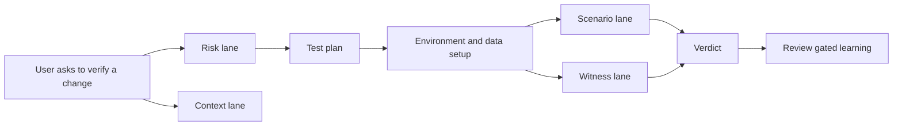

I am still working on this project, so treat this as an in progress dump rather than a polished "here is the thing I built" post. The shape is changing quickly while a lot of the interesting parts are still half design, half scars from the last run.

I started from a slightly uncomfortable place. Codex and Claude Code have ramped up implementation speed so much that typing code is no longer the part that feels scarce.

That sounds like a nice problem to have until the output starts piling up. A model can scaffold a feature, wire a CLI, write docs, add tests and produce a convincing final answer in one sitting, but the review loop still does not solve the part that actually creates trust: end to end verification.

The result is a weird new bottleneck. PRs can pile up with endless AI reviews, follow-up comments and plausible suggestions, while human approvals still lag because nobody has enough confidence that the thing was exercised through the path users will actually hit.

So I wanted to see how far I could push the next step. If AI can help me write code faster, can it also help me verify code more honestly?

Not just by running a test command and calling it a day. I wanted something closer to how a skeptical engineer would approach a risky change: run the thing, drive it through the path a user would hit, look at the logs, check the live config, compare the output and then decide whether the behavior actually happened.

The first iteration of this project is my attempt at building that loop.

## The first version had too much architecture cosplay

The first version came out of the machine exactly the way AI projects often do. It was ambitious, broad and slightly drunk on taxonomy.

There were skills for every category of verification I could imagine. There were agents for planning, static analysis, scenario validation, context watching, bug reproduction and report writing. The structure looked serious because it had a lot of named parts.

Then I read back through the sessions that built the project and the real pattern was obvious. The first useful correction was not "add more agents." It was "why do these agents exist?"

An agent is useful when it owns work that can happen independently. Watching changing context while a run is active is independent. Reading a diff for risk while an environment is starting is independent. Running a scenario is independent from a read only witness that watches logs and metrics.

But an agent whose whole job is to wrap one checklist is mostly ceremony. It makes the system look distributed without making the work more parallel.

That was the first design correction: **agents are work lanes, skills are reusable playbooks and the CLI is the shared tool surface**.



That diagram looks cleaner than the early repo did, which is usually a sign that the early repo was trying too hard.

## The agents became lanes instead of personalities

The agent split only started making sense once I stopped treating agents like characters and started treating them like **lanes of work**.

The static risk lane reads the change and predicts where reality might disagree with the author's intent. It does not mutate the environment. Its job is to say "this config default changed", "this fallback path now matters", "this new class needs a witness" or "this old behavior might break if an existing user upgrades."

The context lane watches everything outside the code while the run is happening. A review comment, incident note, design doc update or release thread can change the shape of the verification. This lane should not own execution because its value is staying light enough to run beside the heavier work.

The scenario lane is the one that actually drives the system. It creates state, feeds inputs, calls APIs, runs jobs, restarts components and checks the visible result. This is the lane that has to think like a user rather than a unit test.

The witness lane is deliberately read only. It watches the same run from the side and asks whether the intended runtime path actually executed. Logs, metrics, live config and class loading evidence all belong here.

The fuzz lane comes later, after the deterministic scenarios are already believable. Its job is to explore operation interleavings from seeds, keep the schedules reproducible and shrink any failure into something a human can inspect.

I like this split because each lane has a reason to run in parallel. It is not parallelism for the aesthetic. It is parallelism where the work does not share ownership of the same mutable thing.

## The skills became the toolbox

The skills ended up being much more numerous than the agents because skills are smaller units of reusable method.

Some skills are about **planning**. They classify the change, turn risks into a test matrix and make sure the approval plan says what is being proven in human language rather than internal ids.

Some skills are about **environment and data**. They start the local system, generate deterministic inputs, stand up external dependencies when the real path needs them and keep enough state around that a later run can be reproduced.

Some skills are **oracles**. They compare query or request output, snapshot live state, assert invariants and separate hard violations from missing evidence. This matters because a model should not be allowed to collapse "collector unavailable" into "everything passed."

Some skills are about **operational behavior**. They build deterministic schedules for reloads, restarts, retention, background jobs, concurrent operations and other annoying things that usually get tested by vibes until they break in production.

Some skills are about **compatibility and regression shape**. They look at old configs, invalid inputs, renamed keys, changed defaults and public behavior that might surprise an existing user even if the new code works for the happy path.

Some skills are about **reproduction and reporting**. If a run finds something suspicious, the next useful artifact is not a paragraph of concern. It is a smaller repro, the command that triggers it, the evidence that proves it failed for the intended reason and a report that preserves gaps without turning them into drama.

And then there is the learning skill, which is really a guardrail around memory. It lets the system propose improvements to its own playbooks, but only through review gated changes.

That split made the system easier to reason about. Agents answer "what work can happen independently?" Skills answer "what method do we reuse when this class of problem appears again?"

## The boring CLI was the point

The second correction was making the CLI boring.

I did not want the command line tool to become the brain of the system. The agents should decide what needs to be investigated. The reusable playbooks should describe how a class of investigation works. The CLI should just provide stable verbs for the repetitive parts that every serious verification run needs.

That meant the CLI surface had to stay practical:

```text
validate the framework
generate deterministic data
start a local environment
run a query or request
compare expected and actual output
snapshot live state
wait for a readiness condition
record a learning proposal
```

There is nothing magical in that list because that is the point. The interesting part is not the command names. The interesting part is forcing the agent to use a shared, inspectable tool instead of inventing another one off script every time it needs evidence.

The project became more useful once I stopped asking "how many agents can I create?" and started asking "what commands do I wish existed every time I need to prove a change actually works?"

## A green check is not the same as proof

The biggest turn in the project came from a specific failure mode that shows up everywhere once you start looking for it.

A request can return HTTP 200. A query can return the expected rows. A background job can finish. A dashboard can go green. All of that can still fail to prove that the new code path ran.

That is the verification gap I care about.

The feature flag might never have been enabled, the new class might exist on disk without ever loading, the system might have fallen back to the old implementation or the right answer might have come from a slower generic path while the optimized path never executed. That is the kind of false green that wastes the most time because the test looks successful until someone reads the logs later and realizes it proved the wrong thing.

So the first iteration grew an **execution witness** lane.

The scenario lane mutates the system. It creates state, sends inputs, triggers workflows and checks the user visible output. The witness lane stays read only. It watches logs, metrics, live configs and runtime signals for evidence that the intended path executed.

The witness contract is intentionally concrete:

```json
{
  "witness": {
    "must_log": [
      {"component": "worker", "pattern": "NewProcessor: handled request .*", "min_count": 1}
    ],
    "must_not_log": [
      {"component": "worker", "pattern": "falling back to legacy processor"}
    ],
    "must_class_load": [
      "com.example.runtime.NewProcessor"
    ],
    "must_metric_delta": [
      {"component": "worker", "metric": "new_processor.requests", "op": ">", "value": 0}
    ],
    "config_assertion": [
      {"endpoint": "/config/live", "json_path": "features.new_processor.enabled", "equals": true}
    ]
  }
}
```

The important part is not the JSON. The important part is the rule behind it: a test with a witness block cannot be marked `PASS` until the witness passes too.

That is a very different bar from "the command returned zero." It asks the model to prove that the interesting thing happened, not just that the visible output looked acceptable.

## The plan had to be readable by a tired human

Another thing I had to fix was the shape of the planning output.

Early AI generated plans love internal identifiers. They produce tables full of `R7`, `B3`, `T12`, terse labels and references that only make sense if you already read the hidden JSON. That is fine for machine state. It is terrible for human approval.

The human review point matters because this is where the system decides what proof it is going to collect. If the approval table is unreadable, I am not really approving the plan. I am trusting the model's summary of its own plan, which is exactly the kind of thing I am trying to avoid.

So I pushed the user facing plan toward plain language:

| Bad approval surface | Better approval surface |
| --- | --- |
| `risk: R9` | "feature flag is set but runtime still uses the old path" |
| `scenario: B4` | "restart one worker while the job is actively processing data" |
| `dataset: D2` | "mixed valid and invalid records with duplicate ids" |
| `witness: W5` | "worker log must show the new handler and must not show fallback" |

The internal ids can still exist in the JSON because machines need stable handles. The reviewer should not have to read them. The reviewer should see what the test is trying to prove, why it matters and what evidence would make the result trustworthy.

I am still thinking through what the right review surface should be here. A markdown table is good enough for the first version, but I can imagine publishing the plan as a Google Sheet so the cases, risks, owners, evidence and verdicts are easy to filter. I can also imagine an HTML like output that makes the approval flow feel closer to a lightweight QA dashboard, where a reviewer can scan the plan, expand the evidence and see which witnesses are blocking a real pass.

I do not know which one is right yet. The important constraint is that the human should be reviewing the shape of the proof, not deciphering the model's private bookkeeping.

That change sounds like UX polish, but I think it is part of verification. A plan that cannot be reviewed is just another way for the model to smuggle assumptions into the run.

## The environment had to become real enough to lie

Once I accepted that the project was about runtime proof, the local environment harness had to grow up.

The early model was too small. A single process is useful for a smoke test, but it is not enough for a lot of real behavior. Replication needs multiple workers. Background jobs need background processes that are actually running. Restart scenarios need components that can be stopped and rejoined without killing the whole system.

That pushed the harness away from "one process id in a file" and toward a component registry.

```json
[
  {
    "role": "primary",
    "index": 0,
    "pid": 1234,
    "logPath": ".qa-runs/clusters/demo/primary.log",
    "ports": {"http": 9000},
    "startedAtMs": 1700000000000
  },
  {
    "role": "worker",
    "index": 1,
    "pid": 1235,
    "logPath": ".qa-runs/clusters/demo/worker-1.log",
    "ports": {"http": 9100},
    "startedAtMs": 1700000001000
  }
]
```

The boring details mattered more than I expected. Side processes needed unique ports. They needed isolated data directories. The harness had to discover the actual runtime identity of a component after it registered, because the id the system chose at startup was not always the id I would have guessed from the command line.

That bug class is exactly why local verification tools need to be real enough to lie. If two workers share the same default data directory, a recovery scenario can pass for a fake reason. The file is already local, so the network fetch or rebuild path you wanted to test never runs.

That is not a product bug. That is a bad test shape, but it is still dangerous because it produces confidence.

## I started treating blocked as a real verdict

One of the quieter changes I liked was making the system less eager to be helpful.

When an environment cannot answer the question being asked, the correct verdict is often `BLOCKED`. Not "mostly passed." Not "passed with a note that the important part did not run." Blocked.

That sounds obvious until you watch AI tools work. Models are very good at finding adjacent work. If the real environment cannot start, they run a unit test. If the real dependency is unavailable, they mock it. If the real config cannot be applied, they inspect the file and infer what should happen.

All of those can be useful developer activities, but they are not the same as runtime verification.

So I started pushing the framework toward a simple rule: **do not silently answer a different question**.

If the requested proof requires a real dependency and the dependency is missing, say that. If the proof requires a multi process topology and the local harness only launched one process, say that. If the path is feature flag gated and no witness can prove the flag was live, say that.

The point is not to be dramatic. The point is to keep uncertainty in the output instead of laundering it into a green check.

## The useful part was the correction loop

The repo changed because the sessions kept correcting the model.

One session pushed the framework away from too many agents. Another pushed it away from running tests as a substitute for user facing behavior. Another corrected a plan that staged downstream artifacts by hand because that was not the same as exercising the real path. Later sessions added external dependency recipes because skipping the external system is often just another way to test the bypass.

That loop mattered more than any one file.

The AI was very good at generating structure. It was less naturally good at knowing which structure was honest. The useful pattern was forcing every abstraction to answer a verification question:

- Does this make runtime evidence easier to collect?
- Does this reduce repeated setup mistakes?
- Does this prevent a false green?
- Does this make a later run more reproducible?
- Does this keep the human approval point where it belongs?

When the answer was no, the structure usually had to be deleted or demoted.

## Real runs made the framework less theoretical

The first iteration became much more interesting once it started running against real local systems.

The ingestion style runs forced the dependency story to become real because topics, payloads, schemas and consumer config all had to work before behavior could be judged. The file reader runs pushed the dataset story because "generate a file" is not the same as generating the weird edge cases that break a reader. The stateful runs corrected the target implementation when the first plan was aimed at the wrong path.

The clearest runs were the ones that ended with gaps.

That sounds backwards, but it is the part I trust most. A run that says "the visible behavior passed, but this witness could not prove the new path because the metric endpoint was missing" is more useful than a fake green. It says what was proven, what was not and which missing proof should become the next framework improvement.

That is the most useful shape I got from this iteration: **the framework does not just produce a verdict, it produces better future verification machinery**.

## Learning needed a brake pedal

One problem with agent based QA is that every run teaches you something while session compaction is very good at making those lessons disappear.

So I added a review gated learning loop where the word "review" matters. I do not want the system silently rewriting its own instructions every time a run goes sideways. That would make the repo drift based on whatever one model happened to infer from one bad run.

Instead, the agent can propose durable changes as JSON: patch this playbook, add this reference, update this agent instruction, validate with these commands. The CLI can render the proposal, validate the target paths and apply it only when explicitly approved.

That turned repeated mistakes into controlled updates. Bad setup assumptions became recipes. Weak witness patterns became better witness recipes. Harness bugs became concrete checks. None of that had to live only in chat history.

This is also where AI starts feeling less like a code generator and more like a QA apprentice with a notebook. The notebook is not trusted automatically, but it is still useful.

## Verification wants a different kind of AI

The biggest lesson is that verification has a different shape from generation.

Generation rewards breadth. Verification rewards friction. It asks annoying questions, refuses fallbacks, records gaps and treats "I got the right answer" as weaker than "I got the right answer through the path I intended to test."

That means an AI verification system needs a different personality from an AI coding system. It should be more suspicious. It should prefer runtime evidence over plausible reasoning. It should preserve blocked states instead of smoothing them into success. It should make the cheap path harder when the cheap path would answer the wrong question.

The uncomfortable part is that this makes the system feel slower in the moment. It asks for logs when a summary would be faster. It asks for a live config when a source file looks obvious. It asks for a witness when the output already looks right because that friction is the feature.

That is backwards from the usual coding assistant experience, but I think it is the right trade.

I still do not know how far this goes. The current version is not some grand autonomous QA engine. It is a local verification driver with a CLI, a few useful work lanes, a runtime witness idea and a learning loop that needs human approval.

But that already feels like a meaningful direction.

If coding is getting faster, the next bottleneck is deciding what to trust. I do not think the answer is "let the model write more tests." The answer is closer to building systems that force the model to gather evidence, explain gaps and prove that the interesting code actually ran.

The next thing I am thinking about is how to make this easier for my teammates to use without turning it into another thing they have to babysit. Maybe that means a GitHub Action that auto triggers on certain PRs and publishes a readable verification plan or report. Before I can do that seriously, I need to make the loop cheaper and faster, because an expensive slow verifier will become shelfware no matter how correct the idea is.

That is the part I want to keep pushing on: not just whether AI can generate the code, but whether it can help make the proof cheap enough that people actually use it.
