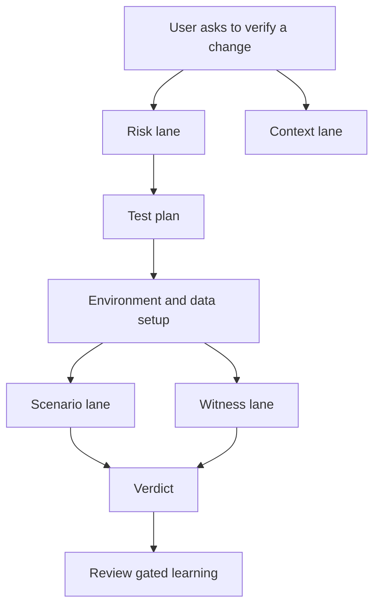

<svg width="0" height="0" style="position:absolute" aria-hidden="true">
  <defs>
    <filter id="qa-doodle-wobble" x="-8%" y="-8%" width="116%" height="116%">
      <feTurbulence type="fractalNoise" baseFrequency="0.032" numOctaves="2" seed="23" result="noise"/>
      <feDisplacementMap in="SourceGraphic" in2="noise" scale="2.8"/>
    </filter>
  </defs>
</svg>

I am still working on this project, so treat this as an in progress dump rather than a polished YC announcement posst. The shape is changing quickly while a lot of the interesting parts are still half design, half scars from the last run.

I started from a slightly uncomfortable place. Codex and Claude Code have ramped up implementation speed so much that me and my teammates are ending up with tens of PRs lying around waiting for approvals.

Why is that? Especially when AI code reviewers have also gotten better. It's cause the review loop still does not solve the part that actually creates trust i.e. end to end verification. People don't trust the PR author themselves have done it (and they are right, pffft)

So I wanted to see how far I could push the next step. If AI can help me write code faster, can it also help me verify code more honestly? Not just by writing a lazy test with everything mocked(something i am also trying to fix) then running a test command and calling it a day. I wanted something closer to how a skeptical engineer would approach a risky change: run the thing, drive it through the path a user would hit, look at the logs, check the live config, compare the output and then decide whether the behavior actually happened.

The first iteration of this project is my attempt at building that loop.

<figure class="wbw-explainer" role="img" aria-label="A cheerful coding robot rapidly sends pull requests down a conveyor belt. At the end, one tired human reviewer sits behind a growing mountain of pull requests with a tiny trust meter.">
<svg viewBox="0 0 680 330">
  <g filter="url(#qa-doodle-wobble)">
    <path class="wbw-thin" d="M23,271 Q178,267 343,271 T657,269"/>
    <circle class="wbw-line" cx="93" cy="107" r="29"/>
    <rect class="wbw-thin" x="81" y="96" width="24" height="17" rx="3"/>
    <path class="wbw-thin" d="M93,78 L93,66 M86,66 L100,66 M80,120 Q93,132 106,120"/>
    <path class="wbw-line" d="M93,136 L93,201 M93,153 L55,176 M93,153 L139,172 M93,201 L74,244 M93,201 L112,244"/>
    <path class="wbw-line" d="M138,172 L172,155"/>
    <path class="wbw-blue" d="M164,147 L180,163 M180,147 L164,163"/>
    <path class="wbw-line" d="M154,225 L445,225 M154,258 L445,258"/>
    <circle class="wbw-thin" cx="184" cy="242" r="15"/><circle class="wbw-thin" cx="257" cy="242" r="15"/><circle class="wbw-thin" cx="330" cy="242" r="15"/><circle class="wbw-thin" cx="403" cy="242" r="15"/>
    <rect class="wbw-card" x="161" y="181" width="68" height="43" rx="3" transform="rotate(-1 195 202)"/>
    <rect class="wbw-card" x="235" y="180" width="68" height="44" rx="3" transform="rotate(1 269 202)"/>
    <rect class="wbw-card" x="309" y="180" width="68" height="44" rx="3" transform="rotate(-1 343 202)"/>
    <rect class="wbw-card" x="383" y="180" width="68" height="44" rx="3" transform="rotate(1 417 202)"/>
    <rect class="wbw-card" x="451" y="194" width="72" height="55" rx="3" transform="rotate(-4 487 221)"/>
    <rect class="wbw-card" x="466" y="142" width="72" height="55" rx="3" transform="rotate(2 502 169)"/>
    <rect class="wbw-card" x="449" y="91" width="72" height="55" rx="3" transform="rotate(-2 485 118)"/>
    <rect class="wbw-card" x="478" y="42" width="72" height="55" rx="3" transform="rotate(3 514 69)"/>
    <circle class="wbw-line" cx="590" cy="155" r="15"/>
    <path class="wbw-line" d="M590,170 L590,222 M590,183 L561,204 M590,183 L619,204 M590,222 L574,258 M590,222 L606,258"/>
    <path class="wbw-thin" d="M581,153 L587,157 M599,153 L593,157 M584,165 Q590,159 596,165"/>
    <path class="wbw-thin" d="M553,282 L632,282 M553,282 L553,300 M632,282 L632,300"/>
    <path class="wbw-red" d="M561,291 L568,291"/>
  </g>
  <text x="93" y="36" text-anchor="middle" font-size="13" class="wbw-blue-text">CODING SPEED</text>
  <text x="195" y="208" text-anchor="middle" font-size="11">PR #41</text>
  <text x="269" y="208" text-anchor="middle" font-size="11">PR #42</text>
  <text x="343" y="208" text-anchor="middle" font-size="11">PR #43</text>
  <text x="417" y="208" text-anchor="middle" font-size="11">PR #44</text>
  <text x="487" y="225" text-anchor="middle" font-size="11">PR #45</text>
  <text x="502" y="173" text-anchor="middle" font-size="11">PR #46</text>
  <text x="485" y="122" text-anchor="middle" font-size="11">PR #47</text>
  <text x="514" y="73" text-anchor="middle" font-size="11">PR #48</text>
  <text x="590" y="41" text-anchor="middle" font-size="13" class="wbw-muted">one reviewer</text>
  <text x="592" y="316" text-anchor="middle" font-size="12" class="wbw-red-text">TRUST METER</text>
</svg>
<figcaption>implementation got a conveyor belt. trust still had one tired human.</figcaption>
</figure>

## The first version had too much architecture spaghetti

The first version came out of the machine exactly the way AI projects often do. It was ambitious, broad and slightly drunk on taxonomy.

There were skills for every category of verification I could imagine. There were agents for planning, static analysis, scenario validation, context watching, bug reproduction and report writing. The structure looked serious because it had a lot of named parts. I was iterating on the idea in my notebook, then I handed that off to GPT-5.5-Pro to come up with a plan, iterated on that for a few days. Then I handed that plan over to Codex's /goal which worked on it for around 10 hours. 

I started using it and realised claude would always get confused which skills to pick and agents to invoke at what that. I read back through the sessions that built the project and the real pattern was obvious. The first useful correction was not "add more agents." It was "why do these agents exist?"

An agent is useful when it owns work that can happen independently. Watching changing context while a run is active is independent. Reading a diff for risk while an environment is starting is independent. Running a scenario is independent from a read only witness that watches logs and metrics.

But an agent whose whole job is to wrap one checklist is mostly ceremony. It makes the system look distributed without making the work more parallel.

<figure class="wbw-explainer" role="img" aria-label="One overwhelmed robot wears six agent hats and is tangled in cords connecting planning, reporting, static analysis, scenario validation, reproduction and context watching. A sign says parallel work zero.">
<svg viewBox="0 0 680 330">
  <g filter="url(#qa-doodle-wobble)">
    <circle class="wbw-line" cx="340" cy="118" r="31"/>
    <rect class="wbw-thin" x="326" y="107" width="28" height="18" rx="3"/>
    <path class="wbw-thin" d="M340,87 L340,73 M332,73 L348,73 M326,132 Q340,144 354,132"/>
    <path class="wbw-line" d="M340,149 L340,225 M340,166 L286,190 M340,166 L394,190 M340,225 L314,275 M340,225 L366,275"/>
    <path class="wbw-line" d="M311,91 Q340,61 369,91 L358,68 L326,68 Z"/>
    <path class="wbw-blue" d="M286,190 Q244,160 211,128 M394,190 Q436,159 469,128"/>
    <path class="wbw-red" d="M298,174 Q246,220 204,238 M382,174 Q431,221 477,238"/>
    <path class="wbw-green" d="M316,158 Q271,115 221,82 M364,158 Q410,114 459,82"/>
    <rect class="wbw-card" x="45" y="45" width="156" height="54" rx="4" transform="rotate(-2 123 72)"/>
    <rect class="wbw-card" x="476" y="44" width="157" height="54" rx="4" transform="rotate(2 555 71)"/>
    <rect class="wbw-card" x="38" y="116" width="169" height="54" rx="4" transform="rotate(1 123 143)"/>
    <rect class="wbw-card" x="475" y="116" width="168" height="54" rx="4" transform="rotate(-1 559 143)"/>
    <rect class="wbw-card" x="43" y="198" width="160" height="54" rx="4" transform="rotate(-1 123 225)"/>
    <rect class="wbw-card" x="479" y="199" width="157" height="54" rx="4" transform="rotate(1 558 226)"/>
    <path class="wbw-dash" d="M302,207 Q264,246 302,274 Q343,303 380,271 Q410,246 379,206 Q349,181 318,209 Q294,230 315,248 Q341,266 359,246 Q371,229 354,218"/>
    <rect class="wbw-card" x="256" y="285" width="169" height="34" rx="3"/>
  </g>
  <text x="123" y="78" text-anchor="middle" font-size="13">planning agent</text>
  <text x="555" y="77" text-anchor="middle" font-size="13">reporting agent</text>
  <text x="123" y="149" text-anchor="middle" font-size="13">static analysis agent</text>
  <text x="559" y="149" text-anchor="middle" font-size="13">scenario agent</text>
  <text x="123" y="231" text-anchor="middle" font-size="13">reproduction agent</text>
  <text x="558" y="232" text-anchor="middle" font-size="13">context agent</text>
  <text x="340" y="306" text-anchor="middle" font-size="13" class="wbw-red-text">PARALLEL WORK: 0</text>
</svg>
<figcaption>the first architecture was mostly one robot changing hats very quickly</figcaption>
</figure>

That was the first design correction: **agents are work lanes, skills are reusable playbooks and the CLI is the shared tool surface**.



## Getting the agent split right

The agent split only started making sense once I stopped treating them like a wrapper on skills but more like a single unit of work that could be done in parallel without rotting the context of main session. 

The static risk lane reads the change and predicts where reality might disagree with the author's intent. It does not mutate the environment. Its job is to say "this config default changed", "this fallback path now matters" or "this old behavior might break if an existing user upgrades."

The context lane watches everything outside the code while the run is happening. A review comment, incident note, design doc update or release thread can change the shape of the verification. This lane should not own execution because its value is staying light enough to run beside the heavier work. It also gathers past issues observed in this code path reported in Slack or RCAs

The scenario lane is the one that actually drives the system. It creates state, feeds inputs, calls APIs, runs jobs, restarts components and checks the visible result. This is the lane that has to think like a user rather than a unit test.

The witness lane is deliberately read only. It watches the same run from the side and asks whether the intended runtime path actually executed. Logs, metrics, live config and class loading evidence all belong here. I'll expand more on this later in this blog

The fuzz lane comes later, after the deterministic scenarios are already believable. It's job is to run multiple cluster or table altering operations like pod restarts, table rebalance etc. in parallel and check that our state does not corrupt and invariants are preserved. It should not be like after restart we start getting different data in query response.

I like this split because each lane has a reason to run in parallel.

## The skills became the toolbox

The skills ended up being much more numerous than the agents because skills are smaller units of reusable method.

Some skills are about **planning**. They classify the change, turn risks into a test matrix and make sure the approval plan says what is being proven in human language rather than internal ids.

Some skills are about **environment and data**. They start the local system, generate deterministic inputs, stand up external dependencies when the real path needs them and keep enough state around that a later run can be reproduced.

Some skills are **oracles**. They compare query or request output, snapshot live state, assert invariants and separate hard violations from missing evidence. This matters because a model should not be allowed to collapse "collector unavailable" into "everything passed."

Some skills are about **operational behavior**. They build deterministic schedules for reloads, restarts, retention, background jobs, concurrent operations and other annoying things that usually get tested by vibes until they break in production.

Some skills are about **compatibility and regression shape**. They look at old configs, invalid inputs, renamed keys, changed defaults and public behavior that might surprise an existing user even if the new code works for the happy path.

Some skills are about **reproduction and reporting**. If a run finds something suspicious, the next useful artifact is not a paragraph of concern. It is a smaller repro, the command that triggers it, the evidence that proves it failed for the intended reason and a report that preserves gaps without turning them into drama.

And then there is the learning skill, which I mostly think of as a guardrail around memory. It exists because the verifier should improve from repeated failures, but that improvement needs its own approval path instead of quietly rewriting the system while nobody is looking.

That split made the system easier to reason about. Agents answer "what work can happen independently?" Skills answer "what method do we reuse when this class of problem appears again?"

## The boring CLI was the point

The second correction was making a CLI, but I did not want the command line tool to become the brain of the system. The agents should decide what needs to be investigated. The reusable playbooks should describe how a class of investigation works. The goal of the CLI is to provide mostly a way to interact with our systems easily so that agent doesn't have to write a custom script or have deterministic fast paths for things like generating a test dataset.

That meant the CLI surface had to stay practical:

```text
generate deterministic data
start a local environment
run a query or request
compare expected and actual output
snapshot live state
wait for a readiness condition
```

There is nothing magical in that list because that is the point. The interesting part is forcing the agent to use a shared, inspectable tool instead of inventing another one off script every time it needs evidence.

The project became more useful once I stopped asking "how many agents can I create?" and started asking "what commands do I wish existed every time I need to prove a change actually works?"

## A green check is not the same as proof

The biggest turn in the project came from a specific failure mode that shows up everywhere once you start looking for it.

A request can return HTTP 200. A query can return the expected rows. A background job can finish. A dashboard can go green. All of that can still fail to prove that the new code path ran.

That is the verification gap I care about.

The feature flag might never have been enabled, the new class might exist on disk without ever loading, the system might have fallen back to the old implementation or the right answer might have come from a slower generic path while the optimized path never executed. That is the kind of false green that wastes the most time because the test looks successful until someone reads the logs later and realizes it proved the wrong thing.

So the first iteration grew an **execution witness** lane.

The scenario lane mutates the system. It creates state, sends inputs, triggers workflows and checks the user visible output. The witness lane stays read only. It watches logs, metrics, live configs and runtime signals for evidence that the intended path executed.

The witness contract is intentionally concrete:

```json
{
  "witness": {
    "must_log": [
      {"component": "worker", "pattern": "NewProcessor: handled request .*", "min_count": 1}
    ],
    "must_not_log": [
      {"component": "worker", "pattern": "falling back to legacy processor"}
    ],
    "must_class_load": [
      "com.example.runtime.NewProcessor"
    ],
    "must_metric_delta": [
      {"component": "worker", "metric": "new_processor.requests", "op": ">", "value": 0}
    ],
    "config_assertion": [
      {"endpoint": "/config/live", "json_path": "features.new_processor.enabled", "equals": true}
    ]
  }
}
```

The important part is not the JSON. The important part is the rule behind it: a test with a witness block cannot be marked `PASS` until the witness passes too.

<iframe src="/widgets/i-am-building-a-qa-agent-because-coding-got-too-fast/witness-gate.html" width="100%" height="570" style="border: 1px solid #222; border-radius: 6px; background: #0a0a0a;" loading="lazy"></iframe>

That is a very different bar from "the command returned zero." It asks the model to prove that the interesting thing happened, not just that the visible output looked acceptable.

## The plan had to be readable by a tired human

I am an advocate for HITL loops. I don't trust any AI system that doesn't have atleast 1 human approval. I designed this agent to work in similar fashion. It would generate a whole test plan first in a JSON file and then ask user for approval or modifications or clarifications before proceeding to actually execute the plan.

However, the early AI generated plans love internal identifiers. They produce tables full of `R7`, `B3`, `T12`, terse labels and references that only make sense if you already read the full test plan JSON. It is terrible for human approval.

So I pushed the user facing plan toward plain language:

| Bad approval surface | Better approval surface |
| --- | --- |
| `risk: R9` | "feature flag is set but runtime still uses the old path" |
| `scenario: B4` | "restart one worker while the job is actively processing data" |
| `dataset: D2` | "mixed valid and invalid records with duplicate ids" |
| `witness: W5` | "worker log must show the new handler and must not show fallback" |

The internal ids can still exist in the JSON because machines need stable handles. The reviewer should not have to read them. The reviewer should see what the test is trying to prove, why it matters and what evidence would make the result trustworthy.

I am still thinking through what the right review surface should be here. A markdown table is good enough for the first version, but I can imagine publishing the plan as a Google Sheet so the cases, risks, owners, evidence and verdicts are easy to filter. I can also imagine an HTML like output that makes the approval flow feel closer to a lightweight QA dashboard, where a reviewer can scan the plan, expand the evidence and see which witnesses are blocking a real pass.

I do not know which one is right yet. The important constraint is that the human should be reviewing the shape of the proof, not deciphering the model's intentions.

## I started treating blocked as a real verdict

One of the quieter changes I liked was making the system less eager to be helpful.

When an environment cannot answer the question being asked, the correct verdict is often `BLOCKED`. Not "mostly passed." Not "passed with a note that the important part did not run." Blocked.

That sounds obvious until you watch AI tools work. Models are very good at finding adjacent work. If the real environment cannot start, they run a unit test. If the real dependency is unavailable, they mock it. If the real config cannot be applied, they inspect the file and infer what should happen.

All of those can be useful developer activities, but they are not the same as runtime verification.

So I started pushing the framework toward a simple rule: **do not silently verify by skipping necessary steps**.

If the requested proof requires a real dependency and the dependency is missing, say that. If the proof requires a multi process topology and the local harness only launched one process, say that. If the path is feature flag gated and no witness can prove the flag was live, say that.

The point is not to be dramatic. The point is to keep uncertainty in the output instead of laundering it into a green check.

<figure class="wbw-explainer" role="img" aria-label="In one panel, a helpful robot sweeps a missing dependency, absent runtime witness and failed environment under a green PASS rug. In the other, a skeptical robot holds up a BLOCKED sign and leaves the gaps visible.">
<svg viewBox="0 0 680 330">
  <g filter="url(#qa-doodle-wobble)">
    <path class="wbw-dash" d="M340,26 L340,306"/>
    <circle class="wbw-line" cx="143" cy="98" r="26"/>
    <rect class="wbw-thin" x="132" y="89" width="22" height="15" rx="3"/>
    <path class="wbw-thin" d="M143,72 L143,61 M136,61 L150,61 M132,111 Q143,120 154,111"/>
    <path class="wbw-line" d="M143,124 L143,188 M143,142 L103,166 M143,142 L181,165 M143,188 L124,230 M143,188 L162,230"/>
    <path class="wbw-line" d="M181,165 L221,219 M211,210 L245,256"/>
    <path class="wbw-green" d="M57,237 Q159,216 276,237 L266,287 L66,287 Z"/>
    <rect class="wbw-card" x="75" y="210" width="85" height="35" rx="3" transform="rotate(-4 117 228)"/>
    <rect class="wbw-card" x="155" y="215" width="89" height="35" rx="3" transform="rotate(3 200 232)"/>
    <rect class="wbw-card" x="110" y="244" width="104" height="35" rx="3" transform="rotate(-1 162 262)"/>
    <circle class="wbw-line" cx="494" cy="98" r="26"/>
    <rect class="wbw-thin" x="483" y="89" width="22" height="15" rx="3"/>
    <path class="wbw-thin" d="M494,72 L494,61 M487,61 L501,61 M483,112 Q494,106 505,112"/>
    <path class="wbw-line" d="M494,124 L494,190 M494,143 L455,169 M494,143 L536,159 M494,190 L475,232 M494,190 L513,232"/>
    <rect class="wbw-card" x="534" y="123" width="111" height="73" rx="4" transform="rotate(2 590 160)"/>
    <path class="wbw-red" d="M398,252 L421,252 M398,269 L421,269 M398,286 L421,286"/>
    <path class="wbw-thin" d="M455,169 L421,252"/>
  </g>
  <text x="170" y="39" text-anchor="middle" font-size="14" class="wbw-green-text">HELPFUL MODE</text>
  <text x="117" y="231" text-anchor="middle" font-size="10">dependency missing</text>
  <text x="200" y="235" text-anchor="middle" font-size="10">no live config</text>
  <text x="162" y="266" text-anchor="middle" font-size="10">witness unavailable</text>
  <text x="168" y="304" text-anchor="middle" font-size="13" class="wbw-green-text">PASS ✓</text>
  <text x="510" y="39" text-anchor="middle" font-size="14" class="wbw-red-text">VERIFICATION MODE</text>
  <text x="590" y="151" text-anchor="middle" font-size="16" class="wbw-red-text">BLOCKED</text>
  <text x="590" y="176" text-anchor="middle" font-size="11">still a real verdict</text>
  <text x="425" y="250" font-size="11">missing dependency</text>
  <text x="425" y="267" font-size="11">no live config</text>
  <text x="425" y="284" font-size="11">witness unavailable</text>
</svg>
<figcaption>uncertainty does not become evidence just because it fits under the rug</figcaption>
</figure>

## The gaps became the useful part

The first iteration became much more interesting once it started running against real local systems because the failures stopped being abstract.

The ingestion style runs forced the dependency story to become real because topics, payloads, schemas and consumer config all had to work before behavior could be judged. The file reader runs pushed the dataset story because "generate a file" is not the same as generating the weird edge cases that break a reader. The stateful runs corrected the target implementation when the first plan was aimed at the wrong path.

The clearest runs were the ones that ended with gaps.

That sounds backwards, but it is the part I trust most. A run that says "the visible behavior passed, but this witness could not prove the new path because the metric endpoint was missing" is more useful than a fake green. It says what was proven, what was not and which missing proof should become the next framework improvement.

That is the most useful shape I got from this iteration: **the framework does not just produce a verdict, it produces better future verification machinery**.

Once I had dogfooded major flows like query, ingestion, upserts, retention etc. what followed was asking the right questions for all skills and agents invoked in the session:

- Does this make runtime evidence easier to collect?
- Does this reduce repeated setup mistakes?
- Does this prevent a false green?
- Does this make a later run more reproducible?
- Does this keep the human approval point where it belongs?

When the answer was no, the skill usually had to be augmented to fill the gap or sometimes deleted because it was confusing the model. A skill meant for CI, for example, is actively annoying when the run is supposed to stay local.

This is where the learning loop belongs. The system should notice repeated setup mistakes, weak witness patterns and missing checks, but I do not want it silently rewriting its own instructions every time a run goes sideways. That would make the repo drift based on whatever one model happened to infer from one bad run.

Instead, the agent can propose durable changes as JSON: patch this playbook, add this reference, update this agent instruction, validate with these commands. The CLI can render the proposal, validate the target paths and apply it only when explicitly approved.

That turns repeated mistakes into controlled updates. Bad setup assumptions become recipes. Weak witness patterns become better witness recipes. Harness bugs become concrete checks. None of that has to live only in chat history.

<iframe src="/widgets/i-am-building-a-qa-agent-because-coding-got-too-fast/gap-learning-loop.html" width="100%" height="580" style="border: 1px solid #222; border-radius: 6px; background: #0a0a0a;" loading="lazy"></iframe>

This is also where AI starts feeling less like a code generator and more like a QA apprentice with a notebook. The notebook is not trusted automatically, but it is still useful.

## Verification wants a different kind of AI

The biggest lesson is that verification has a different shape from generation.

Generation rewards breadth. Verification rewards friction. It asks annoying questions, refuses fallbacks, records gaps and treats "I got the right answer" as weaker than "I got the right answer through the path I intended to test."

That means an AI verification system needs a different personality from an AI coding system. It should be more suspicious. It should prefer runtime evidence over plausible reasoning. It should preserve blocked states instead of smoothing them into success. It should make the cheap path harder when the cheap path would answer the wrong question.

The uncomfortable part is that this makes the system feel slower in the moment. It asks for logs when a summary would be faster. It asks for a live config when a source file looks obvious. It asks for a witness when the output already looks right because that friction is the feature.

That is backwards from the usual coding assistant experience, but I think it is the right tradeoff.

<figure class="wbw-explainer" role="img" aria-label="Two panels compare AI personalities. A coding assistant happily builds a wall at high speed with a nail gun. A verification assistant pulls on the finished wall, checks it with a magnifying glass and asks for the log.">
<svg viewBox="0 0 680 320">
  <g filter="url(#qa-doodle-wobble)">
    <path class="wbw-dash" d="M340,25 L340,294"/>
    <circle class="wbw-line" cx="122" cy="104" r="27"/>
    <rect class="wbw-thin" x="110" y="94" width="24" height="16" rx="3"/>
    <path class="wbw-thin" d="M122,77 L122,65 M115,65 L129,65 M110,117 Q122,128 134,117"/>
    <path class="wbw-line" d="M122,131 L122,195 M122,148 L81,171 M122,148 L166,165 M122,195 L103,237 M122,195 L141,237"/>
    <path class="wbw-blue" d="M166,165 L202,149 L212,171 L178,184 Z"/>
    <path class="wbw-thin" d="M210,157 L232,145 M215,165 L239,165 M205,149 L220,132"/>
    <path class="wbw-line" d="M250,88 L316,88 L316,250 L250,250 Z M250,128 L316,128 M250,169 L316,169 M250,210 L316,210 M283,88 L283,250"/>
    <circle class="wbw-line" cx="459" cy="104" r="27"/>
    <rect class="wbw-thin" x="447" y="94" width="24" height="16" rx="3"/>
    <path class="wbw-thin" d="M459,77 L459,65 M452,65 L466,65 M447,117 Q459,111 471,117"/>
    <path class="wbw-line" d="M459,131 L459,195 M459,148 L420,171 M459,148 L500,169 M459,195 L440,237 M459,195 L478,237"/>
    <circle class="wbw-red" cx="526" cy="174" r="29"/>
    <path class="wbw-red" d="M547,195 L574,222"/>
    <path class="wbw-line" d="M590,88 L654,88 L654,250 L590,250 Z M590,128 L654,128 M590,169 L654,169 M590,210 L654,210 M622,88 L622,250"/>
    <path class="wbw-red" d="M590,181 Q570,188 555,207 M565,205 L555,207 L558,197"/>
    <rect class="wbw-card" x="389" y="247" width="166" height="42" rx="4" transform="rotate(-1 472 268)"/>
  </g>
  <text x="170" y="38" text-anchor="middle" font-size="15" class="wbw-blue-text">CODING ASSISTANT</text>
  <text x="170" y="277" text-anchor="middle" font-size="13" class="wbw-muted">look how fast!</text>
  <text x="510" y="38" text-anchor="middle" font-size="15" class="wbw-red-text">QA ASSISTANT</text>
  <text x="472" y="273" text-anchor="middle" font-size="13">cool. show me the log.</text>
</svg>
<figcaption>same intelligence. very different job description.</figcaption>
</figure>

I still do not know how far this goes. The current version is not some grand autonomous QA engine. It is a local verification driver with a CLI, a few useful work lanes and a runtime witness idea that keeps forcing better evidence.

But that already feels like a meaningful direction.

If coding is getting faster, the next bottleneck is deciding what to trust. I do not think the answer is "let the model write more tests." The answer is closer to building systems that force the model to gather evidence, explain gaps and prove that the interesting code actually ran.

The next thing I am thinking about is how to make this easier for my teammates to use without turning it into another thing they have to babysit. Maybe that means a GitHub Action that auto triggers on certain PRs and publishes a readable verification plan or report. Before I can do that seriously, I need to make the loop cheaper and faster, because an expensive slow verifier will become shelfware no matter how correct the idea is.

I am also working on making past bugs easier to reproduce and maybe add an investigator that verifies the FAILED cases were not setup's fault (since I am noticing that to be the case in 20% of the runs). Once it is stable I'll add a way to report bugs directly as a JIRA ticket
