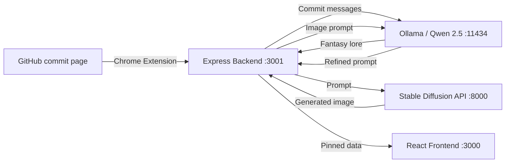

I have a bad habit of browsing commit histories on repos I find interesting. Not skimming, actually reading the messages. There is a surprising amount of storytelling buried in those one-liners. You can watch someone discover a bug, try three fixes, give up on one approach, then quietly rename the whole module a week later.

The problem is that commit history is the least visual interface GitHub offers. It is a flat list of grey text sorted by time. No thumbnails, no previews, no way to save the ones you like. I wanted something closer to a mood board. A Pinterest for commits. Pin the interesting ones, see them laid out as cards, and because I was already deep in the image generation rabbit hole at the time, generate fantasy art for each repository based on its commit history.

The result was **Ginterest** -- a four-part system consisting of a Chrome extension, an Express backend, a local Stable Diffusion pipeline, and a React frontend. The whole thing runs locally. No cloud APIs. No accounts. Just a GPU, Ollama, and a willingness to spend an afternoon wiring things together.

---

## The system at a glance

Before diving into the pieces, here is how data flows through the whole thing:



Four separate services. Three localhost ports. Zero persistence beyond in-memory arrays and a folder of screenshots. Production grade this is not. But it works, and I learned things building it that I would not have learned from a cleaner architecture.

---

## Part 1: The Chrome extension

The extension has two modes. On a single commit page (`github.com/<org>/<repo>/commit/<sha>`), it injects a red **Pin commit** button. On the commits list page (`github.com/<org>/<repo>/commits/<branch>`), it injects a floating **Pin Repo Lore** button.

### Dealing with GitHub's client-side routing

The first annoying thing you discover building a GitHub Chrome extension is that GitHub uses **client-side routing**. Clicking between pages does not trigger a full page load. The extension's content script runs once on `document_idle`, and then the URL changes without the script being re-injected. If you naively create your button on initial load and never check again, navigating to a commit page from the repo root shows nothing.

The fix is a `MutationObserver` on `document.body`:

```javascript
const observer = new MutationObserver((mutations) => {
  for (const mutation of mutations) {
    if (mutation.type === 'childList') {
      updateButtonVisibility();
    }
  }
});

observer.observe(document.body, {
  childList: true,
  subtree: true
});

window.addEventListener('popstate', updateButtonVisibility);
```

`updateButtonVisibility` checks the current URL against regex patterns and creates or removes buttons accordingly. The `popstate` listener catches browser back/forward navigation. This pattern fires a lot -- every DOM mutation on the page -- but the check is just two regex tests, so it is cheap enough.

### Capturing screenshots from a content script

When you pin a single commit, the extension also captures a screenshot of the visible tab. Content scripts cannot do this directly. You have to send a message to the **background service worker**, which has access to `chrome.tabs.captureVisibleTab`:

```javascript
// In the content script
const response = await chrome.runtime.sendMessage({ action: 'captureScreenshot' });
const screenshotDataUrl = response.screenshot;

// In background.js
chrome.runtime.onMessage.addListener((request, sender, sendResponse) => {
  if (request.action === 'captureScreenshot') {
    chrome.tabs.captureVisibleTab(null, { format: 'png' }, (dataUrl) => {
      sendResponse({ screenshot: dataUrl });
    });
    return true; // Required for async sendResponse
  }
});
```

That `return true` is one of those Manifest V3 footguns that will cost you an hour if you forget it. Without it, the message channel closes before the async callback fires, and `sendResponse` silently does nothing.

The screenshot gets sent to the backend as a base64-encoded data URL inside the JSON body. Yes, the entire PNG as a string inside a POST body. The express server is configured with `express.json({ limit: "10mb" })` to accommodate this. It is not elegant. It works.

### The "Pin Repo Lore" flow

The more interesting button is **Pin Repo Lore**. Instead of capturing one commit, it scrapes every commit message visible on the commits list page:

```javascript
const commitElems = document.querySelectorAll(
  '[data-testid="list-view-item-title-container"]'
);

const commitData = [];
commitElems.forEach((elem) => {
  if (!elem) return;
  const message = elem.innerText.trim();
  commitData.push({
    message,
    author: "Unknown",
    id: new Date().getTime().toString(),
    url: window.location.href,
  });
});
```

This sends the full array of commits to the backend's `/api/pinAll` endpoint, which kicks off the LLM and image generation pipeline. We will get to that.

One fragility here: the selector `[data-testid="list-view-item-title-container"]` is a GitHub internal test ID. It works today. It will break without warning when GitHub's frontend team ships a refactor. I chose it over class-based selectors because GitHub's CSS classes are generated and change even more often. Neither approach is stable. That is the life of a content script.

---

## Part 2: The backend and the LLM pipeline

The Express backend is the coordination layer. It receives pinned commits from the extension, calls Ollama for text generation, calls the Stable Diffusion API for image generation, and serves the results to the React frontend.

### Generating "lore" from commit messages

This is the part that made the project fun to build. The `/api/pinAll` endpoint takes an array of commit messages and feeds them to a local **Ollama** instance running **Qwen 2.5 3B**. The prompt is deliberately ridiculous:

```javascript
const promptText = `
Pretend you are a comedic Gen Alpha-coded fantasy lore master.
You have the following commit messages from a GitHub repo:

${commitList}

Using modern Gen Alpha slang and fantasy elements, create a hilarious, 
imaginative backstory or "lore" for the entire repository without 
mentioning the commits. Keep it funny!
`;
```

Why Qwen 2.5 3B? Because it runs on consumer hardware, it is fast enough for interactive use, and for a joke lore generator the quality bar is "funny enough to share," not "factually rigorous." The `num_predict: 64` token limit keeps responses snappy, though in hindsight 64 tokens is pretty tight for a full fantasy backstory. Some outputs get cut off mid-sentence, which honestly adds to the comedy.

### Two-stage prompting: lore then image

The generated lore text feeds into a second Ollama call that produces a **Stable Diffusion prompt** from the lore:

```javascript
async function generateImagePromptWithOllama(lore) {
  const promptText = `
Write a single line prompt for a fantasy scenery image based on the following lore:

${lore}

Example prompts - 
an explorer on the path to a cavern shaped like a skull...
wide angle view of a ruined city in the forest...
A space trucker walking towards an alien spaceship...
raining, storming, fantasy village, shadow in the mist...
`;
```

This two-stage approach was a deliberate choice over feeding commit messages directly to the image model. The problem with raw commit messages is that they are terrible image prompts. "fix flaky test in CI pipeline" does not produce interesting art. But "The Code Monks of the Continuous Integration Temple, keepers of the sacred green check mark" might produce something worth looking at.

The few-shot examples in the image prompt step steer the LLM toward the aesthetic I wanted: fantasy landscape art, Boris Vallejo style, detailed scenes. Without those examples, the model tends to generate prompts that are too abstract or too literal.

### The image generation call

The backend proxies the generated prompt to the FastAPI image generation service:

```javascript
async function generateImageFromText(prompt) {
  const response = await axios.post(
    API_URL,
    { prompt: prompt },
    {
      headers: { "Content-Type": "application/json" },
      responseType: "arraybuffer",
    }
  );
  const base64Data = btoa(
    new Uint8Array(response.data).reduce(
      (data, byte) => data + String.fromCharCode(byte), ""
    )
  );
  return `data:image/png;base64,${base64Data}`;
}
```

The image comes back as raw bytes, gets converted to a base64 data URL, and gets stored in memory alongside the lore text and commit data. The whole pinned batch -- commits, lore, image prompt, generated image -- lives in an in-memory array on the Express server.

I know. In-memory storage with no persistence. If you restart the server, everything is gone. For a weekend hack where I am the only user, this was the right tradeoff. Adding a database would have been more time than the feature justified.

---

## Part 3: The image generation pipeline

This was the part I was actually excited about. The FastAPI server wraps a **Stable Diffusion XL** pipeline with two important optimizations layered on top.

### Hyper-SD: one-step diffusion

Standard SDXL takes 20-50 inference steps to generate an image. That is too slow for an interactive workflow where you are pinning commits and want to see results in seconds. **Hyper-SD** from ByteDance is a LoRA adapter that enables single-step generation:

```python
base_model_id = "stabilityai/stable-diffusion-xl-base-1.0"
repo_name = "ByteDance/Hyper-SD"
ckpt_name = "Hyper-SDXL-1step-lora.safetensors"

pipe = StableDiffusionXLPipeline.from_pretrained(
    base_model_id,
    torch_dtype=torch.float16,
    safety_checker=None
).to("cuda")

pipe.load_lora_weights(
    hf_hub_download(repo_name, ckpt_name), 
    adapter_name="hyper_sd"
)
```

One step. One forward pass through the UNet. The quality is noticeably worse than a 20-step generation, but for Pinterest-card-sized images accompanying joke lore text, it is more than good enough. The speed difference is dramatic: sub-second generation versus 5-10 seconds.

### Stacking LoRAs for style

Here is where it got interesting. I wanted the generated images to have a consistent fantasy art style, not the default SDXL photorealistic look. So I loaded a second LoRA -- a fantasy art adapter -- and stacked it with Hyper-SD:

```python
pipe.load_lora_weights(
    "/home/kharekartik/Downloads/Fantasy_art_XL_V1.safetensors", 
    adapter_name="fantasy"
)

pipe.set_adapters(
    ["hyper_sd", "fantasy"], 
    adapter_weights=[1.0, 0.8]
)

pipe.fuse_lora()
```

**LoRA stacking** is one of those things that sounds like it should not work. You are composing two independently trained low-rank adaptations and hoping they produce coherent output. In practice, it works surprisingly well as long as the weight balance is right. The Hyper-SD adapter at weight 1.0 maintains the one-step generation capability, while the fantasy adapter at 0.8 shifts the aesthetic without overwhelming the base model.

I tried 1.0/1.0 initially. The results were oversaturated to the point of being unrecognizable. 1.0/0.8 was the sweet spot.

### Tiny VAE for throughput

The other optimization is replacing SDXL's default VAE with **TAESD** (Tiny AutoEncoder for Stable Diffusion):

```python
pipe.vae = AutoencoderTiny.from_pretrained(
    "madebyollin/taesdxl",
    torch_dtype=torch.float16
)
```

The VAE is the bottleneck on the decode step. Standard SDXL's VAE is large and slow. TAESD is a distilled version that produces slightly softer images but decodes significantly faster. Combined with single-step inference, the full pipeline from prompt to PNG is under a second on a consumer GPU.

### The scheduler choice

I used **TCD Scheduler** (Trajectory Consistency Distillation) instead of the default:

```python
from diffusers import TCDScheduler
pipe.scheduler = TCDScheduler.from_config(pipe.scheduler.config)
```

TCD is designed for low-step generation. It pairs well with Hyper-SD because both are optimized for the same regime. Using DDPM or Euler with a single-step LoRA produces blurry, incoherent results. The scheduler matters more when you have fewer steps, because each step carries more weight.

### What I tried and abandoned

The commented-out code in `gen_image.py` tells a story. There is a block for **stable-fast** compilation with xformers and Triton:

```python
# from sfast.compilers.diffusion_pipeline_compiler import compile, CompilationConfig
# config = CompilationConfig.Default()
# config.enable_xformers = True
# config.enable_triton = True
# config.enable_cuda_graph = True
# pipe = compile(pipe, config)
```

I tried this early on. The idea was to compile the diffusion pipeline with CUDA graphs for maximum throughput. The problem: compilation takes several minutes on startup, and with single-step inference the per-image speedup is marginal. When you are already generating in under a second, saving 200ms is not worth a 3-minute cold start for a dev tool. I also considered `animagine-xl-3.1` as the base model (it is anime-focused), but the fantasy LoRA produced better results on standard SDXL.

---

## Part 4: The frontend

The React frontend is a Create React App with Tailwind CSS, styled to look like a Pinterest board. The layout uses **CSS columns** for a masonry-style grid:

```css
.board-container {
  column-count: 4;
  column-gap: 16px;
  max-width: 1200px;
  margin: 32px auto;
  padding: 0 16px;
}

.commit-card {
  display: inline-block;
  background-color: #fff;
  border-radius: 12px;
  margin-bottom: 16px;
  overflow: hidden;
  width: 100%;
  box-shadow: 0 2px 6px rgba(0, 0, 0, 0.15);
  transition: transform 0.2s ease-in-out;
}
```

CSS `column-count` is the cheapest masonry layout you can get. No JavaScript, no ResizeObserver, no library. Cards flow into columns naturally, and because the generated images have variable aspect ratios, the staggered heights look intentional rather than broken.

### The LoreCard component

Each pinned batch renders as a `LoreCard` with the generated fantasy image, the repo name and branch parsed from the URL, and a truncated lore preview:

```jsx
const LoreCard = ({ lore }) => {
  const [showPopup, setShowPopup] = useState(false);

  const truncatedPrompt =
    lore.prompt.length > 100
      ? `${lore.prompt.substring(0, 100)}...`
      : lore.prompt;
  
  const [repoName, branch] = lore.url
    .match(/github\.com\/(.+?)\/commits\/(.+?)(\/|$)/i)
    ?.slice(1) ?? [];

  return (
    <div className="commit-card bg-white rounded-lg shadow-md p-4 relative">
      
      <h3>{repoName}</h3>
      <h3>{branch}</h3>
      <p onMouseEnter={handleMouseEnter} onMouseMove={handleMouseMove}>
        {truncatedPrompt}
      </p>
      <FullPromptPopup show={showPopup} text={lore.prompt} x={popupX} y={popupY} />
      <a href={lore.url} target="_blank" rel="noreferrer">View Commits</a>
    </div>
  );
};
```

### The hover popup portal

The full lore text shows on hover via a **React portal** that renders at `document.body` level. The popup follows the cursor position using mouse move events and intercepts scroll events to scroll its own content instead of the page:

```jsx
const FullPromptPopup = ({ show, text, x, y }) => {
  const popupRef = useRef(null);

  useEffect(() => {
    const handleWheel = (e) => {
      if (popupRef.current) {
        e.preventDefault();
        popupRef.current.scrollTop += e.deltaY;
      }
    };

    if (show) {
      window.addEventListener('wheel', handleWheel, { passive: false });
    }
    return () => window.removeEventListener('wheel', handleWheel);
  }, [show]);

  if (!show) return null;

  return ReactDOM.createPortal(
    <div
      ref={popupRef}
      style={{ position: 'fixed', top: y + 10, left: x + 10, zIndex: 9999 }}
      className="bg-red-700 border rounded-md shadow-lg p-4 max-w-sm max-h-48 overflow-y-auto"
    >
      <p className="text-white">{text}</p>
    </div>,
    document.body
  );
};
```

The `{ passive: false }` on the wheel listener is required because you are calling `preventDefault()`. Without it, the browser ignores the prevention and scrolls the page anyway. Another small thing that wastes 20 minutes.

---

## What I would change

**Persistence.** In-memory arrays mean everything is gone on restart. A SQLite database or even writing JSON files would fix this with minimal effort. I just never got around to it because the project was always about the pipeline, not the product.

**The scraping approach.** Relying on GitHub's internal DOM test IDs is fragile. A better version would use the GitHub API to fetch commit history. This would also let you go beyond the commits visible on the page and pin arbitrary commit ranges or entire branches.

**The two-LLM-call chain.** Calling Ollama twice sequentially -- once for lore, once for image prompt -- adds latency. A single call with a structured output format could produce both the lore text and the image prompt in one shot. I kept them separate because it was easier to debug and tune each prompt independently, but the latency cost is real.

**Image cleanup.** The FastAPI server writes `temp_{uuid}.png` files and never cleans them up. Run it long enough and you fill the disk. A simple cleanup after response would fix it.

---

## My take

This project has zero practical utility. Nobody needs AI-generated fantasy art for their commit history. But building it taught me a few things that transferred to real work.

**LoRA stacking is more robust than expected.** I went in assuming you could not compose independently trained adapters and get coherent output. The weight balancing matters, but the technique is practical for combining a performance adapter (Hyper-SD) with a style adapter.

**Low-step diffusion is good enough for most non-production use cases.** Single-step Hyper-SD with TAESD produces images that are fine for thumbnails, previews, or anything where you care about speed more than pixel-level quality. The quality ceiling is real, but the speed floor is transformative.

**Chrome extensions on GitHub are annoying.** Client-side routing, unstable DOM selectors, the Manifest V3 async message passing quirks -- all of it adds friction that is disproportionate to the complexity of what you are building. If I were doing this again, I might skip the extension entirely and build a CLI tool that takes a GitHub URL.

**Local-only AI stacks are viable for hobby projects.** Ollama plus a local Stable Diffusion pipeline means no API keys, no usage limits, no latency to a remote server. The tradeoff is hardware requirements and setup complexity. For a weekend hack where I am the only user, that tradeoff is entirely worth it.

The project lives as a weekend experiment that I occasionally fire up when I find an interesting repo. It is not deployed anywhere. It is not packaged for distribution. It is just four localhost services and a Chrome extension that makes my commit browsing slightly more ridiculous.
