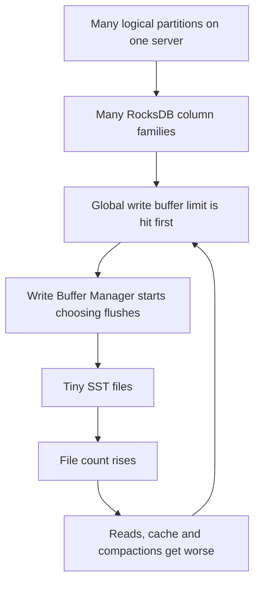
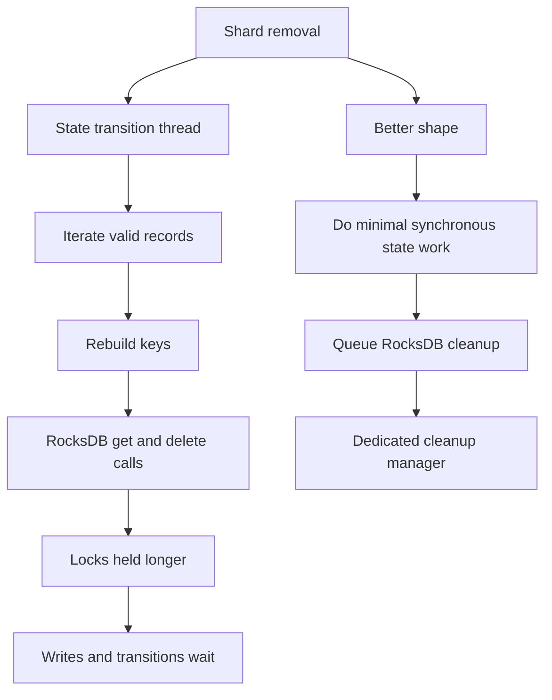
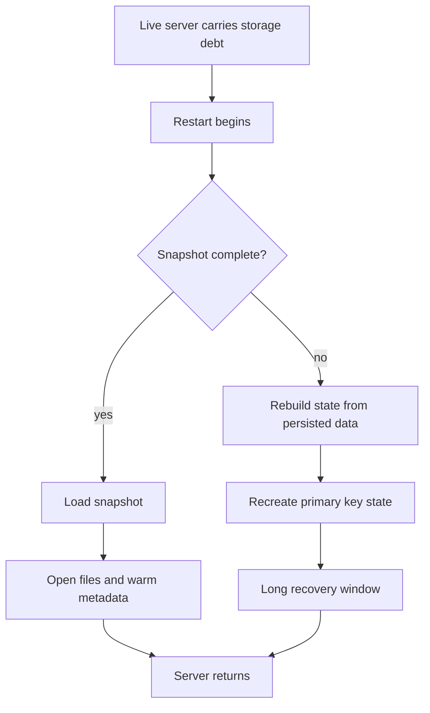

When I integrated RocksDB in our main product, it had mostly done what I needed. It kept large key state out of the JVM heap, gave me local persistence and made point lookups fast enough to not regret moving away from hashmaps (That is a separate story for another day)

Now that we were no longer bounded by memory, we started promoting more usecases for our shiny new datastore. This led to more logical partitions per server, more column families, more keys, more files, more cleanup work and more state to recover when pods got replaced. Eventually we crossed 1 billion keys per server in some of our envs, not counting write amplification. At that scale we started seeing weird production issues and multiple RCAs traced back to RocksDB doing something surprising.

Being in this rocksdb minefield over the last few years has taught me a lot.

In this post I will walk through some of those issues and what you can do to avoid them from the get go.

---

## A flush can be correct and still useless

RocksDB is a write optimised database as envisioned by its creators. And where can we write the data fastest? Yes, the memory. But to scale we can't store all of our data in memory (unless you've a million dollars to afford redis). To tackle this, Rocksdb has this neat mechanism called Flush. 

Flush simply takes data written into memory in a data structure called a memtable aka write buffers and simply dumps that to disk with barely any changes. You can control how many write buffers RocksDB can keep in memory per partition and what should be the max size of each. But what if your partitions grow? How do you control memory across them? Well for that we can set a global threshold as well on write buffer memory usage. When you set this, RocksDB creates an instance of `Write Buffer Manager` that maintain pointers to all write buffers and can trigger flush on any one of them if it sees memory usage nearing threshold. 

The issue we observed at scale was something like this, instead of healthy flushes writing approx the size of write buffers (generally tens of MBs), the event log showed flushes triggered by `Write Buffer Manager` that wrote only a handful of entries (almost in few KBs). This kep occuring too frequently like 1000s of flushes every minute which led to a huge CPU spike and stalled every operation on our cluster. 

The log that led me to this root cause was something like this in RocksDB logs:

```text
EVENT_LOG_v1 {
  "event": "flush_started",
  "num_memtables": 1,
  "num_entries": 3,
  "total_data_size": 114,
  "memory_usage": 16778104,
  "flush_reason": "Write Buffer Manager"
}
```

The healthy case however should look something like this:

```text
EVENT_LOG_v1 {
  "event": "flush_started",
  "num_memtables": 1,
  "num_entries": 1732966,
  "total_data_size": 65852708,
  "memory_usage": 104598264,
  "flush_reason": "Write Buffer Full"
}
```

In the unhealthy case, the shared DB write buffer budget gets hit first and RocksDB starts flushing because of global pressure. With enough column families, that can make it choose memtables that are technically flushable but practically useless to flush. 

The engine is doing work but the work is pointed at the wrong thing.



<iframe src="/widgets/me-vs-rocksdb-in-production/flush-pressure-loop.html" width="100%" height="590" style="border: 1px solid #222; border-radius: 6px; background: #0a0a0a;" loading="lazy"></iframe>

Apart from the CPU spike it leads to much more severe issues down the line. Once RocksDB starts generating a large number of small SST files, reads have more files to search, filters and indexes multiply, compactions get heavier, cache composition changes and tail latency starts drifting. Background maintenance begins competing harder with foreground work, which makes the next round of maintenance more expensive.

In one of the more memorable incidents I worked through, a sick server had an absurdly higher SST count than a healthy peer. That single difference explained a lot of behavior that had looked mysterious from the outside. The server was not cursed, it was carrying around a fragmented, metadata heavy view of the world.

## Averages hid the worst partition

The next scale problem was skew.

It is easy to miss because the cluster level graph can still look reasonable while one logical partition is quietly becoming a different storage problem from all its peers. The average says the system is fine. The outlier is where the incident lives.

I saw cases where one partition had more than 130 files sitting at L6 while other partitions looked normal. The expected number for that shape was closer to four or five files and one column family had crossed 900 SSTs in total. That meant more metadata, more filter and index footprint, worse cache pressure, more compaction backlog and uglier long tail reads for that one slice of the workload.

There was an even louder version of the same lesson in another comparison, where a healthy peer had 49 SST files and the unhealthy node had 571,850. That number is absurd enough that it almost stops looking real, but it was exactly why average cluster graphs were useless for this failure mode.

This was not just "more data." It was a deeper LSM shape, with more files to search and more background work waiting to happen.

The fix path changed once I saw the skew clearly. Bigger cache might help, but it was not the whole answer. I had to care about `max_open_files`, background thread count, compaction thresholds, target file sizes, level count and whether the data distribution itself was making one partition carry a completely different physical layout.

We took time to catch both of these issues because we were measuring average get, write, flush and compaction latency. While these only reflect in p90. 

<iframe src="/widgets/me-vs-rocksdb-in-production/lsm-skew-map.html" width="100%" height="590" style="border: 1px solid #222; border-radius: 6px; background: #0a0a0a;" loading="lazy"></iframe>

## The cache lied in three different ways

After flushes, cache was the next thing that taught me not to trust the obvious story.

I used to carry a simple assumption: if a system is slow because it is missing cache, the fix is to make the cache bigger.

With RocksDB, that assumption is only useful after you prove which cache problem you have.

One incident started as restart slowness. A server was taking far too long to come back even after reducing the number of active tables. Flamegraphs showed RocksDB `get()` dominating the profile. I saw a lot of decompression work. We disabled compression and still saw too much random file access.

That forced the obvious question: why is RocksDB going to files so often if we gave it a large cache?

I checked the logs if cache size was even getting honoured and it was. However, I went deeper and found what was actually occupying this cache. 

The cache evidence looked like this:

```text
Bloom/filter blocks: 88.68% of cache
Data blocks:         0.003% of cache
CPU:                 ~20% -> 80-100%
```

A healthier sample had a completely different shape:

```text
DataBlock:   619.58 MB, 60.5%
FilterBlock: 183.93 MB, 17.9%
IndexBlock:  184.59 MB, 18.0%
```

| Cache resident | What it helps | How it can hurt |
|---|---|---|
| Data blocks | Point lookups and repeated reads | Starves when metadata dominates the cache. |
| Filter blocks | Avoiding files that cannot contain a key | Grows with SST file count and can crowd out data. |
| Index blocks | Finding data blocks inside files | Also grows with file count and can dominate under fragmentation. |

<iframe src="/widgets/me-vs-rocksdb-in-production/cache-composition.html" width="100%" height="610" style="border: 1px solid #222; border-radius: 6px; background: #0a0a0a;" loading="lazy"></iframe>

That made point lookups more expensive than I had imagined. A cache miss was not just one more disk read. It could be disk read, decompression, block level index reconstruction and immediate eviction because the cache was full of metadata.

Native profiling around `BlockPrefixIndex` made this concrete. Once I saw CPU burning inside block level index creation, I understood that "cache miss" was a much larger sentence than I had been saying out loud.

## The hot path was not always the foreground path

Some of the later incidents corrected my instinct in a different way.

I would look at high CPU and start by asking whether reads were too expensive or whether `get()` and `put()` were doing too much work. That was often the right first question, but it was not always where the answer lived.

There were cases where increasing cache did not move CPU enough, with profiling also failing to support a clean foreground read story. The system was sick because background compaction, tombstones and cleanup debt had become the dominant work.

One compaction curve captured the shape better than any CPU graph:

```text
pending_compaction_bytes = 2.7 GiB
pending_compaction_bytes = 7.6 GiB
pending_compaction_bytes = 14.3 GiB
pending_compaction_bytes = 20.2 GiB
```

That climb happened over only a few minutes. There was no useful Java heap OOM trail, no clean last gasp in the JVM and no comforting heap graph that explained the node pressure. RocksDB was building up native storage debt faster than the background workers could burn it down.

That shifted the tuning direction away from only chasing cache hit rate. I had to make the LSM shape more stable: larger write buffers where safe, more levels when the tree was too shallow, higher L0 thresholds where appropriate, larger target file sizes and fewer paths that created tiny files or tombstone heavy cleanup work.

The uncomfortable lesson was that RocksDB can make the foreground path look guilty while the real bill is being collected by background maintenance.

## Cleanup was wearing a fake mustache

The most expensive mistake I made around cleanup was treating it like regular operations

I assumed retention, shard deletion, TTL removal and stale state cleanup etc. would just happen like normal gets and puts in RocksDB. At the end of the day, deletes are basically writes inside Rocksdb with a tombstone value. That assumption did not survive contact with real production workloads.

One of the first incidents that forced this on me was a periodic CPU spike tied to retention activity. At first, it looked like a mystery. CPU would spike on a cadence, writes would feel worse and progress would stall in places where it should not stall.

Then we looked at thread activity and the answer stopped being mysterious. State transition threads were burning CPU while removing old keys. The problem with deletion is unlike writes, *all of them happen in a single go e.g. deleting a file that removes 10 million keys at once.*

The expensive part was not deciding that old keys should go away. The expensive part was asking RocksDB to delete enough of them while the rest of the system still needed to make progress.



<iframe src="/widgets/me-vs-rocksdb-in-production/cleanup-critical-path.html" width="100%" height="610" style="border: 1px solid #222; border-radius: 6px; background: #0a0a0a;" loading="lazy"></iframe>

The fix was to move expensive cleanup work off the critical path.

That led to a much better framing. Perform the minimum required state transition work synchronously, defer heavy RocksDB cleanup into a separate manager that is ideally *single threaded and rate limited*, free critical threads sooner and let writes continue.

There is still a tradeoff because deferred cleanup can leave garbage state around longer. But that is a better trade than letting old state removal block critical runtime progress.

The deeper lesson was that background work is only harmless if it is actually isolated, paced correctly, unable to starve the critical path and unable to accumulate into a backlog that changes the storage shape.

## The restart path collected every unpaid bill

I used to think of restarts as reset buttons.

If a RocksDB backed server got into a bad state, a restart felt like a clean escape hatch. Rebuild, warm up and move on. Operationally, that can be true, which is part of why the trap is easy.

Over time, I learned the harsher version: restarts do not erase storage debt, they reveal it.

A live RocksDB server can limp along with too many SST files, poor cache composition, tombstone debt, too many primary keys, snapshots that are not as complete as I think and cleanup that has already fallen behind.

As long as the process stays up, those costs are distributed over time. The server can remain technically alive while carrying a terrible internal shape.

The bill arrives the moment I restart it.



<iframe src="/widgets/me-vs-rocksdb-in-production/restart-debt.html" width="100%" height="600" style="border: 1px solid #222; border-radius: 6px; background: #0a0a0a;" loading="lazy"></iframe>

Primary key count stopped being a side metric for me and became a capacity metric. It predicted restart time, snapshot usefulness, cleanup cost, compaction burden and memory pressure.

That lesson hit especially hard when restart cost was much more tightly coupled to total key state and key size than to the raw data bytes users usually think about.

The proof was not subtle here either:

```text
dataset family size:       ~3B keys
time to come online:       ~30h
major CPU time:            RocksDB
effective block cache:     8 MiB instead of intended 1 GiB

different startup case:
keys per node:             ~310M
startup before tuning:     >3h
startup after tuning:      <1h
```

That changed how I looked at readiness timeouts. Increasing patience around startup can be operationally necessary, but it does not change the fact that recovery has become a data structure problem.

Snapshots changed category too because they were not just a performance optimization. They were part of the recovery contract. When snapshots were complete and trustworthy, restarts could be manageable. When snapshots were missing data, stale, skipped by fallback paths or built with regressions, restart quietly turned into rebuild from first principles.

The other sharp edge here was newer RocksDB compaction behavior. RocksDB's `level_compaction_dynamic_level_bytes` option is the recommended default starting in 8.4 and it changes how level targets are computed. Instead of trying to keep every level populated in the old fixed ladder shape, RocksDB can keep lower levels effectively empty and push data straight toward the first level with a valid target, which often means the bottom level.

That is a good default for many workloads because it controls space amplification, but it surprised me at this scale. After restart, I could see files sitting at L6 and not getting compacted into the shape I expected. The database was not broken, it was following the newer leveled compaction model while my operational expectation still assumed the older layout.

The latency symptom looked like a read problem, but the fix was not another cache tweak. The only practical way out was to raise `max_open_files` enough that RocksDB could keep the large working set of SSTs open instead of constantly paying file open and table cache churn. That made `max_open_files` stop feeling like a boring resource limit and start feeling like part of the recovery budget.

The phrase I use in my head now is the primary key wall. It is not one clean threshold where everything instantly fails. It is the point after which every operational activity gets more expensive: cleanup touches more state, compaction has more to reorganize, snapshots become more critical, restart becomes more punishing and memory budgets get tighter.

You can operate past that point for a while. The danger is that the system remains serviceable just long enough for everyone to normalize the growing cost.

Then one day a restart or rebuild path needs to succeed inside a real operational window and all the hidden debt is due.

## The right answer started looking like a controller

After enough of these incidents, I became less interested in one off tuning advice.

The pattern was too repeatable because every incident eventually collapsed into someone changing one number: `db_write_buffer_size`, `max_open_files`, `max_background_jobs`, `level0_file_num_compaction_trigger`, cache size or some related knob.

The frustrating part was that the system often had enough signal before the page. L0 file count was rising, compaction pending bytes were visible, flush reasons were in logs, effective cache capacity was dumpable, primary key count was measurable and snapshot coverage could be checked.

The missing piece was a deterministic loop.

I do not mean asking a model what `max_background_jobs` should be. A stateful store taking live writes does not need a nondeterministic model in the decision path. Same inputs should produce the same output, with a rollback story and an audit trail.

The controller shape I trust is boring:

| Primitive | Why it matters |
|---|---|
| Admission math | Reject impossible configs before runtime turns them into incidents. |
| Hysteresis | Require repeated bad samples before changing a live database knob. |
| Cooldown | Let RocksDB settle before acting on the next metric sample. |
| Kill switch | Give on call a boring way to stop automation without a redeploy. |
| Action log | Record previous value, next value and reason before every mutation. |

LLMs can still help around that loop. They can draft controller code, summarize prior incidents and write human readable explanations for why a controller acted.

But the loop itself needs deterministic code because the thing being tuned is holding live state.

That is the cleanest way I can state the lesson: deterministic in the loop, language at the edges.

## Native crashes were a different warning

The later class of problems did not look like tuning at all.

I started seeing shutdown and safe close issues where the process could hit native `SIGSEGV` paths around RocksDB lifecycle handling. That is a different category of pain from slow reads or compaction debt. It is what happens when an embedded native engine lives inside a larger managed process and the ownership rules are not perfectly boring.

The details varied, but the shape was familiar: handles, iterators, shared native resources and async work all needed to agree on who was allowed to close each resource and at what point. If that contract was wrong, the failure mode was not a nice Java exception or a slow graph. It was the process falling over in native code.

I would not make this the center of the story, because most of my RocksDB pain was still scale and performance. But native lifecycle risk belongs in the accounting. It is one more way RocksDB stops being just a storage library and becomes an operational surface.

## The abstraction boundary had collapsed

The hardest question after all this was not which RocksDB knob to tune next.

It was whether we should still be paying this complexity tax at all.

That is not the same as saying RocksDB is bad. RocksDB solved real problems by moving large state out of the JVM heap, enabling high cardinality local state workloads and giving us an embedded store with serious write throughput.

But it also made more of the system's behavior legible in terms of storage engine internals. Flush policy, file count, cache composition, bloom filter behavior, cleanup scheduling, compaction debt, snapshot correctness, restart cost and native memory budgeting all became normal engineering vocabulary.

Any one of those is survivable. The question is what it means when they become the recurring language of your incidents.

At that point, I am not just tuning a component anymore. I am carrying an engine shaped tax through every operational discussion.

The right answer is not always to replace RocksDB. In many systems, the right path is to fix integration bugs, move expensive work off critical paths, improve snapshot discipline, budget memory honestly and own the engine properly.

But I do think teams should ask the question directly. What exact requirement forces this embedded LSM engine to remain here? Which incidents would disappear if the state model were simpler? Which incidents would remain no matter what storage engine we used? Are we still getting enough value to justify the operational ownership cost?

Those questions are about fit, not brand.

My honest answer is not that RocksDB was the wrong choice. My honest answer is that RocksDB kept solving real problems while making the cost of owning it visible.

Once that happens, the mature question is not how to tune it more. It is whether this is still the layer we want to become experts in.

A boring footnote I keep next to all of this: memory budgeting has to be done for the whole process, not one knob at a time. JVM heap, block cache, write buffers and native overhead all spend from the same envelope, even if every config page pretends they are separate worlds.
