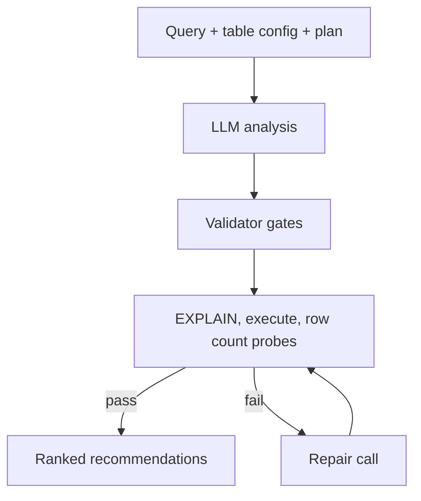

So I was building a feature that takes a slow Apache Pinot query, looks at it and tells you how to make it faster. You paste in the SQL, it pulls the table config and the query plan and out comes a set of ranked recommendations, things like add this index, rewrite the join this way, your time filter is not pushing down. The demo version of this took about a week and it looked incredible, which is exactly the problem I want to talk about.

An LLM will produce plausible query optimization advice all day long. That is genuinely the easy part. The hard part, the part that ate months, was making the advice correct because a confident recommendation that is wrong is so much worse than no recommendation at all. If a user adds the index I told them to add and their query gets no faster, or worse, if I hand them a "faster" rewrite that quietly returns different rows, I have not helped them. I have burned their trust and their afternoon.

## The demo that lies to you

The first version was a single call to the model with the query and a big pile of metadata stuffed into the prompt. It came back with beautifully written recommendations and when I read them they all sounded right. That was the trap, because they sounded right for the simple reason that models are sycophantic and I had no way to tell which of them actually were.

I would eyeball a handful of outputs, nod, ship a prompt tweak and then a different query would produce something subtly broken that I only caught because I happened to know that table. The model would recommend an index that already existed on the column or suggest a rewrite that quietly dropped a filter, recommendations that read fine in isolation and are exactly the kind of thing that makes a user stop trusting the tool forever.

I realized pretty quickly that I could not improve something I could not measure and eyeballing five outputs over coffee was not measurement. I am not Rick Rubin after all.

## You cannot tune what you cannot score

The thing I built next, the thing that mattered more than any prompt I ever wrote, was an **eval suite**. I collected a set of real query shapes and ran them against real Pinot clusters to get their actual plans and runtime stats. For each one I used Claude Opus to write down what a good answer looks like and a second model, acting as a judge with a detailed rubric, scored the analyzer's output against that expectation, checking things like whether the top recommendation was the right one and whether anything was fabricated.

Getting the test cases to be honest was harder than I expected. My first instinct was to write obviously slow queries but Pinot is smarter than my naive attempts. The Calcite optimizer would rewrite a lazy full scan into something efficient or a star-tree index would swallow the aggregation I was trying to make expensive and suddenly my slow query ran in twelve milliseconds with nothing to optimize. I had to learn to write queries that stay genuinely expensive, using predicates the optimizer would not fold and aggregations that could not be pre computed, otherwise I was grading the analyzer on queries that had no real problem to find.

Then came the part I did not want to find. The first time I ran the full suite and read every failure one by one, close to half of them were not the model getting it wrong, they were my dataset getting it wrong. One case expected a specific fix for a point lookup that scanned zero documents and came back instantly, so the model correctly said there was nothing to do and got marked wrong for it. I had written the answer key badly and then blamed the model for not matching it.

The uncomfortable takeaway is that I cannot fully rely on AI to build eval datasets until I have a good seed dataset, so I went over every datapoint by hand and fixed them with the best LLM on the market, my brain. After that I stopped trusting my taste and started trusting the suite. Every decision that follows in this post ran through the eval first.

## Read the model's thinking even if you never ship it

The single most useful thing I did for debugging was turn on a thinking budget during eval runs so I could read the model's reasoning next to its final answer. Thinking is the kind of thing you might reasonably leave disabled in the deployed product, since it adds latency and cost and the user only ever sees the final recommendations. But turning it off during development would have cost me the only window I had into why the model did what it did. Without the trace a bad output is just a bad output. With it I could see which rule the model thought it was following and why, which is where the real diagnosis lived.

The clearest case was a rule I had written to restrict an optimization to one query shape, meant to stop the model from suggesting it too eagerly. The restriction was factually wrong, the optimization was valid for a much broader class of queries than my rule admitted and the model knew it. Handed a query that clearly qualified but did not fit my restriction, it produced the recommendation anyway and argued in its thinking that the restriction did not apply here. It was right. Without the trace all I would have seen was a recommendation that looked spurious and I would have blamed the model for my own wrong rule.

Another rule told the model that every finding must describe a problem, which sounds reasonable until the most important thing to say about a query is that it is already doing the right thing. On an already optimal query the model's thinking openly debated whether it was even allowed to report a good thing and in one case reached for a structural recommendation purely because it had nothing else to justify producing output. I had left it no sanctioned way to say nothing is wrong, so it invented a problem to fill the space.

My instinct each time was to patch the behavior with another rule and I did that for a while, stacking prohibitions and negative examples until the prompt was mostly warnings. None of it worked, the model just found a fresh justification each time, imagining the customer's data growing or appealing to some high traffic future that had nothing to do with the query in front of it. What finally worked was deleting two phrases from the section that described when to use that recommendation, because the permissive language was what made it feel appropriate in the first place. Removing the permission killed the rationalizations that ten stacked prohibitions had not, so now I reach for a deletion before an addition whenever the model is being too eager.

Not every bug lived in the rules either. Some of the worst ones were me asking the model to reason about information I never gave it. The one that stung most was the plan, where a rule told the model to look for specific physical operators as proof that an index fired but the payload I was sending carried the logical plan from the broker and physical operators only exist per shard at execution time. The model was told to look for something that could not be there. The fix was one flag on the plan request that switches it to the real per shard plans, after the prompt had spent the entire development cycle describing the wrong thing. These bugs were not hard to fix, they were hard to notice.

## The safety checks that backfired

Once I could measure quality, the obvious next move was to catch the model's known mistakes in code, with simple deterministic checks that inspect every recommendation on its way out and throw away the ones that look wrong. If the model recommends an index that already exists, drop that recommendation. If the rewritten SQL does not parse, drop it. I built a stack of these checks, called them **validator gates** and felt good about it, right up until I ran the eval with the gates on and off and the numbers embarrassed me. Precision was mediocre, recall was worse and when I dug into the misses, several were the gates themselves throwing away good recommendations. I had built a safety system that was quietly causing the harm it was supposed to prevent.

The gate that still makes me wince stripped all structural advice whenever a query had failed, on the theory that you cannot trust cost reasoning about a query that did not complete. Except a query that timed out because of a full scan is exactly the query where adding an index is the right call, so the gate was deleting the fix for the very failure it had detected.

What came out of that mess is a rule I now apply to every gate. A gate is allowed to delete a recommendation only when it can prove the thing is broken against ground truth, like a SQL parser or the real table metadata. Anything softer than proof is only allowed to demote, never delete. I would much rather show a slightly misranked list than silently swallow the one recommendation that would have helped.

The other change was to stop enforcing silently. Every time a gate drops or changes something now, it records the reason in a suppression list on the response. The UI ignores it but the eval reads it, which turned a vague feeling that the gates seemed too aggressive into a ranked list of exactly which gate was eating which recommendation.

## Never ship a rewrite you didn't run

Gates catch the mistakes I can predict but rewritten queries fail in ways I cannot, because the model has no idea what data is actually in the table and a perfectly reasonable rewrite can still return zero rows. So any recommendation that carries a rewritten query gets run against the actual cluster before it ever reaches the user, through three probes. First I run EXPLAIN on the rewrite and if the plan errors, it is gone. Then I execute it and if it errors or cannot finish in its time budget, it is gone. Finally, for a rewrite that claims to return the same rows as the original, I compare the row count and if the counts differ, it is gone.

The row count check only applies to the equivalence preserving rewrites. There is a separate recommendation type for deliberately narrowing a query and checking its row count would be nonsense because it is supposed to change. Comparing counts instead of actual data is a deliberate shortcut with blind spots I know about, a COUNT(*) returns exactly one row whether the filter under it matches everything or nothing but I do not want to ship table data to an LLM and this was the best hack short of computing checksums, which is slow.

For a long time a rewrite that failed these probes just got dropped and I slowly realized how much good work I was throwing away, because often the model had the right idea and made one fixable mistake. I tried the obvious thing first, teaching the main analysis prompt to fix its own broken rewrites, which did not work. That prompt already carries a lot and asking it to also self correct meant the repair got dropped on exactly the harder cases where I needed it most. What worked was making **repair** a separate call with one job, because a focused prompt that does one thing reliably does that thing.

The repair call gets the failed rewrite, the exact failure and a short list of rules. The corrected query has to be valid, has to return the same rows as the original and is never allowed to be heavier, which means no full scans, no cross joins, no looser filters and no bigger limits sneaking in under the guise of a fix. It is also never allowed to quietly hand back a narrower query instead, because that would turn a promise of equivalence into a result altering change. When it retries it sees every past attempt and why each one failed, so it does not loop back to the same broken idea. The output runs through the same three probes and only replaces the original if it passes. I also hit a genuinely stupid bug here where the model would prepend a sentence of explanation before the SQL, so the query became something like `EXPLAIN PLAN FOR The failure is a timeout...` and burned every attempt, which I fixed by stripping any prose before the first real SQL keyword.

By this point the path from query to recommendation looked less like a model call and more like a gauntlet.

## The OOM whack-a-mole

The worst user experience I found was not a wrong answer, it was a loop. A user runs a heavy query and it runs out of memory. The analyzer suggests a rewrite, they run it and it runs out of memory again. The analyzer suggests raising a group limit, they raise it and it runs out of memory again, because raising a limit on a query that is dying from memory pressure just pushes it harder into the wall. I was shipping a tool that could get someone stuck in a circle.

Fixing this needed a few things at once. On a query that genuinely ran out of memory, the analyzer now suppresses any recommendation that would increase memory use and promotes the **scope reduction** recommendation to the top, overriding the normal ordering, because reducing what the query asks for is the only thing a user can do right now, unilaterally, to get an answer back at all. Everything else, like adding an index or repartitioning, is a durable fix but a slow and permissioned one. And when no scope reduction survived the earlier steps, a dedicated backstop call tries to author one, with a contract I had to loosen deliberately. The backstop answers to the user's goal, not to equivalence with the original result, so it is allowed to restructure joins and flatten subqueries as long as the smaller query still answers the actual question. If even that cannot produce something runnable, it falls back to a plain recommendation to scale up or pre aggregate, so a stuck query is never left with nothing.

Letting a backstop restructure a query only works if it knows what about the query is load bearing and what is incidental, which turned out to need a concept of its own. What a query literally does and what the user is trying to learn are two different things. A query might sort a full year of data to show the top ten rows for last week. To make that cheaper safely I need to know that the goal is last week's top ten and the full year sort is just how the SQL happened to be written.

I first captured this as a single free text field where the model wrote down the query's intent and it was a mess in both directions. When the intent was purely analytical it dropped the grouping keys and filters that actually define the result, so rewrites anchored to it came back non equivalent. When it faithfully transcribed the query it inherited all the query's redundancy and protected the dead work I was trying to prune. One string could not hold both the human goal and the exact result contract, so the version that worked splits intent into three parts, the **goal** being the single human decision with no SQL in it, the **literal shape** being exactly what the current query returns and the **minimal form** being the smallest query that still satisfies the goal. Equivalence preserving rewrites anchor to the literal shape and must reproduce the exact result, scope reducing rewrites anchor to the minimal form and may return less as long as they still serve the goal. The intent became the compass for what to simplify toward and result equality became the yardstick for how far. Separating the two is what made narrowing safe instead of reckless.

## The tokens I stopped paying for

All of this scaffolding had a side effect I did not think about until it started hurting, which is that the analyzer got slow and not cheap. The input I could cache between calls but generation is sequential, so the number of tokens the model writes is basically the latency the user feels. The fastest way to make the thing faster was to make it say less.

The first cut was the model reprinting the original query back to me. It was dutifully writing out the before of every rewrite, which I already had because I was the one who sent it, so I stopped asking for the before entirely and now reconstruct the diff on my side. The rewrite itself was the bigger win. Emitting a whole rewritten query is a lot of tokens when the actual change is a two line filter, so the model now emits the change as a small find and replace edit against the original and I rebuild the full rewrite on my side. On a large query that is the difference between a few hundred tokens and a few. An edit that does not apply cleanly is a new way to fail, so the rebuilt rewrite runs through the exact same validation as everything else and a bad edit gets dropped like any other broken rewrite.

A last pass over the output shape trimmed the fields the UI could derive on its own, tightened the enums and stopped asking for prose where a value would do. The trouble with every one of these output rules is that they rot in silence. I rewrote the prompt in a later pass, accidentally dropped the line that kept descriptions to a single sentence and the outputs drifted straight back to paragraphs. Nothing threw and no check failed. I only caught it because I had started tracking output length as a metric in the eval, because a format rule you do not measure will quietly disappear the next time someone edits the section beside it.

## The recommendations I still can't prove

Verification is the backbone of everything above and the uncomfortable truth is that the highest leverage advice is exactly the advice I can least verify. A rewrite I can run, so I can prove it is equivalent and prove it is faster before anyone sees it. But a recommendation to add an index or repartition the data is a different kind of claim, because the only honest way to check whether it helps is to build the index or move the data and run the query again. That is a heavy mutating operation on a live cluster, one that can take hours and changes the cluster for every other query running on it. I am never going to do that just to test a suggestion.

So these recommendations rest on reasoning from the plan and the stats rather than proof. I can verify the cheap deterministic parts, that the index does not already exist and that the column is real but whether adding it will actually make the query faster stays a prediction. I made my peace with that by being honest about which claims are proven and which are bets. The rewrites carry a guarantee because I earned it by running them, the structural recommendations carry a prediction and I lean on the eval to keep those honest in aggregate. The real fix would be some cheap way to simulate the effect of an index or a new partitioning scheme without paying to build it, which is the thing I most wish the database could hand me and mostly cannot today.

## Judgment for the model, guarantees for the code

If I were starting this over, I would not write a single rule until I had done two boring things first, audited every field in the payload and built the eval. The most expensive bugs I hit were not clever, they were a field I never sent and an answer key I had written wrong. Both sat invisible until I went looking for them. After that I would treat every rule as a cost rather than a safety blanket and read the model's own thinking whenever an output looked wrong, because a rule the model is quietly arguing with looks exactly like a model that cannot follow instructions.

The thing I keep coming back to is where determinism belongs. The model is great at judgment, at reading a query and forming a hypothesis about why it is slow but it is terrible at guarantees. So I let it judge and I never let it promise. Every promise the product makes, that a rewrite is equivalent or that an index does not already exist, is enforced by something deterministic that checks against ground truth. The model is the cheap twenty percent that demos well and this scaffolding is the expensive eighty percent that makes it a product. Most of the pain in this project came from the times I let those two roles blur.
