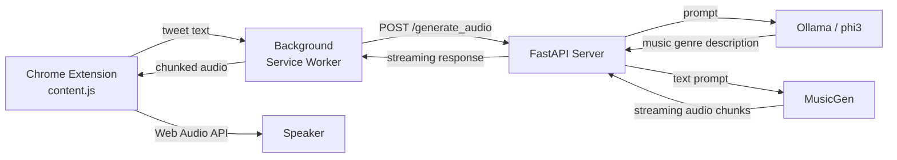

I wanted to click on a tweet and hear what it sounds like. Not text-to-speech. Actual music. A tweet about a perfect sunny day should sound like bright indie pop. An angry rant should sound like distorted metal. Code snippets should get scored based on how clean or cursed they are.

That was the whole idea. It took a local LLM, Meta's **MusicGen** model, a FastAPI server, a Chrome extension with custom WAV streaming, and a surprising amount of pain around the Web Audio API. The result is a system where you browse Twitter, click any tweet, and music starts playing in your browser within a few seconds, streamed chunk by chunk as the model generates it.

---

## The architecture

The system has three parts that talk to each other in a straight line.



1. **Chrome extension content script** attaches click listeners to every tweet on the page. When you click one, it grabs the tweet text and sends it to the background service worker.
2. **Background service worker** makes a POST request to the local FastAPI server and streams the response back to the content script.
3. **FastAPI server** takes the tweet text, asks a local LLM to describe a music genre that matches the vibe, feeds that genre description into MusicGen, and streams the generated audio back as raw PCM chunks.

The content script reassembles those chunks into WAV format in the browser and schedules them on the Web Audio API for gapless playback. No file downloads, no waiting for the full generation to finish.

---

## Step 1: from tweet text to music genre

The first problem is mapping arbitrary text to a music prompt. MusicGen doesn't understand tweets. It understands descriptions like "80s pop track with bassy drums and synth" or "classical sorrowful Indian music." Something has to bridge that gap.

I used **Ollama** running locally with the **phi3** model. The prompt engineering went through a few iterations. The first version was straightforward sentiment mapping:

```python
prompt = """Describe a music genre that matches the sentiment, mood and vibe of the tweet.
Some example genres - An 80s driving pop song with heavy drums and synth pads in the background
90s rock song with loud guitars and heavy drums. Classical sorrowful indian music. Bhangda beats with Dhol.

Tweet: What an amazing day! The sun is shining, I'm hanging out with my best friends, and everything just feels perfect.
Genre: Uplifting indie pop song with bright acoustic guitars, handclaps, and joyful vocals.

Tweet: Feeling so frustrated and angry right now. Everything is going wrong and I just want to scream!
Genre: Aggressive heavy metal song with distorted electric guitars, pounding drums, and angry shouting vocals.

Tweet:""" + tweet_text
```

That worked for emotional tweets. But then I thought: what if the tweet is a code snippet? What if you could score code quality as music? Clean code gets something pleasant. Spaghetti gets harsh industrial noise. So the final version of the prompt analyzes code quality instead of just sentiment:

```python
formatted_prompt = f"""Analyze the provided code and assess its quality based on
factors such as readability, maintainability, organization, and adherence to best
practices. Then, describe a music genre that matches the sentiment, mood, and vibe
of the code quality.

Some example genres:
An 80s driving pop song with heavy drums and synth pads in the background
90s rock song with loud guitars and heavy drums
Classical sorrowful Indian music
Bhangra beats with Dhol

Only output the Genre. Do not include the explanation.
Code: {prompt}
Genre:
"""
```

The "Only output the Genre. Do not include the explanation" instruction matters because phi3 loves to explain itself. Without it you get three paragraphs of justification before the actual genre line. Even with it, the model sometimes tacks on an "Explanation:" section, so there's a cleanup step:

```python
def remove_explanation(text):
    explanation_index = text.find("Explanation")
    if explanation_index != -1:
        text = text[:explanation_index].strip()
    return text
```

Brute force but reliable. The LLM step typically takes a few seconds on a decent local GPU, which is acceptable because the user is about to wait for audio generation anyway.

---

## Step 2: MusicGen streaming

**MusicGen** is Meta's open source text-to-music model. I used the `facebook/musicgen-small` variant, which is small enough to run locally but still produces surprisingly decent audio. The model loads at server startup:

```python
processor = MusicgenProcessor.from_pretrained("facebook/musicgen-small")
model = MusicgenForConditionalGeneration.from_pretrained("facebook/musicgen-small")

device = "cuda" if torch.cuda.is_available() else "cpu"
if device != model.device:
    model.to(device)
    if device == "cuda":
        model.half()
```

The `half()` call on CUDA cuts memory usage roughly in half by switching to float16. On the small model this is the difference between fitting comfortably in 4GB VRAM and not.

### Why streaming matters

MusicGen generates about 20 seconds of audio by default. Without streaming, the user clicks a tweet and waits the entire generation time (could be 30+ seconds on CPU) before hearing anything. That's a terrible experience.

With streaming, you hear the first chunk within a few seconds. The rest fills in while you're already listening. The model keeps generating in the background and the audio plays continuously.

The streaming implementation uses a custom `MusicgenStreamer` class. The key idea is a **token cache** that accumulates generated tokens and periodically decodes them into audio chunks:

```python
class MusicgenStreamer:
    def __init__(self, model, device=None, play_steps=10, stride=None, timeout=None):
        self.decoder = model.decoder
        self.audio_encoder = model.audio_encoder
        self.generation_config = model.generation_config
        self.device = device if device is not None else model.device
        self.play_steps = play_steps

        if stride is not None:
            self.stride = stride
        else:
            hop_length = np.prod(self.audio_encoder.config.upsampling_ratios)
            self.stride = hop_length * (play_steps - self.decoder.num_codebooks) // 6

        self.token_cache = None
        self.to_yield = 0
        self.audio_queue = Queue()
        self.stop_signal = None
        self.timeout = timeout
```

**`play_steps`** controls how many generation steps accumulate before decoding a chunk. Lower values mean faster first-chunk latency but more decoding overhead. I settled on calculating it from a target of 2 seconds of audio per chunk:

```python
play_steps = int(frame_rate * play_steps_in_s)  # play_steps_in_s = 2.0
```

**`stride`** handles the overlap between adjacent audio chunks. Without it, you'd hear hard clicks at chunk boundaries. The stride creates a crossfade region so adjacent chunks blend smoothly. The formula derives from MusicGen's internal upsampling ratios and codebook structure:

```python
hop_length = np.prod(self.audio_encoder.config.upsampling_ratios)
self.stride = hop_length * (play_steps - self.decoder.num_codebooks) // 6
```

### The delay pattern mask

MusicGen uses multiple codebooks (think of them as parallel streams of audio tokens at different frequency bands). These codebooks are offset from each other by one step, a pattern called the **delay pattern**. The streamer has to undo this offset before decoding tokens back to audio:

```python
def apply_delay_pattern_mask(self, input_ids):
    _, decoder_delay_pattern_mask = self.decoder.build_delay_pattern_mask(
        input_ids[:, :1],
        pad_token_id=self.generation_config.decoder_start_token_id,
        max_length=input_ids.shape[-1],
    )
    input_ids = self.decoder.apply_delay_pattern_mask(input_ids, decoder_delay_pattern_mask)
    input_ids = input_ids[input_ids != self.generation_config.pad_token_id].reshape(
        1, self.decoder.num_codebooks, -1
    )
    input_ids = input_ids[None, ...]
    input_ids = input_ids.to(self.audio_encoder.device)

    output_values = self.audio_encoder.decode(input_ids, audio_scales=[None])
    audio_values = output_values.audio_values[0, 0]
    return audio_values.cpu().float().numpy()
```

This is the heaviest per-chunk operation. Each time we decode, we're running the full audio encoder on the accumulated tokens so far. The `to_yield` pointer tracks how much audio we've already sent so we only yield the new portion:

```python
def put(self, value):
    if self.token_cache is None:
        self.token_cache = value
    else:
        self.token_cache = torch.concatenate([self.token_cache, value[:, None]], dim=-1)

    if self.token_cache.shape[-1] % self.play_steps == 0:
        audio_values = self.apply_delay_pattern_mask(self.token_cache)
        self.on_finalized_audio(audio_values[self.to_yield : -self.stride])
        self.to_yield += len(audio_values) - self.to_yield - self.stride
```

The `put()` method is called by the Transformers generation loop on every step. When enough steps accumulate (divisible by `play_steps`), it decodes and pushes audio to the queue. The consumer side (the FastAPI endpoint) reads from this queue and streams it to the client.

### Threading model

Generation runs in a background thread while the FastAPI endpoint iterates over the streamer:

```python
thread = Thread(target=model.generate, kwargs=generation_kwargs)
thread.start()

def audio_stream():
    for new_audio in streamer:
        audio_data_int16 = (new_audio * 32767).astype(np.int16)
        yield audio_data_int16.tobytes()

return StreamingResponse(audio_stream(), media_type="audio/wav")
```

The float32 to int16 conversion (`* 32767`) maps the normalized [-1, 1] audio range to 16-bit PCM. This is what goes over the wire. The `Queue` inside the streamer is what bridges the generation thread and the response thread without either blocking the other.

---

## Step 3: the Chrome extension

This is where things got genuinely annoying. Chrome extensions in **Manifest V3** have a service worker architecture that makes streaming binary data between components harder than it should be.

### Content script: attaching to tweets

The content script uses a `MutationObserver` to detect when new tweets appear in the DOM (Twitter loads content dynamically as you scroll) and attaches click listeners:

```javascript
function attachTweetListeners() {
  const tweets = document.querySelectorAll('article');
  tweets.forEach(tweet => {
    if (!tweet.dataset.listenerAdded) {
      tweet.addEventListener('click', () => {
        const tweetText = tweet.innerText;
        const port = chrome.runtime.connect({ name: "audioStream" });
        port.postMessage({ action: 'generateAudio', text: tweetText });

        const stream = new ReadableStream({
          start(controller) {
            port.onMessage.addListener((message) => {
              if (message.done) {
                controller.close();
              } else {
                controller.enqueue(message.value);
              }
            });
          }
        });

        playAudio(stream);
      });
      tweet.dataset.listenerAdded = 'true';
    }
  });
}

const observer = new MutationObserver(attachTweetListeners);
observer.observe(document.body, { childList: true, subtree: true });
attachTweetListeners();
```

The `dataset.listenerAdded` flag prevents double-attaching listeners when the observer fires. Without it, every DOM mutation would stack another click handler on every tweet.

### The port-based streaming problem

The original Chrome extension messaging API (`chrome.runtime.sendMessage`) doesn't support streaming. You send a message, you get one response. For streaming audio, I needed a **persistent port connection** via `chrome.runtime.connect()`.

The background service worker opens a fetch to the FastAPI server, reads the response body as a stream, and forwards each chunk through the port:

```javascript
chrome.runtime.onConnect.addListener(port => {
  port.onMessage.addListener((request) => {
    if (request.action === 'generateAudio') {
      fetch("http://localhost:8000/generate_audio", {
        method: "POST",
        headers: { "Content-Type": "application/json" },
        body: JSON.stringify({ prompt: request.text })
      })
      .then(response => {
        const reader = response.body.getReader();

        function push() {
          reader.read().then(({ done, value }) => {
            if (done) {
              port.postMessage({ done: true });
              return;
            }
            port.postMessage({ done: false, value: value });
            push();
          });
        }

        push();
      });
    }
  });
});
```

This is a recursive read loop. Each chunk from the fetch response gets forwarded as a port message. The content script reconstructs a `ReadableStream` from these messages on the other end. It works, but there's a catch: port messages serialize data as JSON. Binary `Uint8Array` chunks get serialized as objects with numeric keys, not as actual typed arrays. That's why the content script has to do `Object.values(value)` to reconstruct the byte array later.

### WAV construction in the browser

The content script receives raw int16 PCM bytes. The Web Audio API's `decodeAudioData` expects a proper WAV file with headers. So each chunk gets wrapped in a WAV container on the fly:

```javascript
class Wav {
  constructor(opt_params) {
    this._sampleRate = opt_params && opt_params.sampleRate ? opt_params.sampleRate : 44100;
    this._channels = opt_params && opt_params.channels ? opt_params.channels : 2;
    this._eof = true;
    this._bufferNeedle = 0;
    this._buffer;
  }

  getWavInt16Array(buffer) {
    var intBuffer = new Int16Array(buffer.length + 23), tmp;
    intBuffer[0] = 0x4952; // "RI"
    intBuffer[1] = 0x4646; // "FF"
    intBuffer[2] = (2 * buffer.length + 15) & 0x0000ffff;
    intBuffer[3] = ((2 * buffer.length + 15) & 0xffff0000) >> 16;
    // ... full WAV header construction
    intBuffer[10] = 0x0001; // format tag: PCM
    intBuffer[11] = this._channels;
    // sample rate, byte rate, block align, bits per sample...
    for (var i = 0; i < buffer.length; i++) {
      intBuffer[i + 23] = buffer[i];
    }
    return intBuffer;
  }
}
```

This is writing a WAV header byte by byte into an `Int16Array`. The magic numbers (`0x4952`, `0x4646`, etc.) are the ASCII codes for "RIFF", "WAVE", "fmt ", "data" packed as 16-bit integers. It's not pretty, but it means each audio chunk becomes a self-contained WAV that `decodeAudioData` can handle.

### Gapless playback scheduling

The hardest part of the browser-side implementation was making consecutive audio chunks play without gaps or overlaps. The Web Audio API is not designed for append-style streaming. You schedule buffer sources at specific times and hope you got the math right.

```javascript
var nextTime = 0;
function scheduleBuffers() {
  while (audioStack.length) {
    var buffer = audioStack.shift();
    var source = context.createBufferSource();
    source.buffer = buffer;
    source.connect(context.destination);
    audioSources.push(source);
    if (nextTime == 0)
      nextTime = context.currentTime + 0.1;  // 100ms initial latency
    source.start(nextTime);
    nextTime += source.buffer.duration;
  }
}
```

The `nextTime` variable is the critical piece. Each buffer gets scheduled to start exactly when the previous one ends. The initial 100ms offset (`context.currentTime + 0.1`) gives the system a small buffer so the first chunk doesn't start before it's fully decoded.

If a chunk arrives late (network hiccup, slow generation), you get a gap. If the scheduling math drifts, you get overlap. In practice, with 2-second chunks from MusicGen, the system stays smooth because each chunk arrives well before the previous one finishes playing.

---

## What I tried that didn't work

**Direct sounddevice playback.** The test script originally used Python's `sounddevice` library to play audio chunks directly on the server:

```python
audio_array = np.frombuffer(new_audio.tobytes(), dtype=np.float32)
sd.play(audio_array, samplerate=32000)
sd.wait()
```

This was fine for local testing but obviously doesn't work when the audio needs to play in a browser. The `sd.wait()` call also blocks the thread, which defeats the purpose of streaming.

**Chrome's basic message passing.** Before the port-based approach, I tried using `chrome.runtime.sendMessage` with a single response callback. The problem is fundamental: you can only send one response per message. For streaming, you need to send dozens of chunks. The port API was the only viable path.

**JSON serialization of binary data.** Chrome's port messaging serializes everything as JSON. A `Uint8Array` becomes `{"0": 255, "1": 128, ...}`. This is wasteful (the serialized form is much larger than the binary) but there's no way around it in Manifest V3 without going through more complex workarounds like `SharedArrayBuffer` (which requires specific CORS headers that Twitter doesn't set).

---

## The tradeoffs I accepted

**Local only.** The FastAPI server runs on localhost. There's no deployment story. You need a machine with enough GPU (or patience for CPU inference) to run MusicGen and Ollama simultaneously. This was always a weekend hack, not a product.

**Model quality vs speed.** `musicgen-small` produces decent audio but it's not going to fool anyone into thinking they're listening to a real recording. The medium and large variants sound better but take significantly longer to generate. For a real-time-ish experience where you're clicking tweets and expecting quick feedback, small was the right call.

**Tweet text is messy.** `tweet.innerText` grabs everything visible in the tweet article element. That includes the username, timestamp, engagement counts, and the actual tweet text. The LLM is robust enough to handle the noise, but a cleaner extraction (targeting just the tweet body) would give better genre descriptions.

**No concurrent generation.** Click two tweets quickly and you'll get two overlapping audio streams. The server handles them independently but the browser's audio context plays both simultaneously. A proper implementation would cancel the previous generation when a new click happens. The `stopAudio()` function exists for this but isn't wired into the click flow.

**Sample rate hardcoded to 32000.** MusicGen small generates at 32000 Hz. That's hardcoded in both the server's PCM conversion and the client's WAV construction. If you swap to a different model variant with a different sample rate, both sides break silently. The server knows the actual rate (`model.audio_encoder.config.sampling_rate`) but doesn't communicate it to the client.

---

## What I learned

**Streaming audio in the browser is still painful.** The Web Audio API is powerful but low-level. There's no built-in concept of "here's a stream, play it as it arrives." You have to manually construct WAV headers, decode each chunk, schedule buffer sources at precise times, and track playback position yourself. The **Media Source Extensions** API would be a better fit for this use case, but it doesn't support raw PCM -- you'd need to encode to a supported codec server-side.

**Manifest V3 makes extension development harder in specific ways.** The move from background pages to service workers broke a lot of patterns that extension developers relied on. Persistent connections through ports work but feel like a workaround. The serialization overhead for binary data is real.

**Local LLMs are surprisingly good at vibe classification.** phi3 running through Ollama consistently produces reasonable genre descriptions. "Angry tweet about a delayed flight" maps to something like "aggressive punk rock with distorted guitars." "Beautiful sunset photo description" maps to "ambient electronic with soft synth pads." The few-shot examples in the prompt do most of the heavy lifting.

**MusicGen's streaming support is underrated.** The HuggingFace Transformers library has a streamer interface that MusicGen supports natively. The `MusicgenStreamer` class, adapted from [Sanchit Gandhi's Gradio demo](https://huggingface.co/spaces/sanchit-gandhi/musicgen-streaming), made it possible to get audio out incrementally without waiting for full generation. The token cache and delay pattern mask logic is fiddly but well-documented in the original implementation.

**The hardest bugs were at boundaries.** Not model quality issues or LLM prompt issues. The bugs that took the most time were: port message serialization losing typed array information, WAV headers with wrong byte counts causing `decodeAudioData` to reject chunks, and `nextTime` scheduling drift causing audible gaps. Infrastructure problems, not ML problems.

---

## My take

This is a dumb project in the best possible way. It takes three interesting technologies -- local LLMs, neural audio generation, and browser extension streaming -- and wires them together into something that has no practical value but is genuinely fun to use. Click a tweet, hear music. The angry tweets sound angry. The happy tweets sound happy. The code tweets get judged.

The interesting technical takeaway is that all three pieces (Ollama, MusicGen, Chrome extension streaming) are individually well-documented but combining them requires solving a bunch of glue problems that nobody writes about. Binary streaming through Chrome ports. WAV header construction from raw PCM. Gapless scheduling on the Web Audio API. These are the unglamorous parts that make the demo actually work.

If you want to build something similar, start with the MusicGen streamer. Get that working standalone with `sounddevice` first. Then add the FastAPI layer. Then tackle the Chrome extension last, because that's where the most frustrating platform-specific issues live.
