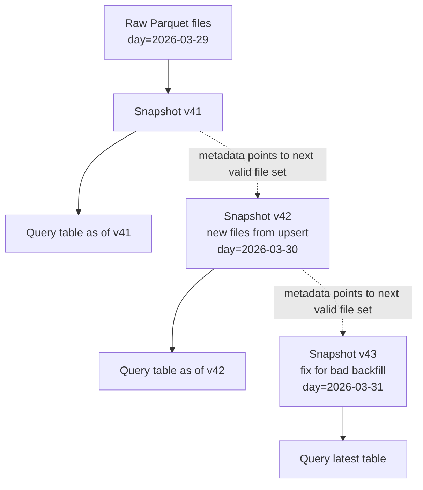
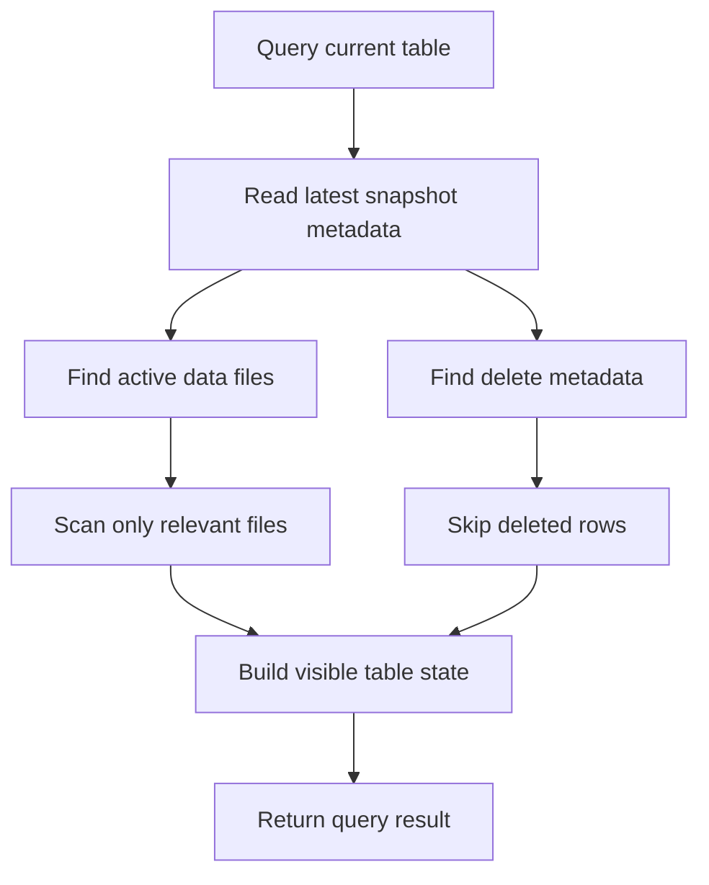

For a long time, a data lake mostly meant "a giant pile of files in object storage." Usually Parquet files on S3, GCS, or ADLS. That was cheap, flexible, and good enough until teams started expecting database-like guarantees from that pile of files.

That is where the recent obsession with **time travel**, **snapshots**, and table formats like **[Delta Lake](https://docs.delta.io/latest/delta-intro.html)** and **[Apache Iceberg](https://iceberg.apache.org/docs/latest/)** comes from.

The short version is this:

- A raw data lake stores files.
- Modern table formats store files **plus metadata about which files make up the table at a given moment**.
- That metadata lets you ask, "show me the table as it looked yesterday," which is what people call **time travel**.

It sounds flashy, but the real value is much less sci-fi and much more operational.

## What time travel means

Time travel does **not** mean the system keeps every old row in memory or replays the entire history every time you query.

It usually means the table keeps a sequence of **snapshots**.

A snapshot is basically:

- the set of data files that currently belong to the table
- the metadata files that describe them
- the schema / partition state associated with that version

When a write happens, the table does not mutate "in place" like a traditional single-node database page would. Instead, the engine writes new files and then publishes a new snapshot that points to the correct set of files.

So if a user asks for:

- the latest version, they read the newest snapshot
- yesterday's version, they read an older snapshot
- data before a bad overwrite job, they read the snapshot from before the damage

That is the core idea. Time travel is really **snapshot selection**.



The files are the physical storage layer. The snapshots are the logical table history. That distinction is the whole game.

Here is the same idea in a more practical view:

| Layer | What lives there | Why it matters |
| --- | --- | --- |
| Storage | Parquet data files in object storage | Cheap and scalable, but not enough on its own |
| Metadata | Logs, manifests, snapshot metadata | Defines which files are valid for a table version |
| Query engine | Spark, Trino, Flink, DuckDB | Reads metadata first, then reconstructs the visible table |

## Why raw lakes started breaking down

Because file-based lakes have some very real problems once more than one team or engine starts writing to them.

### 1. The table is not clearly defined

If a "table" is just a folder full of Parquet files, then a reader has to infer the table by listing files in storage. That sounds simple, but it gets messy fast:

- files may be partially written
- a writer may be in the middle of replacing a partition
- two jobs may race with each other
- a reader may observe a half-old, half-new version of the table

This is the classic "my data lake is just files, so consistency is now my problem" situation.

### 2. Rollback is messy

If a bad backfill rewrites a month of data, recovery in a raw lake usually means:

- restore from backups
- hunt through old file paths
- rerun upstream jobs
- pray nothing else changed while doing that

That is not a serious operating model for an important analytical table.

### 3. Updates and deletes are awkward

Analytics data stopped being append-only a while ago. Teams now need:

- GDPR / privacy deletes
- late arriving data correction
- deduplication
- upserts from CDC pipelines

Doing that directly on a sea of Parquet files is ugly. You end up rewriting large chunks of data manually with weak guarantees.

### 4. Schema and partition changes get fragile

You eventually want to:

- add columns
- rename columns
- change partition strategy
- compact small files

Without a real table layer, these tasks become expensive and fragile conventions.

## What Delta Lake and Iceberg add

They add a **table abstraction on top of object storage**.

The storage is still cheap object storage. The files are still often Parquet. But the table now has a proper metadata layer that tracks:

- current files
- previous files
- schema
- partition information
- deletes
- transaction state

That is the part people mean when they say these systems "bring database features to the data lake."

### Delta Lake in short

Delta Lake keeps a transaction log that records table changes, so readers and writers can agree on valid versions of the table and query older ones when history is retained.

### Iceberg in short

Apache Iceberg represents table state through metadata and manifest files, making snapshot-based reads, schema evolution, partition evolution, and multi-engine access much more manageable on object storage.

## Why snapshots matter

If you only remember one thing, remember this:

**Time travel is not the product. Snapshots are the product.**

Once you have reliable snapshots, a lot of useful things fall out naturally.

### Reproducibility

Suppose a dashboard looked wrong on Monday and leadership asked why revenue dropped. With snapshot-based tables, you can often query the table exactly as it existed when the dashboard ran.

That matters because "rerun the query now" is not the same thing. The data may already have changed.

### Safe recovery from bad writes

If a buggy job corrupts data, reverting to an older snapshot is much easier than reconstructing file state manually.

### Concurrent readers and writers

A reader can keep using a stable snapshot while a writer publishes a new one. That is a huge improvement over readers seeing an inconsistent mix of files.

### Auditable history

You can answer practical questions such as:

- when did this table change?
- which job produced this version?
- what changed between version 120 and 121?

That is operational gold once the table matters.

## The common technical ideas underneath

Under the branding and ecosystem arguments, both systems are trying to solve the same storage problem:

**how do you let cheap object storage behave like a table that has history, consistent reads, and manageable updates?**

The answer is a metadata-first design.

### 1. Metadata defines the table

This is the most important technical shift.

In an old-school lake, a reader might say:

- list all files under `/table/date=2026-03-31/`
- hope those files represent the current truth

In Delta Lake or Iceberg, the reader instead starts from table metadata and asks:

- what is the current table version?
- which data files belong to that version?
- which delete metadata applies to those files?
- which schema and partition spec should I use to interpret them?

That means the table is not "whatever files happen to be in the directory." The table is "whatever files the current metadata says are valid."

That distinction is what gives you atomicity and reproducibility.

### 2. Every write becomes a metadata commit

Whether you run:

- `INSERT`
- `MERGE`
- `DELETE`
- compaction
- schema evolution

the end result is not "mutate this Parquet file in place."

Instead, the writer usually:

- writes new data files and sometimes new delete metadata
- prepares new table metadata describing the change
- atomically publishes a new snapshot / version

That publish step is the real commit.

So when people talk about transaction logs, manifest lists, metadata JSON, or snapshot lineage, they are all talking about different ways of answering the same question:

**what is the authoritative description of the table right now, and what was it before?**

### 3. The system keeps a real history

Both formats maintain enough metadata to reconstruct the sequence of table states over time.

That history is useful for:

- time travel
- audit
- debugging broken jobs
- incremental processing
- rollback

Conceptually, you can think of it like this:

```text
version 41 -> add files A,B,C
version 42 -> remove B, add D
version 43 -> register delete metadata for rows in D
version 44 -> compact A,C,D into E and carry forward live rows only
```

That chain is why the system can answer both "what does the table look like now?" and "what did the table look like before the bad merge?"

### 4. Row changes are tracked through extra metadata

This part matters a lot because it is where modern lakehouse formats become more than "Parquet with marketing."

Parquet files are immutable in practice. Rewriting them for every tiny delete or update would be too expensive.

So these systems rely on extra metadata to express row-level change.

Depending on the format and feature set, that metadata may look like:

- delete vectors
- position deletes
- equality deletes
- delete files attached to data files

The shared idea is simple:

- the base data file still exists
- extra metadata says which rows should be treated as deleted or superseded
- readers must apply that metadata at query time and skip those records

So if a file contains one million rows and ten thousand are deleted, the engine does not necessarily rewrite the whole file immediately. It can keep the file and maintain separate row-level delete state until compaction cleans things up later.

That is a very important practical optimization.



That is roughly what is happening under the hood. The engine is reconstructing the table view, not blindly reading every file.

### 5. Readers reconstruct the table view

When you query one of these tables, the engine is not simply opening all Parquet files in a folder.

It is doing something more like this:

1. Read the latest snapshot metadata.
2. Resolve the active data files for that snapshot.
3. Load any delete metadata that applies.
4. Skip files using file-level stats where possible.
5. Skip rows using delete metadata where needed.
6. Return the logical table state for that version.

This is why metadata quality matters so much. Query performance is not only about Parquet scan speed. It is also about how efficiently the engine can determine:

- which files matter
- which files can be pruned
- which rows are no longer visible

### 6. Compaction still matters

Delete metadata is powerful, but it is not free.

Over time, if you keep layering:

- many small files
- many delete files / vectors
- many tiny commits

then reads get heavier because the engine has to merge more metadata with more data files.

So both ecosystems eventually need maintenance operations such as:

- compaction
- rewrite data files
- rewrite manifests / metadata
- snapshot expiration / vacuum / retention cleanup

This is one of the most important non-obvious truths: these formats reduce pain, but they also introduce metadata management as a first-class operational concern.

### 7. Delete vectors make deletes practical

This deserves a plain explanation because it sounds more exotic than it is.

A delete vector is basically row-level deletion metadata associated with a data file. Instead of rewriting the file immediately, the table tracks which records are logically gone so readers can ignore them.

That solves a real problem:

- without delete metadata, every delete means rewrite files
- with delete metadata, deletes can be cheap first and physically cleaned up later

Iceberg often expresses this idea through position deletes and equality deletes. Delta Lake has its own deletion-vector based machinery. The implementation differs, but the purpose is the same:

- separate logical deletion from immediate physical rewrite

That is what makes row-level operations on data lakes feel much closer to database behavior.

One easy way to think about it is this:

| Without row-level delete metadata | With row-level delete metadata |
| --- | --- |
| Delete means rewrite data files right away | Delete can be recorded first and cleaned up later |
| Small corrections are expensive | Small corrections are much cheaper |
| Readers only look at base files | Readers combine base files with delete state |
| Operationally simple at first | Better long-term, but needs metadata maintenance |

## Why this became popular

No. It is one visible feature, but popularity comes from a bundle of problems being solved at once.

### 1. The lakehouse model took off

Teams wanted warehouse-like reliability without giving up cheap object storage and open file formats. Delta and Iceberg fit that perfectly.

### 2. Multi-engine access became normal

One team uses Spark. Another uses Trino. Another uses Flink. Someone else wants DuckDB or Snowflake to read the same data.

A proper table format gives these engines a common contract instead of forcing each engine to guess from files.

### 3. CDC made row-level changes unavoidable

Modern pipelines are full of:

- inserts
- updates
- deletes
- merges

Raw lakes are weak here. Table formats make this tractable.

### 4. Governance became a real requirement

Privacy deletions, lineage, reproducibility, cost control, and correctness are no longer "nice to have" once data becomes business critical.

### 5. Small-file chaos had to be handled

A lot of lake pain is not glamorous. It is:

- too many tiny files
- expensive listings
- slow query planning
- inconsistent partition conventions

Modern table formats help organize and compact that mess.

## What it actually solves

It solves genuine problems. But it does **not** solve every problem people sometimes attach to it.

### Where it helps

#### Reliable table versions

This is the big one. You can reason about a table as a coherent object instead of as a random directory of files.

#### Rollback and recovery

Accidental overwrites and bad merges are far less catastrophic when older snapshots exist.

#### Better interoperability

Open table metadata is much better than every engine inventing its own conventions around folders and partitions.

#### Safer schema evolution

Schema changes become managed metadata operations instead of tribal knowledge plus hope.

#### More practical batch + streaming convergence

These formats make it easier to treat a table as continuously changing state rather than only as immutable batch dumps.

### Where it does not help

#### Bad data modeling

If your table design is nonsense, Delta and Iceberg will preserve that nonsense very reliably.

#### Poor pipeline logic

If the upstream job writes duplicate or wrong data, time travel helps you recover, but it does not stop the bug from happening.

#### Object storage performance limits

Metadata helps a lot, but object storage is still not a low-latency OLTP database.

#### Infinite free history

Snapshots cost money. Old files and metadata must be retained if you want long time-travel windows. Someone still has to manage retention and compaction.

## Delta and Iceberg

Because the market wanted slightly different things.

Delta Lake became popular first in many Spark-heavy environments because it made the data lake feel much more transactional very quickly.

Apache Iceberg gained a lot of momentum because it positioned itself as a highly portable open table format with strong support for:

- engine interoperability
- hidden partitioning
- schema evolution
- partition evolution
- large-scale metadata management

In practice, the decision is often less philosophical than people pretend. It usually comes down to:

- which compute engines you run
- what catalog setup you want
- whether you need broad ecosystem interoperability
- what your current platform already supports well

## Why snapshots matter more than the label

Because "time travel" sounds like a sexy end-user feature, but data teams usually care about boring, expensive failures:

- the backfill overwrote good data
- the daily dashboard changed after a late-arriving correction
- the delete job only removed half the intended rows
- Spark and Trino disagreed on what the table looked like
- the partition layout that worked last year is now a bottleneck

Snapshots make those failures survivable.

That is why this trend is real. It is not just a prettier name for versioning. It is an attempt to turn a file dump into something that behaves more like a serious analytical storage system.

## My take

If your workload is tiny, append-only, and owned by one team, you may not need Delta Lake or Iceberg yet. Plain Parquet files may be enough.

But once your environment has even a few of these characteristics:

- multiple writers
- multiple query engines
- data corrections
- privacy deletes
- reproducibility requirements
- expensive production dashboards
- teams asking for "what changed?" every week

then yes, these table formats solve something very real.

The industry is moving in this direction because raw files were too primitive for the responsibilities we dumped onto data lakes.

So the answer to "WTF is time travel?" is:

- not magic
- not literal row rewinding
- not just marketing

It is a practical consequence of managing a data lake table through **snapshots** instead of pretending a folder of files is good enough.

## Further reading

- [Delta Lake overview](https://docs.delta.io/latest/delta-intro.html)
- [Delta Lake time travel](https://docs.delta.io/latest/delta-batch.html#query-an-older-snapshot-of-a-table-time-travel)
- [Apache Iceberg documentation](https://iceberg.apache.org/docs/latest/)
- [Apache Iceberg evolution](https://iceberg.apache.org/evolution/)
